# Lottery

基于Springboot，Dubbo 等开发的分布式抽奖系统

## 1. 环境 配置 规范


## 2. 搭建(DDD + RPC)架构

DDD（Domain-Driven Design 领域驱动设计）是由Eric Evans最先提出，目的是对软件所涉及到的领域进行建模，以应对系统规模过大时引起的软件复杂性的问题。整个过程大概是这样的，开发团队和领域专家一起通过 通用语言(Ubiquitous Language)去理解和消化领域知识，从领域知识中提取和划分为一个一个的子领域（核心子域，通用子域，支撑子域），并在子领域上建立模型，再重复以上步骤，这样周而复始，构建出一套符合当前领域的模型。

依靠领域驱动设计的设计思想，通过事件风暴建立领域模型，合理划分领域逻辑和物理边界，建立领域对象及服务矩阵和服务架构图，定义符合DDD分层架构思想的代码结构模型，保证业务模型与代码模型的一致性。通过上述设计思想、方法和过程，指导团队按照DDD设计思想完成微服务设计和开发。

- 拒绝泥球小单体、拒绝污染功能与服务、拒绝一加功能排期一个月
- 架构出高可用极易符合互联网高速迭代的应用服务
- 物料化、组装化、可编排的服务，提高人效

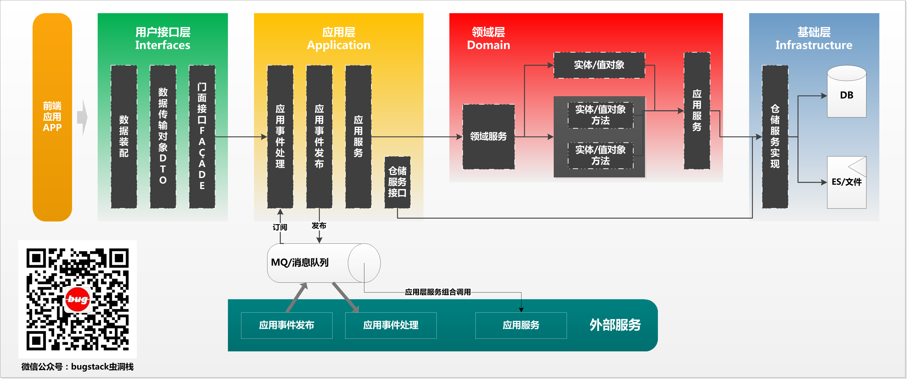

- **应用层{application}**

  - 应用服务位于应用层。用来表述应用和用户行为，负责服务的组合、编排和转发，负责处理业务用例的执行顺序以及结果的拼装。

  - 应用层的服务包括应用服务和领域事件相关服务。

  - 应用服务可对微服务内的领域服务以及微服务外的应用服务进行组合和编排，或者对基础层如文件、缓存等数据直接操作形成应用服务，对外提供粗粒度的服务。

  - 领域事件服务包括两类：领域事件的发布和订阅。通过事件总线和消息队列实现异步数据传输，实现微服务之间的解耦。

- **领域层{domain}**

  - 领域服务位于领域层，为完成领域中跨实体或值对象的操作转换而封装的服务，领域服务以与实体和值对象相同的方式参与实施过程。

  - 领域服务对同一个实体的一个或多个方法进行组合和封装，或对多个不同实体的操作进行组合或编排，对外暴露成领域服务。领域服务封装了核心的业务逻辑。实体自身的行为在实体类内部实现，向上封装成领域服务暴露。

  - 为隐藏领域层的业务逻辑实现，所有领域方法和服务等均须通过领域服务对外暴露。

  - 为实现微服务内聚合之间的解耦，原则上禁止跨聚合的领域服务调用和跨聚合的数据相互关联。

- **基础层{infrastructure}**

  - 基础服务位于基础层。为各层提供资源服务（如数据库、缓存等），实现各层的解耦，降低外部资源变化对业务逻辑的影响。

  - 基础服务主要为仓储服务，通过依赖反转的方式为各层提供基础资源服务，领域服务和应用服务调用仓储服务接口，利用仓储实现持久化数据对象或直接访问基础资源。

- **接口层{interfaces}**
  - 接口服务位于用户接口层，用于处理用户发送的Restful请求和解析用户输入的配置文件等，并将信息传递给应用层。

**DDD是在MVC的基础上可以更加明确了房间的布局**

DDD结构它是一种充血模型结构，所有的服务实现都以领域为核心，应用层定义接口，领域层实现接口，领域层定义数据仓储，基础层实现数据仓储中关于DAO和Redis的操作，但同时几方又有互相的依赖。那么这样的结构再开发独立领域提供 http 接口时候，并不会有什么问题体现出来。但如果这个时候需要引入 RPC 框架，就会暴露问题了，因为使用 RPC 框架的时候，需要对外提供描述接口信息的 Jar 让外部调用方引入才可以通过反射调用到具体的方法提供者，那么这个时候，RPC 需要暴露出来，而 DDD 的系统结构又比较耦合，怎么进行模块化的分离就成了问题点。所以我们本章节在模块系统结构搭建的时候，也是以解决此项问题为核心进行处理的。

**DDD + RPC，模块分离系统搭建**

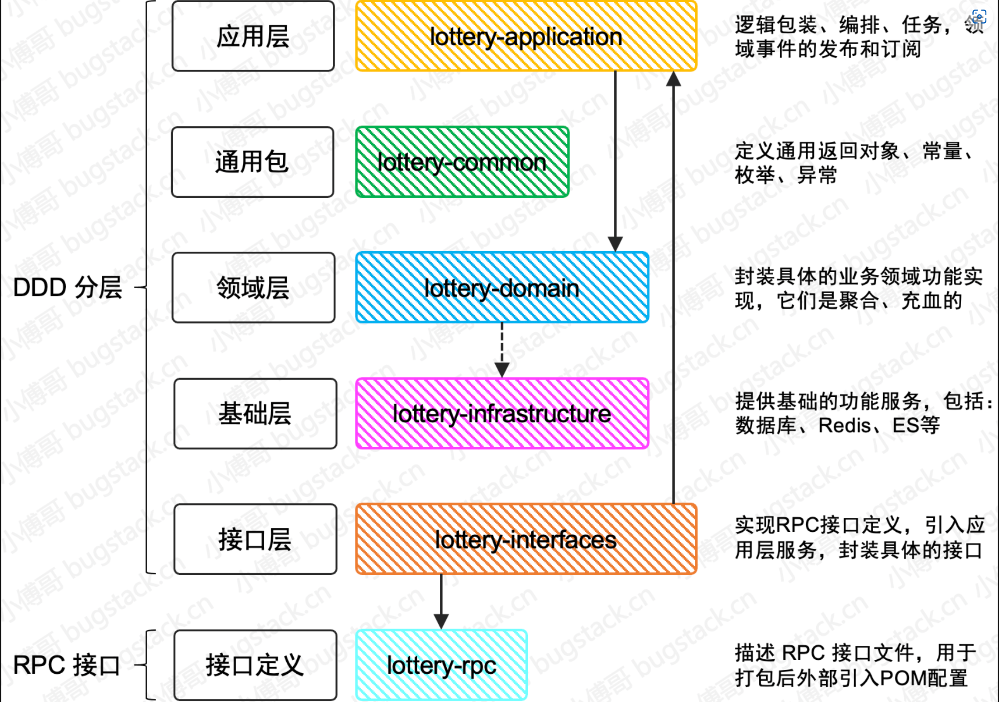

如果按照模块化拆分，那么会需要做一些处理，包括：

1. 应用层，不再给领域层定义接口，而是自行处理对领域层接口的包装。否则领域层既引入了应用层的Jar，应用层也引入了领域层的Jar，就会出现循环依赖的问题。
2. 基础层中的数据仓储的定义也需要从领域层剥离，否则也会出现循环依赖的问题。
3. RPC 层定义接口描述，包括：入参Req、出参Res、DTO对象，接口信息，这些内容定义出来的Jar给接口层使用，也给外部调用方使用。


## 3. 跑通广播模式RPC过程调用

### 一、创建抽奖活动表

抽奖活动的设计和开发过程中，涉及到的表信息包括：活动表、奖品表、策略表、规则表、用户参与表、中奖信息表等。

首先创建一个活动表，用于实现系统对数据库的CRUD操作，也就可以被RPC接口调用，在后续再进行优化。

**活动表(activity)**

```sql
CREATE TABLE `activity` (
  `id` bigint(20) NOT NULL AUTO_INCREMENT COMMENT '自增ID',
  `activity_id` bigint(20) NOT NULL COMMENT '活动ID',
  `activity_name` varchar(64) CHARACTER SET utf8mb4 DEFAULT NULL COMMENT '活动名称',
  `activity_desc` varchar(128) CHARACTER SET utf8mb4 DEFAULT NULL COMMENT '活动描述',
  `begin_date_time` datetime DEFAULT NULL COMMENT '开始时间',
  `end_date_time` datetime DEFAULT NULL COMMENT '结束时间',
  `stock_count` int(11) DEFAULT NULL COMMENT '库存',
  `take_count` int(11) DEFAULT NULL COMMENT '每人可参与次数',
  `state` tinyint(2) DEFAULT NULL COMMENT '活动状态：1编辑、2提审、3撤审、4通过、5运行(审核通过后worker扫描状态)、6拒绝、7关闭、8开启',
  `creator` varchar(64) CHARACTER SET utf8mb4 DEFAULT NULL COMMENT '创建人',
  `create_time` datetime DEFAULT CURRENT_TIMESTAMP COMMENT '创建时间',
  `update_time` datetime DEFAULT CURRENT_TIMESTAMP COMMENT '修改时间',
  PRIMARY KEY (`id`),
  UNIQUE KEY `unique_activity_id` (`activity_id`)
) ENGINE=InnoDB AUTO_INCREMENT=2 DEFAULT CHARSET=utf8mb4 COLLATE=utf8mb4_bin COMMENT='活动配置';

```

活动表：是一个用于配置抽奖活动的总表，用于存放活动信息，包括：ID、名称、描述、时间、库存、参与次数等。

### 二、POM 文件配置

按照现有工程的结构模块分层，包括：

- lottery-application，应用层，引用：`domain`
- lottery-common，通用包，引用：`无`
- lottery-domain，领域层，引用：`infrastructure`
- lottery-infrastructure，基础层，引用：`无`
- lottery-interfaces，接口层，引用：`application`、`rpc`
- lottery-rpc，RPC接口定义层，引用：`common`

**lottery-rpc配置**

```xml
<parent>
    <artifactId>Lottery</artifactId>
    <groupId>com.banana69.lottery</groupId>
    <version>1.0-SNAPSHOT</version>
</parent>
<modelVersion>4.0.0</modelVersion>
<artifactId>lottery-rpc</artifactId>

<packaging>jar</packaging>

<dependencies>
    <dependency>
        <groupId>cn.itedus.lottery</groupId>
        <artifactId>lottery-common</artifactId>
        <version>1.0-SNAPSHOT</version>
    </dependency>
</dependencies>

<build>
    <finalName>lottery-rpc</finalName>
    <plugins>
        <!-- 编译plugin -->
        <plugin>
            <groupId>org.apache.maven.plugins</groupId>
            <artifactId>maven-compiler-plugin</artifactId>
            <configuration>
                <source>${jdk.version}</source>
                <target>${jdk.version}</target>
                <compilerVersion>1.8</compilerVersion>
            </configuration>
        </plugin>
    </plugins>
</build>
```

**lottery-interfaces配置**

```xml
<artifactId>lottery-interfaces</artifactId>

<packaging>war</packaging>

<dependencies>
    <dependency>
        <groupId>org.springframework.boot</groupId>
        <artifactId>spring-boot-starter-web</artifactId>
    </dependency>
    ...
</dependencies>

<build>
    <finalName>Lottery</finalName>
    <resources>
        <resource>
            <directory>src/main/resources</directory>
            <filtering>true</filtering>
            <includes>
                <include>**/**</include>
            </includes>
        </resource>
    </resources>
    <testResources>
        <testResource>
            <directory>src/test/resources</directory>
            <filtering>true</filtering>
            <includes>
                <include>**/**</include>
            </includes>
        </testResource>
    </testResources>
    <plugins>
        <plugin>
            <groupId>org.springframework.boot</groupId>
            <artifactId>spring-boot-maven-plugin</artifactId>
        </plugin>
        <plugin>
            <groupId>org.apache.maven.plugins</groupId>
            <artifactId>maven-compiler-plugin</artifactId>
            <configuration>
                <source>8</source>
                <target>8</target>
            </configuration>
        </plugin>
    </plugins>
</build>

```

lottery-interfaces 是整个程序的出口，也是用于构建 War 包的工程模块，所以你会看到一个 `<packaging>war</packaging>` 的配置。

在 dependencies 会包含所有需要用到的 SpringBoot 配置，也会包括对其他各个模块的引入。

在 build 构建配置上还会看到一些关于测试包的处理，比如这里包括了资源的引入也可以包括构建时候跳过测试包的配置。

**配置广播模式Dubbo**

最早 RPC 的设计和使用都是依赖于注册中心，那就是需要把服务接口信息在程序启动的时候，推送到一个统一的注册中心，在其他需要调用 RPC 接口的服务上再通过注册中心的均衡算法来匹配可以连接的接口落到本地保存和更新。那么这样的标准的使用方式可以提供更大的连接数和更强的负载均衡作用，但目前我们这个以学习实践为目的的工程开发则需要尽可能减少学习成本，也就需要在开发阶段少一些引入一些额外的配置，那么目前使用广播模式就非常适合，以后也可以直接把 Dubbo 配置成注册中心模式。

```yml
# Dubbo 广播方式配置
dubbo:
  application:
    name: Lottery
    version: 1.0.0
  registry:
    address: N/A #multicast://224.5.6.7:1234
  protocol:
    name: dubbo
    port: 20880
  scan:
    base-packages: cn.itedus.lottery.rpc

```

广播模式的配置唯一区别在于注册地址，`registry.address = multicast://224.5.6.7:1234`，服务提供者和服务调用者都需要配置相同的📢广播地址。或者配置为 N/A 用于直连模式使用

application，配置应用名称和版本

protocol，配置的通信协议和端口

scan，相当于 Spring 中自动扫描包的地址，可以把此包下的所有 rpc 接口都注册到服务中

**搭建测试工程调用 RPC**

为了测试 RPC 接口的调用以及后续其他逻辑的验证，这里需要创建一个测试工程：Lottery-Test这个工程中用于引入 RPC 接口的配置和同样广播模式的调用。


使用zookeeper作为注册中心，该项目中zookeeper使用docker搭建，版本为3.4.13

```bash
docker run -d --name zookeeper --restart always -p 2181:2181 -p 2888:2888 -p 3888:3888 -v /Users/null/Daily/docker/zookeeper/conf/zoo.cfg:/conf/zoo.cfg -v /Users/null/Daily/docker/zookeeper/data:/data -v /Users/null/Daily/docker/zookeeper/log:/datalog  zookeeper:3.4.13
```

搭建dubbo-admin，在github下载，选择0.4.0版本

在 dubbo-admin中执行命令

```bash
mvn clean package -Dmaven.test.skip=true
```

执行完命令后切换到目录

```bash
dubbo-admin-develop/dubbo-admin-distribution/target>
```

执行：

```bash
java -jar ./dubbo-admin-0.4.0.jar
```

启动后端：

dubbo-admin-ui 目录下执行命令

```bash
npm run dev
```

在跑通RPC的过程中会遇到一些bug，dubbo无法注册，这里使用zookeeper作为注册中心，给消费者引入pom

```xml
<dependency>
            <groupId>org.apache.dubbo</groupId>
            <artifactId>dubbo</artifactId>
            <version>2.7.1</version>
        </dependency>
        <dependency>
            <groupId>org.apache.dubbo</groupId>
            <artifactId>dubbo-spring-boot-starter</artifactId>
            <version>2.7.1</version>
        </dependency>
        <!-- 引入zookeeper -->
        <dependency>
            <groupId>org.apache.curator</groupId>
            <artifactId>curator-framework</artifactId>
            <version>2.12.0</version>
        </dependency>
        <dependency>
            <groupId>org.apache.curator</groupId>
            <artifactId>curator-recipes</artifactId>
            <version>2.12.0</version>
        </dependency>
        <dependency>
            <groupId>org.apache.zookeeper</groupId>
            <artifactId>zookeeper</artifactId>
            <version>3.4.14</version>
            <!--排除这个slf4j-log4j12-->
            <exclusions>
                <exclusion>
                    <groupId>org.slf4j</groupId>
                    <artifactId>slf4j-log4j12</artifactId>
                </exclusion>
            </exclusions>
        </dependency>
```

配置文件：

```yml
server:
  port: 8083

spring:
  datasource:
    username: root
    password: root
    url: jdbc:mysql://127.0.0.1:3306/lottery?useSSL=false&serverTimezone=UTC
    driver-class-name: com.mysql.cj.jdbc.Driver

mybatis-plus:
  mapper-locations: classpath:/mybatis/mapper/*.xml
#  config-location:  classpath:/mybatis/config/mybatis-config.xml

dubbo:
  application:
    name: Lottery
    version: 1.0.0
    parameters:
      unicast: false
  registry:
    address: zookeeper://127.0.0.1:2181
    timeout: 30000
    protocol: zookeeper
  protocol:
    name: dubbo
    port: 20881
  scan:
    base-packages: com.banana69.lottery.rpc
```

消费者配置文件：

```yml
server:
  port: 8081

# Dubbo 广播方式配置
dubbo:
  application:
    name: Lottery-Test
    version: 1.0.0
  registry:
    #注册中心地址
    address: zookeeper://127。0。0。1:2181
    timeout: 30000
  protocol:
    name: dubbo
    port: 20880

```

对接口进行测试：

```java
@SpringBootTest
@RunWith(SpringRunner.class)
class ApiTest {

    private Logger logger = LoggerFactory.getLogger(ApiTest.class);

    @Reference(interfaceClass = IActivityBooth.class,url="dubbo://127.0.0.1:20881")
    private IActivityBooth activityBooth;


    @Test
    public void test_rpc() {
        ActivityReq req = new ActivityReq();
        req.setActivityId(100002L);
        ActivityRes result = activityBooth.queryActivityById(req);
        logger.info("测试结果：{}", JSON.toJSONString(result));
    }


}
```


## 4. 抽奖活动策略表设计

### 4.1 需要建的表

一个满足业务需求的抽奖系统，需要提供抽奖活动配置、奖品概率配置、奖品梳理配置等内容，同时用户在抽奖后需要记录用户的抽奖数据，这就是一个抽奖活动系统的基本诉求。（后续可能会加上区块链的业务，与智能合约进行交互）

该项目提供的表包括

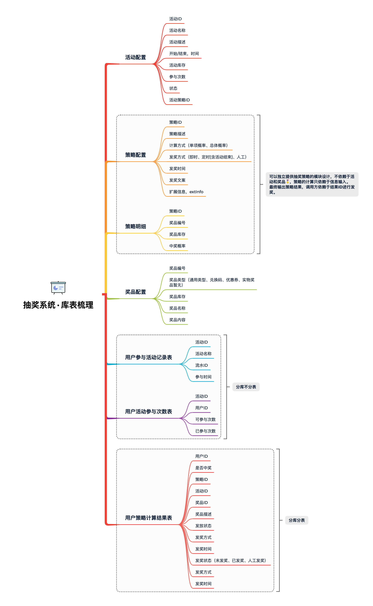

- 活动配置，activity：提供活动的基本配置
- 策略配置，strategy：用于配置抽奖策略，概率、玩法、库存、奖品
- 策略明细，strategy_detail：抽奖策略的具体明细配置
- 奖品配置，award：用于配置具体可以得到的奖品
- 用户参与活动记录表，user_take_activity：每个用户参与活动都会记录下他的参与信息，时间、次数
- 用户活动参与次数表，user_take_activity_count：用于记录当前参与了多少次
- 用户策略计算结果表，user_strategy_export_001~004：最终策略结果的一个记录，也就是奖品中奖信息的内容


### 4.2 建立表结构

1⃣️：**lottery**

```sql
create database lottery;

-- auto-generated definition
create table activity
(
    id            bigint auto_increment comment '自增ID',
    activityId    bigint       null comment '活动ID',
    activityName  varchar(64)  not null comment '活动名称',
    activityDesc  varchar(128) null comment '活动描述',
    beginDateTime datetime     not null comment '开始时间',
    endDateTime   datetime     not null comment '结束时间',
    stockCount    int          not null comment '库存',
    takeCount     int          null comment '每人可参与次数',
    state         int          null comment '活动状态：编辑、提审、撤审、通过、运行、拒绝、关闭、开启',
    creator       varchar(64)  not null comment '创建人',
    createTime    datetime     not null comment '创建时间',
    updateTime    datetime     not null comment '修改时间',
    constraint activity_id_uindex
        unique (id)
)
    comment '活动配置';

alter table activity
    add primary key (id);

-- auto-generated definition
create table award
(
    id           bigint(11) auto_increment comment '自增ID'
        primary key,
    awardId      bigint                             null comment '奖品ID',
    awardType    int(4)                             null comment '奖品类型（文字描述、兑换码、优惠券、实物奖品暂无）',
    awardCount   int                                null comment '奖品数量',
    awardName    varchar(64)                        null comment '奖品名称',
    awardContent varchar(128)                       null comment '奖品内容「文字描述、Key、码」',
    createTime   datetime default CURRENT_TIMESTAMP null comment '创建时间',
    updateTime   datetime default CURRENT_TIMESTAMP null comment 'updateTime'
)
    comment '奖品配置';

-- auto-generated definition
create table strategy
(
    id           bigint(11) auto_increment comment '自增ID'
        primary key,
    strategyId   bigint(11)   not null comment '策略ID',
    strategyDesc varchar(128) null comment '策略描述',
    strategyMode int(4)       null comment '策略方式「1:单项概率、2:总体概率」',
    grantType    int(4)       null comment '发放奖品方式「1:即时、2:定时[含活动结束]、3:人工」',
    grantDate    datetime     null comment '发放奖品时间',
    extInfo      varchar(128) null comment '扩展信息',
    createTime   datetime     null comment '创建时间',
    updateTime   datetime     null comment '修改时间',
    constraint strategy_strategyId_uindex
        unique (strategyId)
)
    comment '策略配置';

-- auto-generated definition
create table strategy_detail
(
    id         bigint(11) auto_increment comment '自增ID'
        primary key,
    strategyId bigint(11)    not null comment '策略ID',
    awardId    bigint(11)    null comment '奖品ID',
    awardCount int           null comment '奖品数量',
    awardRate  decimal(5, 2) null comment '中奖概率',
    createTime datetime      null comment '创建时间',
    updateTime datetime      null comment '修改时间'
)
    comment '策略明细';

```


2⃣️： **lottery_01.sql ~ lottery_02.sql**

```sql
create database lottery_01;

-- auto-generated definition
create table user_take_activity
(
    id           bigint    null,
    uId          tinytext  null,
    takeId       bigint    null,
    activityId   bigint    null,
    activityName tinytext  null,
    takeDate     timestamp null,
    takeCount    int       null,
    uuid         tinytext  null,
    createTime   timestamp null,
    updateTime   timestamp null
)
    comment '用户参与活动记录表';

-- auto-generated definition
create table user_take_activity_count
(
    id         bigint    null,
    uId        tinytext  null,
    activityId bigint    null,
    totalCount int       null,
    leftCount  int       null,
    createTime timestamp null,
    updateTime timestamp null
)
    comment '用户活动参与次数表';

-- auto-generated definition
create table user_strategy_export_001(id           bigint     null,uId          mediumtext null,activityId   bigint     null,orderId      bigint     null,strategyId   bigint     null,strategyType int        null,grantType    int        null,grantDate    timestamp  null,grantState   int        null,awardId      bigint     null,awardType    int        null,awardName    mediumtext null,awardContent mediumtext null,uuid         mediumtext null,createTime   timestamp  null,updateTime   timestamp  null) comment '用户策略计算结果表';
create table user_strategy_export_002(id           bigint     null,uId          mediumtext null,activityId   bigint     null,orderId      bigint     null,strategyId   bigint     null,strategyType int        null,grantType    int        null,grantDate    timestamp  null,grantState   int        null,awardId      bigint     null,awardType    int        null,awardName    mediumtext null,awardContent mediumtext null,uuid         mediumtext null,createTime   timestamp  null,updateTime   timestamp  null) comment '用户策略计算结果表';
create table user_strategy_export_003(id           bigint     null,uId          mediumtext null,activityId   bigint     null,orderId      bigint     null,strategyId   bigint     null,strategyType int        null,grantType    int        null,grantDate    timestamp  null,grantState   int        null,awardId      bigint     null,awardType    int        null,awardName    mediumtext null,awardContent mediumtext null,uuid         mediumtext null,createTime   timestamp  null,updateTime   timestamp  null) comment '用户策略计算结果表';
create table user_strategy_export_004(id           bigint     null,uId          mediumtext null,activityId   bigint     null,orderId      bigint     null,strategyId   bigint     null,strategyType int        null,grantType    int        null,grantDate    timestamp  null,grantState   int        null,awardId      bigint     null,awardType    int        null,awardName    mediumtext null,awardContent mediumtext null,uuid         mediumtext null,createTime   timestamp  null,updateTime   timestamp  null) comment '用户策略计算结果表';

```

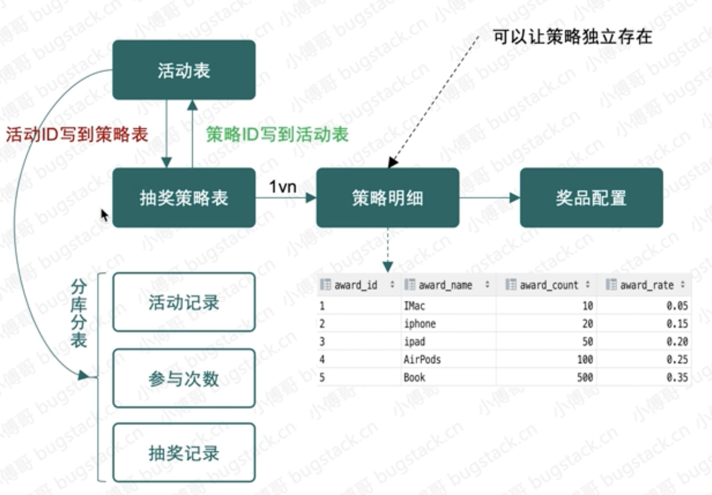


通常分库分表的几个常见方面； 1. 访问频率：对于高频访问的数据，可以将其存储在单独的数据库或表中，以提高读写性能。 2. 数据大小：对于大量的数据，可以将其拆分到多个表中，以减少单表的数据量，降低存储开销。 3. 数据类型：对于不同类型的数据，可以将其拆分到不同的数据库或表中，便于管理和查询。 4. 数据范围：对于不同范围的数据，可以将其拆分到不同的数据库或表中，便于数据的管理和查询。 分库分表的主要目的在于；数据分摊、提高QPS/TPS、分摊压力、提高可扩展性。比如；比如数据库的读写性能下降，或者单表数据量过大，这时候您就需要考虑进行分库分表操作了。通过拆分数据库，可以将单个数据库的压力分摊到多个数据库上，从而避免单个数据库的性能瓶颈，提高系统的性能和可扩展性。此外，分库分表还可以解决数据库存储容量的限制，提高数据库的存储能力。 另外在分库分表之后，数据的一致性会受到影响，数据库的管理和维护成本也会增加。因此，在考虑分库分表时，需要仔细权衡利弊，确定是否真的需要进行分库分表操作。也就是你的开发成本问题。因为有分库分表就会相应的引入 canal binlog同步、es、mq、xxl-job等分布式技术栈。

接下来我们会围绕这些库表一点点实现各个领域的功能，包括：抽奖策略领域、奖品发放领域、活动信息领域等


## 5. 抽奖策略领域模块开发

MVC与DDD的区别：

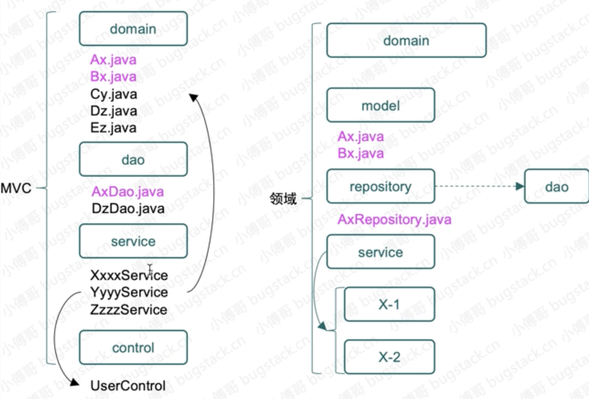

DDD优点：service包装各种领域的实现，Ax的对象只服务于Ax的仓储，没有其他业务领域使用这个对象，service也只专注于当前服务的实现。

**描述：在domain抽奖领域模块实现两种抽奖策略算法，包括：单项概率抽奖和整体概率抽奖，并提供统一的调用方式**

### 5.1 需求引出设计

**需求：**在一场营销抽奖活动玩法中，运营人员通常会配置不同形式的抽奖玩法。例如在转盘中配置12个奖品，每个奖品配置不同的中奖概率，当1个奖品被抽空了以后，那么再抽奖时，是剩余的奖品总概率均匀分配在11个奖品上，还是保持剩余11个奖品的中奖概率，如果抽到为空的奖品则表示未中奖。其实这两种方式在实际的运营过程中都会有所选取，主要是为了配合不同的玩法。

**设计**：在进行抽奖领域模块设计时，需要考虑到库表中要有对应的字段来区分当前运营选择的是什么样的抽奖策略。那么在开发实现上也会用到对应的`策略模式`的使用，两种抽奖算法可以算是不同的抽奖策略，最终提供统一的接口包装满足不同的抽奖功能调用。

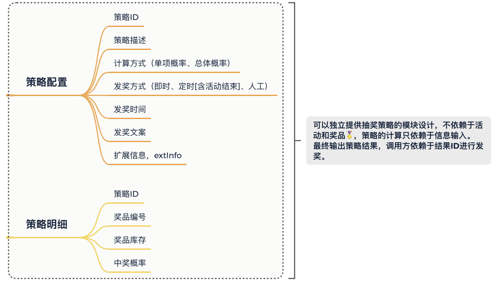

- 库表设计上需要策略配置和策略明细，他们的关系是`1 v n`
- 另外为了让抽奖策略成为可以独立配置和使用的领域模块，在策略表用不引入活动ID信息的配置。因为在建设领域模块的时候，我们需要把让这部分的领域实现具有可独立运行的特性，不让它被业务逻辑污染，它只是一种无业务逻辑的通用共性的功能领域模块，在业务组合的过程中可以使用此功能领域提供的标准接口。
- 通过这样的设计实现，就可以满足于不同业务场景的灵活调用，例如：有些业务场景是需要你直接来进行抽奖反馈中奖信息发送给用户，但还有一些因为用户下单支付才满足抽奖条件的场景对应的奖品是需要延时到账的，避免用户在下单后又进行退单，这样造成了刷单的风险。`所以有时候你的设计是与业务场景息息相关的`

### 5.2 领域功能结构

抽奖系统工程采用DDD架构 + Module模块方式搭建，lottery-domain 是专门用于开发领域服务的模块，不限于目前的抽奖策略在此模块下实现还有以后需要实现的活动领域、规则引擎、用户服务等都需要在这个模块实现对应的领域功能。


strategy 是第1个在 domain 下实现的抽奖策略领域，在领域功能开发的服务下主要含有model、repository、service三块区域，接下来分别介绍下在抽奖领域中这三块区域都做了哪些事情。

- model，用于提供vo、req、res 和 aggregates 聚合对象。
- repository，提供仓储服务，其实也就是对Mysql、Redis等数据的统一包装。
- service，是具体的业务领域逻辑实现层，在这个包下定义了algorithm抽奖算法实现和具体的抽奖策略包装 draw 层，对外提供抽奖接口 IDrawExec#doDrawExec

### 5.3 抽奖算法实现

两种抽奖算法描述，场景A20%、B30%、C50%

- **总体概率**：如果A奖品抽空后，B和C奖品的概率按照 `3:5` 均分，相当于B奖品中奖概率由 `0.3` 升为 `0.375`
- **单项概率**：如果A奖品抽空后，B和C保持目前中奖概率，用户抽奖扔有20%中为A，因A库存抽空则结果展示为未中奖。*为了运营成本，通常这种情况的使用的比较多*

#### 5.3.1 定义接口

`com.banana69.lottery.domain.strategy.service.algorithm.IDrawAlgorithm`

```java
public interface IDrawAlgorithm {

    /**
     * SecureRandom 生成随机数，索引到对应的奖品信息返回结果
     *
     * @param strategyId 策略ID
     * @param excludeAwardIds 排除掉已经不能作为抽奖的奖品ID，留给风控和空库存使用
     * @return 中奖结果
     */
    String randomDraw(Long strategyId, List<String> excludeAwardIds);
}
```

无论任何一种抽奖算法的使用，都以这个接口作为标准的抽奖接口进行抽奖。`strategyId` 是抽奖策略、`excludeAwardIds` 排除掉已经不能作为抽奖的奖品ID，留给风控和空库存使用

#### 5.3.2 总体概率算法

**算法描述**：分别把A、B、C对应的概率值转换成阶梯范围值，A=(0~0.2」、B=(0.2-0.5」、C=(0.5-1.0」，当使用随机数方法生成一个随机数后，与阶梯范围值进行循环比对找到对应的区域，匹配到中奖结果。

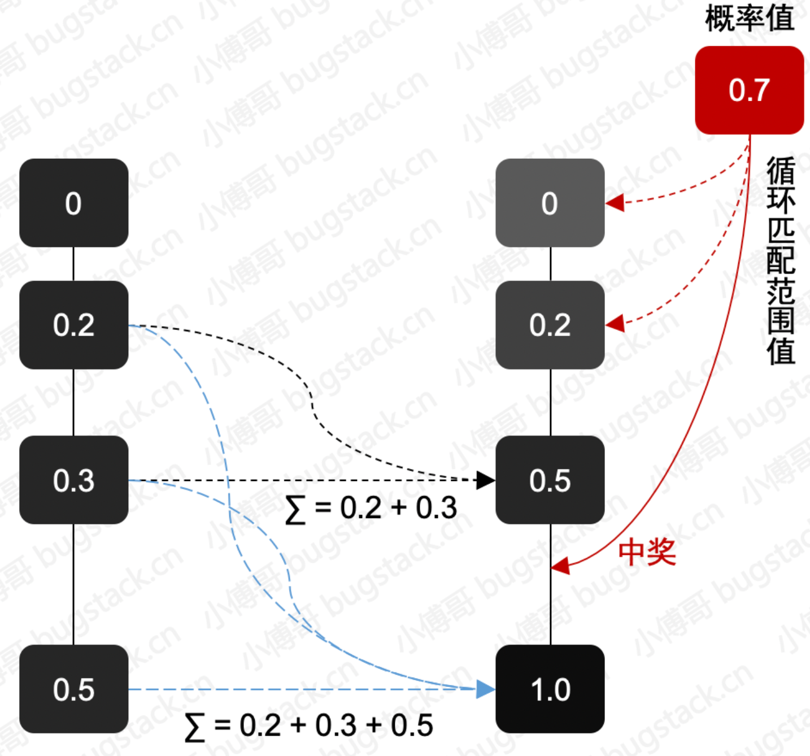

如果使用常见的抽奖算法，设置搜索概率，给不同的奖品设置不同的概率，给它们对应的不同范围值，但在高并发的场景下，如果大家都抽到了同一个区间，性能曲线波动会比较频繁，时间范围就比较大。

**这里使用斐波那契算法**

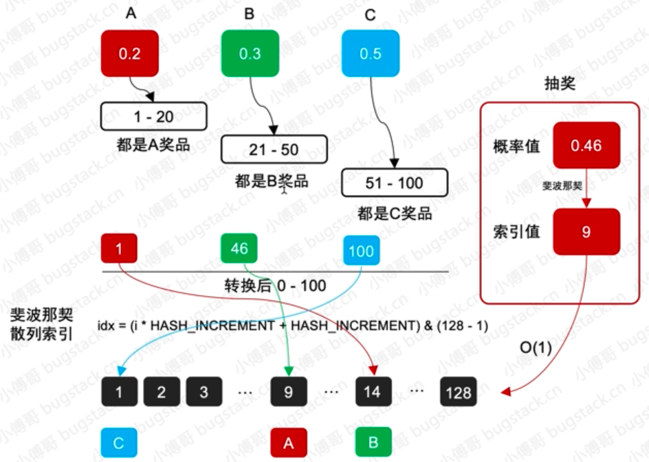

给不同的奖品设置一个概率码，不同的码对应不同的奖品，使用128个长度来存放这些不同奖品对应的数值，通过斐波那契算法将概率只转换为对应的索引值，在一些并发场景的下的抽奖效率会更高一些。

**为什么不使用HashMap：**可能存在hash碰撞，当产生碰撞后产生一个数据链，当超过8个时会转换成红黑树，斐波那契散列痛通过黄金分割点进行增量计算，散列效果更好，在最小空间下实现不碰撞。hashmap的负载因子决定哈希桶的大小，占用的空间也会更大。


```java
public class DefaultRateRandomDrawAlgorithm extends BaseAlgorithm {

    @Override
    public String randomDraw(Long strategyId, List<String> excludeAwardIds) {

        BigDecimal differenceDenominator = BigDecimal.ZERO;

        // 排除掉不在抽奖范围的奖品ID集合
        List<AwardRateInfo> differenceAwardRateList = new ArrayList<>();
        List<AwardRateInfo> awardRateIntervalValList = awardRateInfoMap.get(strategyId);
        for (AwardRateInfo awardRateInfo : awardRateIntervalValList) {
            String awardId = awardRateInfo.getAwardId();
            if (excludeAwardIds.contains(awardId)) {
                continue;
            }
            differenceAwardRateList.add(awardRateInfo);
            differenceDenominator = differenceDenominator.add(awardRateInfo.getAwardRate());
        }

        // 前置判断
        if (differenceAwardRateList.size() == 0) return "";
        if (differenceAwardRateList.size() == 1) return differenceAwardRateList.get(0).getAwardId();

        // 获取随机概率值
        SecureRandom secureRandom = new SecureRandom();
        int randomVal = secureRandom.nextInt(100) + 1;

        // 循环获取奖品
        String awardId = "";
        int cursorVal = 0;
        for (AwardRateInfo awardRateInfo : differenceAwardRateList) {
            int rateVal = awardRateInfo.getAwardRate().divide(differenceDenominator, 2, BigDecimal.ROUND_UP).multiply(new BigDecimal(100)).intValue();
            if (randomVal <= (cursorVal + rateVal)) {
                awardId = awardRateInfo.getAwardId();
                break;
            }
            cursorVal += rateVal;
        }

        // 返回中奖结果
        return awardId;
    }

}

```

- 首先要从总的中奖列表中排除掉那些被排除掉的奖品，这些奖品会涉及到概率的值重新计算。
- 如果排除后剩下的奖品列表小于等于1，则可以直接返回对应信息
- 接下来就使用随机数工具生产一个100内的随值与奖品列表中的值进行循环比对，算法时间复杂度O(n)


####  单项概率算法

**算法描述**：单项概率算法不涉及奖品概率重新计算的问题，那么也就是说我们分配好的概率结果是可以固定下来的。好，这里就有一个可以优化的算法，不需要在轮训匹配O(n)时间复杂度来处理中奖信息，而是可以根据概率值存放到HashMap或者自定义散列数组进行存放结果，这样就可以根据概率值直接定义中奖结果，时间复杂度由O(n)降低到O(1)。这样的设计在一般电商大促并发较高的情况下，达到优化接口响应时间的目的。

```java
@Component("singleRateRandomDrawAlgorithm")
public class singleRateRandomDrawAlgorithm extends BaseAlgorithm {
    @Override
    public String randomDraw(Long strategyId, List<String> excludeAwardIds) {
        // 获取策略对应的元组
        String[] rateTuple = super.rateTupleMap.get(strategyId);
        assert rateTuple != null;

        // 随机索引
        int randomVal = new SecureRandom().nextInt(100) + 1;
        int idx = super.hashIdx(randomVal);

        // 返回结果
        String awardId = rateTuple[idx];
        if(excludeAwardIds.contains(awardId)){
            return "未中奖";
        }

        return awardId;
    }
}
```

#### 测试结果

```java
@SpringBootTest
@RunWith(SpringRunner.class)
public class DrawAlgorithmTest {

    @Resource(name = "defaultRateRandomDrawAlgorithm")
    private IDrawAlgorithm randomDrawAlgorithm;

    @Resource(name = "singleRateRandomDrawAlgorithm")
    private IDrawAlgorithm singleRateRandomDrawAlgorithm;


    @Before
    public void init() {
        // 奖品信息
        List<AwardRateInfo> strategyList = new ArrayList<>();
        strategyList.add(new AwardRateInfo("一等奖：IMac", new BigDecimal("0.05")));
        strategyList.add(new AwardRateInfo("二等奖：iphone", new BigDecimal("0.15")));
        strategyList.add(new AwardRateInfo("三等奖：ipad", new BigDecimal("0.20")));
        strategyList.add(new AwardRateInfo("四等奖：AirPods", new BigDecimal("0.25")));
        strategyList.add(new AwardRateInfo("五等奖：充电宝", new BigDecimal("0.35")));

        // 初始数据
        randomDrawAlgorithm.initRateTuple(100001L, strategyList);

        singleRateRandomDrawAlgorithm.initRateTuple(100002L, strategyList);


    }

    @Test
    public void test_randomDrawAlgorithm(){
        List<String> excludes = new ArrayList<String>();
        excludes.add("二等奖: iPhone");
        excludes.add("四等奖: Airpods");

        for(int i = 0; i < 20; i++){
            System.out.println("中奖结果：" +
                    randomDrawAlgorithm.randomDraw(100001L, excludes));
        }
    }

    @Test
    public void test_singleRateRandomDrawAlgorithm(){
        List<String> excludes = new ArrayList<String>();
        excludes.add("二等奖: iPhone");
        excludes.add("四等奖: Airpods");
        excludes.add("一等奖：IMac");
        excludes.add("三等奖：ipad");
        excludes.add("五等奖：充电宝");

        for(int i = 0; i < 20; i++){
            System.out.println("中奖结果：" +
                    singleRateRandomDrawAlgorithm.randomDraw(100002L, excludes));
        }
    }

}
```

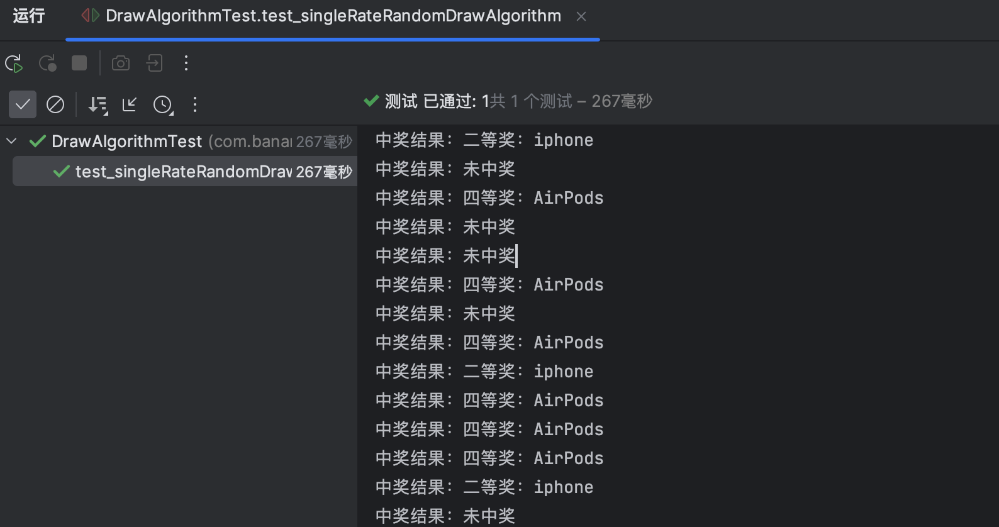


## 6.模板模式处理抽奖流程

本节内容：基于模板设计模式，规范化抽奖执行流程。包括：提取抽象类、编排模板流程、定义抽象方法、执行抽奖策略、扣减中奖库存、包装返回结果等，并基于P3C标准完善本次开发涉及到的代码规范化处理。

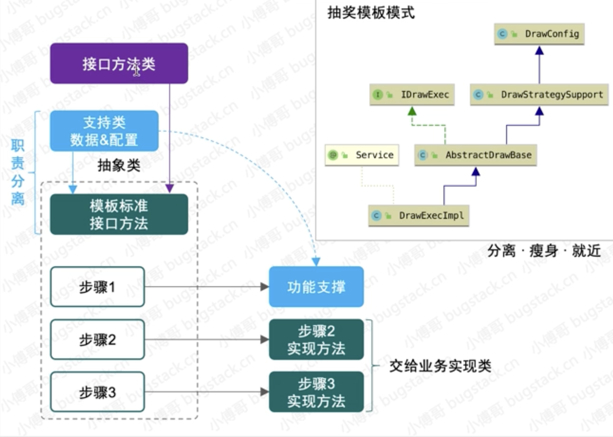

将接口的职责，功能分离，不需要把所有的内容都放到抽象类中

### 6.1 开发日志

使用IDEA P3C插件`Alibaba Java Coding Guidelines`，统一标准化编码方式。

调整表`lottery.strategy_detail`，添加`awardSurplusCount`字段，用于记录扣减奖品库存使用数量。

**【重点】**使用`模板方法设计模式`优化类 `DrawExecImpl` 抽奖过程方法实现，主要以抽象类 `AbstractDrawBase` 编排定义流程，定义抽象方法由类 `DrawExecImpl` 做具体实现的方式进行处理。关于模板模式可以参考下：[重学 Java 设计模式：实战模版模式「模拟爬虫各类电商商品，生成营销推广海报场景」](https://mp.weixin.qq.com/s/3u1gCJBYLna8qwV9dUgpmA)


### 6.2 模版模式应用

本节目标在于把抽奖流程标准化，需要考虑的一条思路包括：

- 根据入参策略ID获取抽奖策略配置
- 校验和处理抽奖策略的数据初始化到内存
- 获取那些被排除掉的抽奖列表，这些奖品可能是已经奖品库存为空，或者因为风控策略不能给这个用户薅羊毛的奖品
- 执行抽奖算法
- 包装中奖结果

#### 6.2.1 工程结构

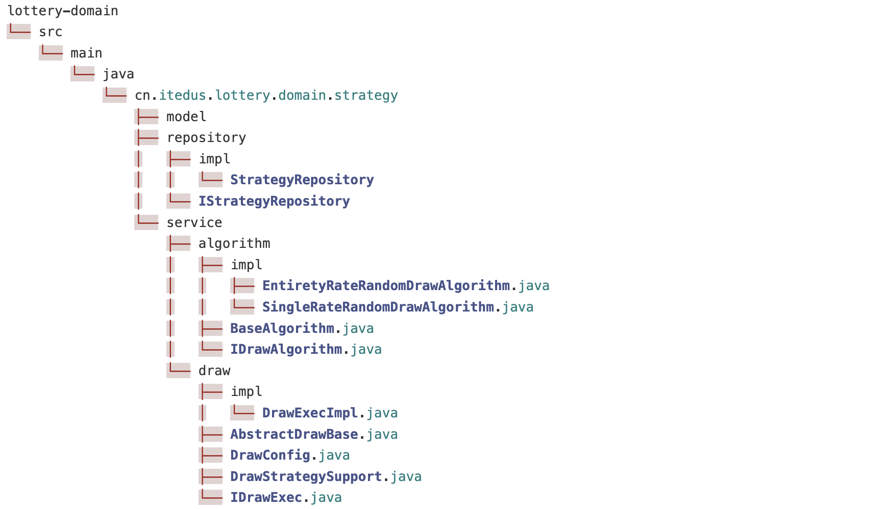

- 主要在于对领域模块`lottery-domain.strategy`中`draw`下的类处理
- **DrawConfig**：配置抽奖策略，SingleRateRandomDrawAlgorithm，EntireTyRateRandomDrawAlgorithm
- **DrawStrategySupport**：提供抽奖策略数据支持，便于查询策略配置、奖品信息。通过这样的方式隔离职责。
- **AbstractDrawBase**：抽象类定义模板方法流程，在抽象类的 `doDrawExec` 方法中，处理整个抽奖流程，并提供在流程中需要使用到的抽象方法，由 `DrawExecImpl` 服务逻辑中做具体实现。


#### 6.2.2 定义抽象抽奖过程，模版模式

```java
public abstract class AbstractDrawBase extends DrawStrategySupport implements IDrawExec {

    private Logger logger  = LoggerFactory.getLogger(AbstractDrawBase.class);

    @Override
    public DrawResult doDrawExec(DrawReq req) {
        // 1. 获取抽奖策略
        StrategyRich strategyRich = super.queryStrategyRich(req.getStrategyId());
        Strategy strategy = strategyRich.getStrategy();

        // 2. 校验抽奖策略是否已经初始化
        this.checkAndInitRateData(req.getStrategyId(), strategy.getStrategyMode(),strategyRich.getStrategyDetailList());

        // 3. 获取不在抽奖范围内的列表，包括：奖品库存为空、风控策略、临时调整等
        List<String> excludeAwardIds = this.queryExcludeAwardIds(req.getStrategyId());

        // 4. 执行抽奖算法
        String awardId = this.drawAlgorithm(req.getStrategyId(), drawAlgorithmGroup.get(strategy.getStrategyMode()), excludeAwardIds);

        // 5. 包装中奖结果
        return buildDrawResult(req.getUId(), req.getStrategyId(), awardId);
    }

    /**
     * 获取不在抽奖范围内的列表，包括：奖品库存为空、风控策略、临时调整等，这类数据是含有业务逻辑的，所以需要由具体地实现方决定
     * @param strategyId 策略ID
     * @return 排除的奖品ID集合
     */
    protected abstract List<String> queryExcludeAwardIds(Long strategyId);

    /**
     * 执行抽奖算法
     * @param strategyId 策略ID
     * @param drawAlgorithm 抽奖算法模型
     * @param excludeAwardIds 排除的抽奖ID集合
     * @return 中奖奖品ID
     */
    protected abstract String drawAlgorithm(Long strategyId, IDrawAlgorithm drawAlgorithm, List<String> excludeAwardIds);

    /**
     * 校验抽奖策略是否已经初始化到内存
     * @param strategyId 抽奖策略ID
     * @param strategyMode 筹集策略模式
     * @param strategyDetailList 抽奖策略详情
     */
    protected  void checkAndInitRateData(Long strategyId, Integer strategyMode, List<StrategyDetail> strategyDetailList){

        // 非单项概率， 不必存入缓存
        if(!Constants.StrategyMode.SINGLE.getCode().equals(strategyMode)){
            return;
        }
        IDrawAlgorithm drawAlgorithm = drawAlgorithmGroup.get(strategyMode);
        // 已经初始化过的数据，不需要重复初始化
        if(drawAlgorithm.isExistRateTuple(strategyId)){
            return;
        }
        // 解析并初始化中奖概率数据的散列表
        List<AwardRateInfo> awardRateInfoList = new ArrayList<>(strategyDetailList.size());
        for(StrategyDetail strategyDetail : strategyDetailList){
            awardRateInfoList.add(new AwardRateInfo(strategyDetail.getAwardId(), strategyDetail.getAwardRate()));
        }
        drawAlgorithm.initRateTuple(strategyId,awardRateInfoList);
    }

    /**
     * 包装抽奖结果
     * @param uId 用户ID
     * @param strategyId 策略ID
     * @param awardId 奖品ID，null 情况：并发抽奖情况下，库存临界值1 -> 0，会有用户中奖结果为 null
     * @return
     */
    private DrawResult buildDrawResult(String uId, Long strategyId, String awardId) {
        if(awardId== null){
            logger.info("执行策略抽奖完成【未中奖】，用户：{} 策略ID：{}", uId, strategyId);
            return new DrawResult(uId, strategyId, Constants.DrawState.FAIL.getCode());
        }
        Award award = super.queryAwardInfoByAwardId(awardId);
        DrawAwardInfo drawAwardInfo = new DrawAwardInfo(award.getAwardId(), award.getAwardName());
        logger.info("执行策略抽奖完成【已中奖】，用户：{} 策略ID：{} 奖品ID：{} 奖品名称：{}", uId, strategyId, awardId, award.getAwardName());
        return new DrawResult(uId, strategyId, Constants.DrawState.SUCCESS.getCode(), drawAwardInfo);
    }

}
```

- 抽象类 AbstractDrawBase 继承了 DrawStrategySupport 类包装的配置和数据查询功能，并实现接口 IDrawExec#doDrawExec 方法，对抽奖进行编排操作。
- 在 doDrawExec 方法中，主要定义了5个步骤：`获取抽奖策略`、`校验抽奖策略是否已经初始化到内存`、`获取不在抽奖范围内的列表，包括：奖品库存为空、风控策略、临时调整等`、`执行抽奖算法`、`包装中奖结果`，和2个抽象方法 `queryExcludeAwardIds`、`drawAlgorithm`。

#### 6.2.3 抽奖过程方法实现

```java
@Service("drawExec")
public class DrawExecImpl extends AbstractDrawBase {

    private Logger logger = LoggerFactory.getLogger(DrawExecImpl.class);

    @Resource
    private IStrategyRepository strategyRepository;


    @Override
    protected List<String> queryExcludeAwardIds(Long strategyId) {
        List<String> awardList = strategyRepository.queryNoStockStrategyAwardList(strategyId);
        logger.info("执行抽奖策略 strategyId：{}，无库存排除奖品列表ID集合 awardList：{}", strategyId, JSON.toJSONString(awardList));
        return awardList;

    }

    @Override
    protected String drawAlgorithm(Long strategyId, IDrawAlgorithm drawAlgorithm, List<String> excludeAwardIds) {
        // 执行抽奖
        String awardId = drawAlgorithm.randomDraw(strategyId, excludeAwardIds);

        // 判断抽奖结果
        if(null == awardId){
            return null;
        }

        // TODO: Redis
        /*
         * 扣减库存，暂时采用数据库行级锁的方式进行扣减库存，后续优化为 Redis 分布式锁扣减 decr/incr
         * 注意：通常数据库直接锁行记录的方式并不能支撑较大体量的并发，但此种方式需要了解，
         * 因为在分库分表下的正常数据流量下的个人数据记录中，是可以使用行级锁的，因为他只影响到自己的记录，不会影响到其他人
         */
        boolean isSuccess = strategyRepository.deductStock(strategyId, awardId);

        // 返回结果，库存扣减成功返回奖品ID，否则返回NULL 「在实际的业务场景中，如果中奖奖品库存为空，则会发送兜底奖品，比如各类券」
        return isSuccess ? awardId : null;

    }
}
```

- 抽象方法的具体实现类**DrawExecImpl**，分别实现了`queryExcludeAwardIds、drawAlgorithm`两个抽象方法，这两个方法可能随着实现方有不同的方式变化，不适合定义成通用的方法。
- queryExcludeAwardIds：排除奖品ID，可以包含无库存奖品，也可能是业务逻辑限定的风控策略排除奖品等，所以交给业务实现类做具体处理。
- drawAlgorithm：是算法抽奖的具体调用处理，因为这里还需要对策略库存进行处理，所以需要单独包装。*注意代码注释，扣减库存*

### 6.3 测试验证

#### 6.3.1 数据准备

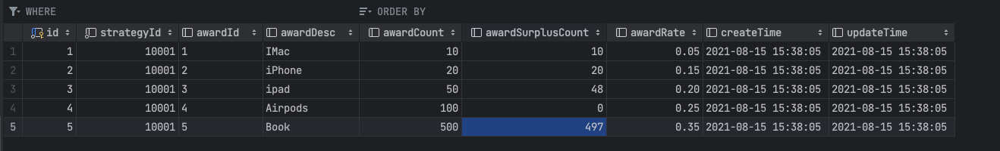

将ID：4 剩余库存设置为 0，在抽奖过程中 ID 4的奖品属于被排除的奖品，不会再抽到该奖品

#### 6.3.2 单元测试

```java
@Test
public void test_drawExec() {
    drawExec.doDrawExec(new DrawReq("小傅哥", 10001L));
    drawExec.doDrawExec(new DrawReq("小佳佳", 10001L));
    drawExec.doDrawExec(new DrawReq("小蜗牛", 10001L));
    drawExec.doDrawExec(new DrawReq("八杯水", 10001L));
}
```

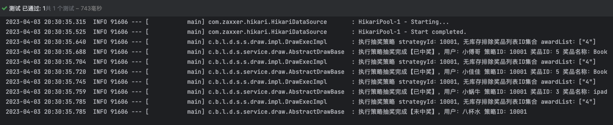


## 7. 简单工厂搭建发奖领域

使用简单工厂，避免使用过多的`if-else`判断奖品的类型。

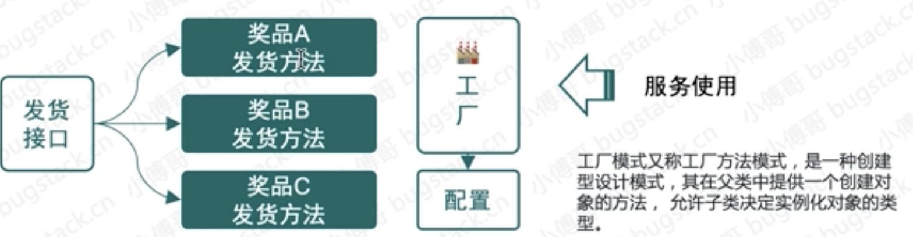

所有的方法交给工厂，工厂方法提供获取创建对象。奖品服务交给工厂处理，通过map数组类型替换掉`if-else`的过程。

### 7.1 调整数据库表字段名称

使用规范化的字段名称，如activityId` 调整为 `activity_id`，涉及改造的表包括：`activity`、`award`、`strategy`、`strategy_detail

```sql
-- create database lottery;

USE lottery;

SET NAMES utf8mb4;
SET FOREIGN_KEY_CHECKS = 0;

-- ----------------------------
-- Table structure for activity
-- ----------------------------
DROP TABLE IF EXISTS `activity`;
CREATE TABLE `activity` (
  `id` bigint(20) NOT NULL AUTO_INCREMENT COMMENT '自增ID',
  `activity_id` bigint(20) NOT NULL COMMENT '活动ID',
  `activity_name` varchar(64) CHARACTER SET utf8mb4 DEFAULT NULL COMMENT '活动名称',
  `activity_desc` varchar(128) CHARACTER SET utf8mb4 DEFAULT NULL COMMENT '活动描述',
  `begin_date_time` datetime(3) DEFAULT NULL COMMENT '开始时间',
  `end_date_time` datetime(3) DEFAULT NULL COMMENT '结束时间',
  `stock_count` int(11) DEFAULT NULL COMMENT '库存',
  `stock_surplus_count` int(11) DEFAULT NULL COMMENT '库存剩余',
  `take_count` int(11) DEFAULT NULL COMMENT '每人可参与次数',
  `strategy_id` bigint(11) DEFAULT NULL COMMENT '抽奖策略ID',
  `state` tinyint(2) DEFAULT NULL COMMENT '活动状态：1编辑、2提审、3撤审、4通过、5运行(审核通过后worker扫描状态)、6拒绝、7关闭、8开启',
  `creator` varchar(64) CHARACTER SET utf8mb4 DEFAULT NULL COMMENT '创建人',
  `create_time` datetime(3) DEFAULT CURRENT_TIMESTAMP(3) COMMENT '创建时间',
  `update_time` datetime(3) DEFAULT CURRENT_TIMESTAMP(3) COMMENT '修改时间',
  PRIMARY KEY (`id`),         
  UNIQUE KEY `unique_activity_id` (`activity_id`)
) ENGINE=InnoDB AUTO_INCREMENT=4 DEFAULT CHARSET=utf8mb4 COLLATE=utf8mb4_bin COMMENT='活动配置';

-- ----------------------------
-- Records of activity
-- ----------------------------
BEGIN;
INSERT INTO `activity` VALUES (1, 100001, '活动名', '测试活动', '2021-10-01 00:00:00', '2021-12-30 23:59:59', 100, 94, 10, 10001, 5, 'xiaofuge', '2021-08-08 20:14:50', '2021-08-08 20:14:50');
INSERT INTO `activity` VALUES (3, 100002, '活动名02', '测试活动', '2021-10-01 00:00:00', '2021-12-30 23:59:59', 100, 100, 10, 10001, 5, 'xiaofuge', '2021-10-05 15:49:21', '2021-10-05 15:49:21');
COMMIT;

-- ----------------------------
-- Table structure for award
-- ----------------------------
DROP TABLE IF EXISTS `award`;
CREATE TABLE `award` (
  `id` bigint(11) NOT NULL AUTO_INCREMENT COMMENT '自增ID',
  `award_id` varchar(64) CHARACTER SET utf8mb4 DEFAULT NULL COMMENT '奖品ID',
  `award_type` tinyint(4) DEFAULT NULL COMMENT '奖品类型（1:文字描述、2:兑换码、3:优惠券、4:实物奖品）',
  `award_name` varchar(64) CHARACTER SET utf8mb4 DEFAULT NULL COMMENT '奖品名称',
  `award_content` varchar(128) CHARACTER SET utf8mb4 DEFAULT NULL COMMENT '奖品内容「文字描述、Key、码」',
  `create_time` datetime(3) DEFAULT CURRENT_TIMESTAMP(3) COMMENT '创建时间',
  `update_time` datetime(3) DEFAULT CURRENT_TIMESTAMP(3) COMMENT '更新时间',
  PRIMARY KEY (`id`),
  UNIQUE KEY `idx_award_id` (`award_id`)
) ENGINE=InnoDB AUTO_INCREMENT=6 DEFAULT CHARSET=utf8mb4 COLLATE=utf8mb4_bin COMMENT='奖品配置';

-- ----------------------------
-- Records of award
-- ----------------------------
BEGIN;
INSERT INTO `award` VALUES (1, '1', 1, 'IMac', 'Code', '2021-08-15 15:38:05', '2021-08-15 15:38:05');
INSERT INTO `award` VALUES (2, '2', 1, 'iphone', 'Code', '2021-08-15 15:38:05', '2021-08-15 15:38:05');
INSERT INTO `award` VALUES (3, '3', 1, 'ipad', 'Code', '2021-08-15 15:38:05', '2021-08-15 15:38:05');
INSERT INTO `award` VALUES (4, '4', 1, 'AirPods', 'Code', '2021-08-15 15:38:05', '2021-08-15 15:38:05');
INSERT INTO `award` VALUES (5, '5', 1, 'Book', 'Code', '2021-08-15 15:38:05', '2021-08-15 15:38:05');
COMMIT;

-- ----------------------------
-- Table structure for rule_tree
-- ----------------------------
DROP TABLE IF EXISTS `rule_tree`;
CREATE TABLE `rule_tree` (
  `id` bigint(20) NOT NULL AUTO_INCREMENT COMMENT '主键ID',
  `tree_name` varchar(64) DEFAULT NULL COMMENT '规则树Id',
  `tree_desc` varchar(128) DEFAULT NULL COMMENT '规则树描述',
  `tree_root_node_id` bigint(20) DEFAULT NULL COMMENT '规则树根ID',
  `create_time` datetime(3) DEFAULT NULL COMMENT '创建时间',
  `update_time` datetime(3) DEFAULT NULL COMMENT '更新时间',
  PRIMARY KEY (`id`)
) ENGINE=InnoDB AUTO_INCREMENT=2110081903 DEFAULT CHARSET=utf8;

-- ----------------------------
-- Records of rule_tree
-- ----------------------------
BEGIN;
INSERT INTO `rule_tree` VALUES (2110081902, '抽奖活动规则树', '用于决策不同用户可参与的活动', 1, '2021-10-08 15:38:05', '2021-10-08 15:38:05');
COMMIT;

-- ----------------------------
-- Table structure for rule_tree_node
-- ----------------------------
DROP TABLE IF EXISTS `rule_tree_node`;
CREATE TABLE `rule_tree_node` (
  `id` bigint(20) NOT NULL AUTO_INCREMENT COMMENT '主键ID',
  `tree_id` int(2) DEFAULT NULL COMMENT '规则树ID',
  `node_type` int(2) DEFAULT NULL COMMENT '节点类型；1子叶、2果实',
  `node_value` varchar(32) DEFAULT NULL COMMENT '节点值[nodeType=2]；果实值',
  `rule_key` varchar(16) DEFAULT NULL COMMENT '规则Key',
  `rule_desc` varchar(32) DEFAULT NULL COMMENT '规则描述',
  PRIMARY KEY (`id`)
) ENGINE=InnoDB AUTO_INCREMENT=123 DEFAULT CHARSET=utf8;

-- ----------------------------
-- Records of rule_tree_node
-- ----------------------------
BEGIN;
INSERT INTO `rule_tree_node` VALUES (1, 2110081902, 1, NULL, 'userGender', '用户性别[男/女]');
INSERT INTO `rule_tree_node` VALUES (11, 2110081902, 1, NULL, 'userAge', '用户年龄');
INSERT INTO `rule_tree_node` VALUES (12, 2110081902, 1, NULL, 'userAge', '用户年龄');
INSERT INTO `rule_tree_node` VALUES (111, 2110081902, 2, '100001', NULL, NULL);
INSERT INTO `rule_tree_node` VALUES (112, 2110081902, 2, '100002', NULL, NULL);
INSERT INTO `rule_tree_node` VALUES (121, 2110081902, 2, '100003', NULL, NULL);
INSERT INTO `rule_tree_node` VALUES (122, 2110081902, 2, '100004', NULL, NULL);
COMMIT;

-- ----------------------------
-- Table structure for rule_tree_node_line
-- ----------------------------
DROP TABLE IF EXISTS `rule_tree_node_line`;
CREATE TABLE `rule_tree_node_line` (
  `id` bigint(20) NOT NULL AUTO_INCREMENT COMMENT '主键ID',
  `tree_id` bigint(20) DEFAULT NULL COMMENT '规则树ID',
  `node_id_from` bigint(20) DEFAULT NULL COMMENT '节点From',
  `node_id_to` bigint(20) DEFAULT NULL COMMENT '节点To',
  `rule_limit_type` int(2) DEFAULT NULL COMMENT '限定类型；1:=;2:>;3:<;4:>=;5<=;6:enum[枚举范围];7:果实',
  `rule_limit_value` varchar(32) DEFAULT NULL COMMENT '限定值',
  PRIMARY KEY (`id`)
) ENGINE=InnoDB AUTO_INCREMENT=7 DEFAULT CHARSET=utf8;

-- ----------------------------
-- Records of rule_tree_node_line
-- ----------------------------
BEGIN;
INSERT INTO `rule_tree_node_line` VALUES (1, 2110081902, 1, 11, 1, 'man');
INSERT INTO `rule_tree_node_line` VALUES (2, 2110081902, 1, 12, 1, 'woman');
INSERT INTO `rule_tree_node_line` VALUES (3, 2110081902, 11, 111, 3, '25');
INSERT INTO `rule_tree_node_line` VALUES (4, 2110081902, 11, 112, 4, '25');
INSERT INTO `rule_tree_node_line` VALUES (5, 2110081902, 12, 121, 3, '25');
INSERT INTO `rule_tree_node_line` VALUES (6, 2110081902, 12, 122, 4, '25');
COMMIT;

-- ----------------------------
-- Table structure for strategy
-- ----------------------------
DROP TABLE IF EXISTS `strategy`;
CREATE TABLE `strategy` (
  `id` bigint(11) NOT NULL AUTO_INCREMENT COMMENT '自增ID',
  `strategy_id` bigint(11) NOT NULL COMMENT '策略ID',
  `strategy_desc` varchar(128) CHARACTER SET utf8mb4 DEFAULT NULL COMMENT '策略描述',
  `strategy_mode` tinyint(2) DEFAULT NULL COMMENT '策略方式（1:单项概率、2:总体概率）',
  `grant_type` tinyint(2) DEFAULT NULL COMMENT '发放奖品方式（1:即时、2:定时[含活动结束]、3:人工）',
  `grant_date` datetime(3) DEFAULT NULL COMMENT '发放奖品时间',
  `ext_info` varchar(128) CHARACTER SET utf8mb4 DEFAULT NULL COMMENT '扩展信息',
  `create_time` datetime(3) DEFAULT CURRENT_TIMESTAMP(3) ON UPDATE CURRENT_TIMESTAMP(3) COMMENT '创建时间',
  `update_time` datetime(3) DEFAULT CURRENT_TIMESTAMP(3) ON UPDATE CURRENT_TIMESTAMP(3) COMMENT '修改时间',
  PRIMARY KEY (`id`),
  UNIQUE KEY `strategy_strategyId_uindex` (`strategy_id`)
) ENGINE=InnoDB AUTO_INCREMENT=2 DEFAULT CHARSET=utf8mb4 COLLATE=utf8mb4_bin COMMENT='策略配置';

-- ----------------------------
-- Records of strategy
-- ----------------------------
BEGIN;
INSERT INTO `strategy` VALUES (1, 10001, 'test', 2, 1, NULL, '', '2021-09-25 08:15:52', '2021-09-25 08:15:52');
COMMIT;

-- ----------------------------
-- Table structure for strategy_detail
-- ----------------------------
DROP TABLE IF EXISTS `strategy_detail`;
CREATE TABLE `strategy_detail` (
  `id` bigint(11) NOT NULL AUTO_INCREMENT COMMENT '自增ID',
  `strategy_id` bigint(11) NOT NULL COMMENT '策略ID',
  `award_id` varchar(64) CHARACTER SET utf8mb4 DEFAULT NULL COMMENT '奖品ID',
  `award_name` varchar(128) CHARACTER SET utf8mb4 DEFAULT NULL COMMENT '奖品描述',
  `award_count` int(11) DEFAULT NULL COMMENT '奖品库存',
  `award_surplus_count` int(11) DEFAULT '0' COMMENT '奖品剩余库存',
  `award_rate` decimal(5,2) DEFAULT NULL COMMENT '中奖概率',
  `create_time` datetime(3) DEFAULT CURRENT_TIMESTAMP(3) COMMENT '创建时间',
  `update_time` datetime(3) DEFAULT CURRENT_TIMESTAMP(3) COMMENT '修改时间',
  PRIMARY KEY (`id`)
) ENGINE=InnoDB AUTO_INCREMENT=6 DEFAULT CHARSET=utf8mb4 COLLATE=utf8mb4_bin COMMENT='策略明细';

-- ----------------------------
-- Records of strategy_detail
-- ----------------------------
BEGIN;
INSERT INTO `strategy_detail` VALUES (1, 10001, '1', 'IMac', 10, 0, 0.05, '2021-08-15 15:38:05', '2021-08-15 15:38:05');
INSERT INTO `strategy_detail` VALUES (2, 10001, '2', 'iphone', 20, 19, 0.15, '2021-08-15 15:38:05', '2021-08-15 15:38:05');
INSERT INTO `strategy_detail` VALUES (3, 10001, '3', 'ipad', 50, 43, 0.20, '2021-08-15 15:38:05', '2021-08-15 15:38:05');
INSERT INTO `strategy_detail` VALUES (4, 10001, '4', 'AirPods', 100, 70, 0.25, '2021-08-15 15:38:05', '2021-08-15 15:38:05');
INSERT INTO `strategy_detail` VALUES (5, 10001, '5', 'Book', 500, 389, 0.35, '2021-08-15 15:38:05', '2021-08-15 15:38:05');
COMMIT;

SET FOREIGN_KEY_CHECKS = 1;

```


### 7.2 发奖领域服务实现

截止到目前我们开发实现的都是关于 `domain` 领域层的建设，当各项核心的领域服务开发完成以后，则会在 `application` 层做服务编排流程处理的开发。例如：从用户参与抽奖活动、过滤规则、执行抽奖、存放结果、发送奖品等内容的链路处理。涉及的领域如下：

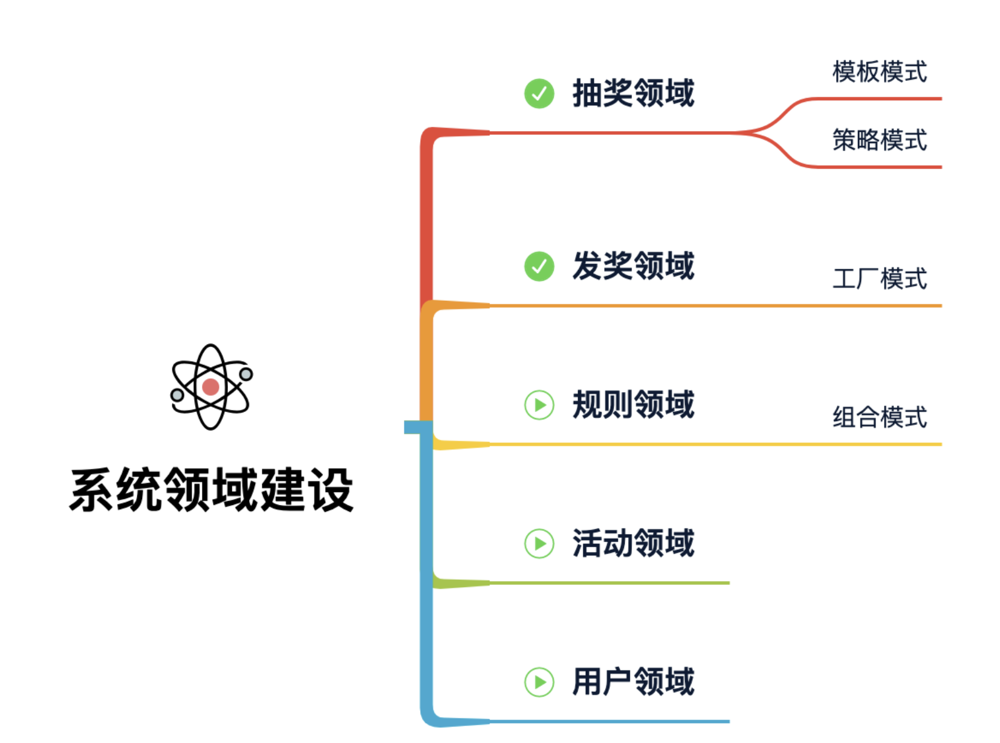

#### 7.2.1 工程结构

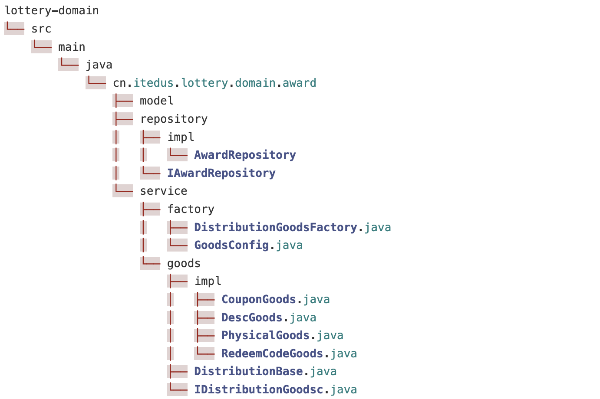

- 关于award发奖领域中主要的核心实现在于service中的两块功能逻辑实现，分别是goods 商品处理`、`factory 工厂
- goods：包装适配各类奖品的发放逻辑，在实际的业务中，需要调用优惠券，兑换码，物流发货等操作，这些内容经过封装后可以在自己的商品类下实现
- factory：工厂模式通过调用方提供的发奖类型，返回对应的发奖服务。通过这样由具体的子类决定返回结果，并且做相应的业务处理。从而不至于让领域层包装太多频繁变化的业务属性，如果核心功能域是在做业务逻辑封装，就会变得非常庞大且混乱。

#### 7.2.2 发奖适配策略

定义奖品配送接口：

```java
public interface IDistributionGoods {
    /**
     * 奖品配送接口，奖品类型（1:文字描述、2:兑换码、3:优惠券、4:实物奖品）
     *
     * @param req   物品信息
     * @return      配送结果
     */
    DistributionRes doDistribution(GoodsReq req);

}
```

抽奖，抽象出配送货物的接口，把各类奖品模拟成货物，配送代表着发货，包括虚拟奖品和实物奖品

**实现发送奖品：CouponGoods、DescGoods、PhysicalGoods、RedeemCodeGoods**

```java
@Component
public class CouponGoods extends DistributionBase implements IDistributionGoods {

    @Override
    public DistributionRes doDistribution(GoodsReq req) {

        // 模拟调用优惠券发放接口
        logger.info("模拟调用优惠券发放接口 uId：{} awardContent：{}", req.getuId(), req.getAwardContent());

        // 更新用户领奖结果
        super.updateUserAwardState(req.getuId(), req.getOrderId(), req.getAwardId(), Constants.AwardState.SUCCESS.getCode(), Constants.AwardState.SUCCESS.getInfo());

        return new DistributionRes(req.getuId(), Constants.AwardState.SUCCESS.getCode(), Constants.AwardState.SUCCESS.getInfo());
    }
}
```

由于抽奖系统并没有与外部系统对接，所以在例如优惠券、兑换码、实物发货上只能通过模拟的方式展示。另外四种发奖方式基本类似。

#### 7.2.3 定义简单工厂

**工厂配置**

```java
public class GoodsConfig {

    /** 奖品发放策略组 */
    protected static Map<Integer, IDistributionGoods> goodsMap = new ConcurrentHashMap<>();

    @Resource
    private DescGoods descGoods;

    @Resource
    private RedeemCodeGoods redeemCodeGoods;

    @Resource
    private CouponGoods couponGoods;

    @Resource
    private PhysicalGoods physicalGoods;

    @PostConstruct
    public void init() {
        goodsMap.put(Constants.AwardType.DESC.getCode(), descGoods);
        goodsMap.put(Constants.AwardType.RedeemCodeGoods.getCode(), redeemCodeGoods);
        goodsMap.put(Constants.AwardType.CouponGoods.getCode(), couponGoods);
        goodsMap.put(Constants.AwardType.PhysicalGoods.getCode(), physicalGoods);
    }
}
```

把四种奖品的发奖，放到一个统一的配置文件类Map中，便于通过AwardType获取相应的对象，减少`if-else`的使用。

**工厂使用**

```java
@Service
public class DistributionGoodsFactory extends GoodsConfig {

    public IDistributionGoods getDistributionGoodsService(Integer awardType){
        return goodsMap.get(awardType);
    }

}
```

配送商品简单工厂，提供获取配送服务


### 7.3 测试

```java
 @Test
    public void test_award() {
        // 执行抽奖
        DrawResult drawResult = drawExec.doDrawExec(new DrawReq("测试用户",10001L));

        // 判断抽奖结果
        Integer drawState = drawResult.getDrawState();
        if(Constants.DrawState.FAIL.getCode().equals(drawState)){
            logger.info("未中奖 DrawAwardInfo is null");
            return;
        }

        // 封装发奖参数，orderId：2109313442431 为模拟ID，需要在用户参与领奖活动时生成
        DrawAwardInfo drawAwardInfo = drawResult.getDrawAwardInfo();
        GoodsReq goodsReq = new GoodsReq(drawResult.getUId(), "2109313442431", drawAwardInfo.getAwardId(), drawAwardInfo.getAwardName(), drawAwardInfo.getAwardContent());

        // 根据 awardType 从抽奖工厂中获取对应的发奖服务
        IDistributionGoods distributionGoodsService = distributionGoodsFactory.getDistributionGoodsService(drawAwardInfo.getAwardType());
        DistributionRes  distributionRes = distributionGoodsService.doDistribution(goodsReq);

        logger.info("测试结果： {}",JSON.toJSONString(distributionRes));
    }
```

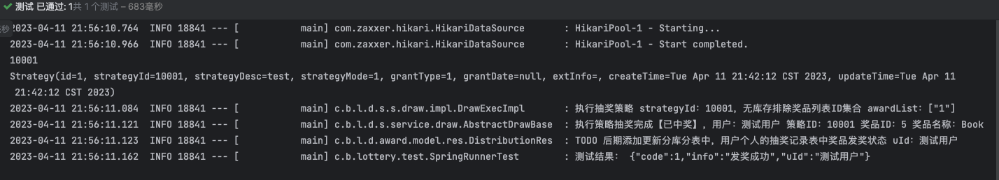


## 8. 活动领域的配置与状态

活动领域部分功能的开发，包括：活动创建、活动状态变更。主要以 domain 领域层下添加 activity 为主，并在对应的 service 中添加 deploy(创建活动)、partake(领取活动，待开发)、stateflow(状态流转) 三个模块。以及调整仓储服务实现到基础层。

### 8.1 开发日志

- 按照 DDD 模型，调整包引用 lottery-infrastructure 引入 lottery-domain，调整后效果`领域层 domain` 定义仓储接口，`基础层 infrastructure` 实现仓储接口。
- 活动领域层需要提供的功能包括：活动创建、活动状态处理和用户领取活动操作，本章节先实现前两个需求，下个章节继续开发其他功能。
- 活动创建的操作主要会用到事务，因为活动系统提供给运营后台创建活动时，需要包括：活动信息、奖品信息、策略信息、策略明细以及其他额外扩展的内容，这些信息都需要在一个事务下进行落库。
- 活动状态的审核，【1编辑、2提审、3撤审、4通过、5运行(审核通过后worker扫描状态)、6拒绝、7关闭、8开启】，这里我们会用到设计模式中的`状态模式`进行处理。


### 8.2 活动创建

**com.banana69.lottery.domain.activity.service.deploy.impl.ActivityDeployImpl**

```java
public class ActivityDeployImpl implements IActivityDeploy {

    private Logger logger = LoggerFactory.getLogger(ActivityDeployImpl.class);

    @Resource
    private IActivityRepository activityRepository;

    @Transactional(rollbackFor = Exception.class)
    @Override
    public void createActivity(ActivityConfigReq req) {
        logger.info("创建活动配置开始，activityId：{}", req.getActivityId());
        ActivityConfigRich activityConfigRich = req.getActivityConfigRich();
        try {
            // 添加活动配置
            ActivityVO activity = activityConfigRich.getActivity();
            activityRepository.addActivity(activity);

            // 添加奖品配置
            List<AwardVO> awardList = activityConfigRich.getAwardList();
            activityRepository.addAward(awardList);

            // 添加策略配置
            StrategyVO strategy = activityConfigRich.getStrategy();
            activityRepository.addStrategy(strategy);

            // 添加策略明细配置
            List<StrategyDetailVO> strategyDetailList = activityConfigRich.getStrategy().getStrategyDetailList();
            activityRepository.addStrategyDetailList(strategyDetailList);

            logger.info("创建活动配置完成，activityId：{}", req.getActivityId());
        } catch (DuplicateKeyException e) {
            logger.error("创建活动配置失败，唯一索引冲突 activityId：{} reqJson：{}", req.getActivityId(), JSON.toJSONString(req), e);
            throw e;
        }
    }

    @Override
    public void updateActivity(ActivityConfigReq req) {
        // TODO: 非核心功能后续补充
    }
}
```

活动的创建操作主要包括：添加活动配置、添加奖品配置、添加策略配置、添加策略明细配置，这些都是在同一个注解事务配置下进行处理 `@Transactional(rollbackFor = Exception.class)`

这里需要注意一点，奖品配置和策略配置都是集合形式的，这里使用了 Mybatis 的一次插入多条数据配置。*如果之前没用过，可以注意下使用方式*


### 8.3 状态模式变更

状态模式：类的行为是基于它的状态改变的，这种类型的设计模式属于行为型模式。它描述的是一个行为下的多种状态变更，比如我们最常见的一个网站的页面，在你登录与不登录下展示的内容是略有差异的(不登录不能展示个人信息)，而这种登录与不登录就是我们通过改变状态，而让整个行为发生了变化。

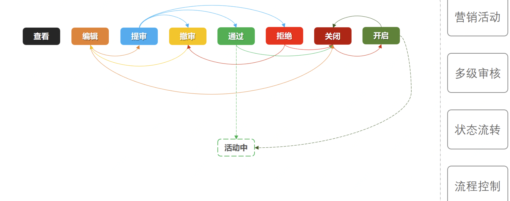

在上图中也可以看到我们的流程节点中包括了各个状态到下一个状态扭转的关联条件，比如；审核通过才能到活动中，而不能从编辑中直接到活动中，而这些状态的转变就是我们要完成的场景处理。

大部分程序员基本都开发过类似的业务场景，需要对活动或者一些配置需要审核后才能对外发布，而这个审核的过程往往会随着系统的重要程度而设立多级控制，来保证一个活动可以安全上线，避免造成误操作引起资损。

#### 8.3.1 工程结构

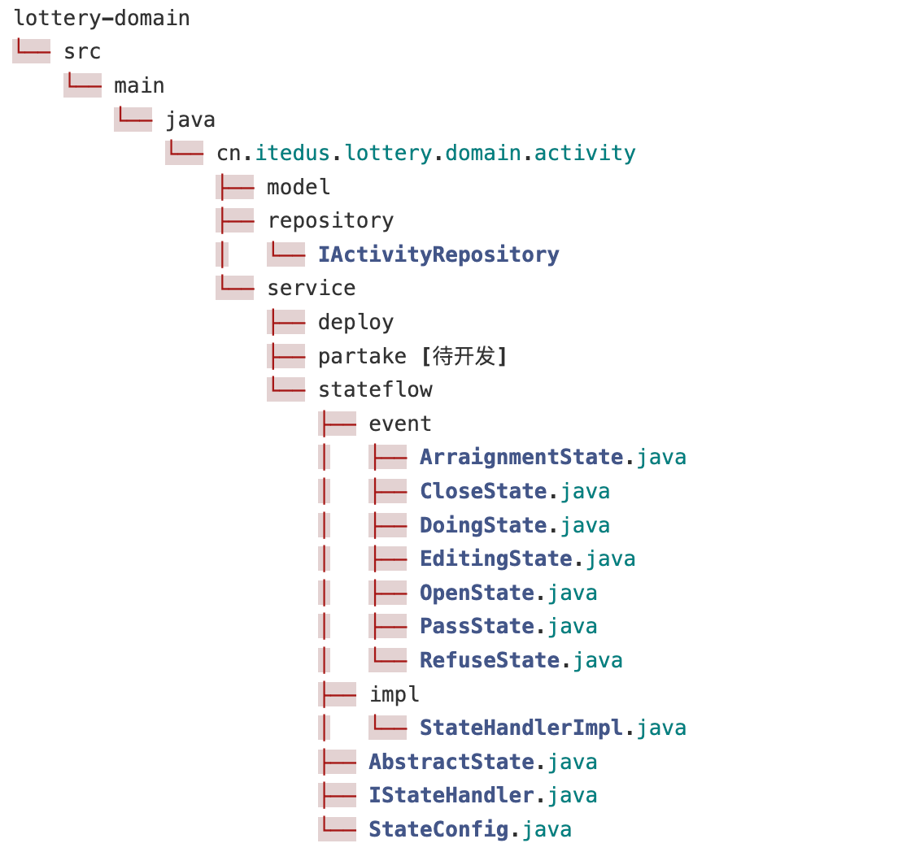

- activity 活动领域层包括：deploy、partake、stateflow
- stateflow 状态流转运用的状态模式，主要包括抽象出状态抽象类AbstractState 和对应的 event 包下的状态处理，最终使用 StateHandlerImpl 来提供对外的接口服务。


#### 8.3.2 定义抽象类

```java
public abstract class AbstractState {

    @Resource
    protected IActivityRepository activityRepository;

    /**
     * 活动提审
     *
     * @param activityId   活动ID
     * @param currentState 当前状态
     * @return 执行结果
     */
    public abstract Result arraignment(Long activityId, Enum<Constants.ActivityState> currentState);

    /**
     * 审核通过
     *
     * @param activityId   活动ID
     * @param currentState 当前状态
     * @return 执行结果
     */
    public abstract Result checkPass(Long activityId, Enum<Constants.ActivityState> currentState);

    /**
     * 审核拒绝
     *
     * @param activityId   活动ID
     * @param currentState 当前状态
     * @return 执行结果
     */
    public abstract Result checkRefuse(Long activityId, Enum<Constants.ActivityState> currentState);

    /**
     * 撤审撤销
     *
     * @param activityId   活动ID
     * @param currentState 当前状态
     * @return 执行结果
     */
    public abstract Result checkRevoke(Long activityId, Enum<Constants.ActivityState> currentState);

    /**
     * 活动关闭
     *
     * @param activityId   活动ID
     * @param currentState 当前状态
     * @return 执行结果
     */
    public abstract Result close(Long activityId, Enum<Constants.ActivityState> currentState);

    /**
     * 活动开启
     *
     * @param activityId   活动ID
     * @param currentState 当前状态
     * @return 执行结果
     */
    public abstract Result open(Long activityId, Enum<Constants.ActivityState> currentState);

    /**
     * 活动执行
     *
     * @param activityId   活动ID
     * @param currentState 当前状态
     * @return 执行结果
     */
    public abstract Result doing(Long activityId, Enum<Constants.ActivityState> currentState);

}
```

在整个接口中提供了各项状态流转服务的接口，例如；活动提审、审核通过、审核拒绝、撤审撤销等7个方法。

在这些方法中所有的入参都是一样的，activityId(活动ID)、currentStatus(当前状态)，只有他们的具体实现是不同的。


#### 8.3.3 提审状体

```java
@Component
public class ArraignmentState extends AbstractState {

    @Override
    public Result arraignment(Long activityId, Enum<Constants.ActivityState> currentState) {
        return Result.buildResult(Constants.ResponseCode.UN_ERROR, "待审核状态不可重复提审");
    }

    @Override
    public Result checkPass(Long activityId, Enum<Constants.ActivityState> currentState) {
        boolean isSuccess = activityRepository.alterStatus(activityId, currentState, Constants.ActivityState.PASS);
        return isSuccess ? Result.buildResult(Constants.ResponseCode.SUCCESS, "活动审核通过完成") : Result.buildErrorResult("活动状态变更失败");
    }

    @Override
    public Result checkRefuse(Long activityId, Enum<Constants.ActivityState> currentState) {
        boolean isSuccess = activityRepository.alterStatus(activityId, currentState, Constants.ActivityState.REFUSE);
        return isSuccess ? Result.buildResult(Constants.ResponseCode.SUCCESS, "活动审核拒绝完成") : Result.buildErrorResult("活动状态变更失败");
    }

    @Override
    public Result checkRevoke(Long activityId, Enum<Constants.ActivityState> currentState) {
        boolean isSuccess = activityRepository.alterStatus(activityId, currentState, Constants.ActivityState.EDIT);
        return isSuccess ? Result.buildResult(Constants.ResponseCode.SUCCESS, "活动审核撤销回到编辑中") : Result.buildErrorResult("活动状态变更失败");
    }

    @Override
    public Result close(Long activityId, Enum<Constants.ActivityState> currentState) {
        boolean isSuccess = activityRepository.alterStatus(activityId, currentState, Constants.ActivityState.CLOSE);
        return isSuccess ? Result.buildResult(Constants.ResponseCode.SUCCESS, "活动审核关闭完成") : Result.buildErrorResult("活动状态变更失败");
    }

    @Override
    public Result open(Long activityId, Enum<Constants.ActivityState> currentState) {
        return Result.buildResult(Constants.ResponseCode.UN_ERROR, "非关闭活动不可开启");
    }

    @Override
    public Result doing(Long activityId, Enum<Constants.ActivityState> currentState) {
        return Result.buildResult(Constants.ResponseCode.UN_ERROR, "待审核活动不可执行活动中变更");
    }

}
```

ArraignmentState 提审状态中的流程，比如：待审核状态不可重复提审、非关闭活动不可开启、待审核活动不可执行活动中变更，而：`审核通过、审核拒绝、撤销审核、活动关闭，都可以操作`。

通过这样的设计模式结构，优化掉原本需要在各个流程节点中的转换使用 ifelse 的场景，这样操作以后也可以更加方便你进行扩展。*当然其实这里还可以使用如工作流的方式进行处理*


#### 8.3.4 状态流转配置抽象类

```java
public class StateConfig {

    @Resource
    private ArraignmentState arraignmentState;
    @Resource
    private CloseState closeState;
    @Resource
    private DoingState doingState;
    @Resource
    private EditingState editingState;
    @Resource
    private OpenState openState;
    @Resource
    private PassState passState;
    @Resource
    private RefuseState refuseState;

    protected Map<Enum<Constants.ActivityState>, AbstractState> stateGroup = new ConcurrentHashMap<>();

    @PostConstruct
    public void init() {
        stateGroup.put(Constants.ActivityState.ARRAIGNMENT, arraignmentState);
        stateGroup.put(Constants.ActivityState.CLOSE, closeState);
        stateGroup.put(Constants.ActivityState.DOING, doingState);
        stateGroup.put(Constants.ActivityState.EDIT, editingState);
        stateGroup.put(Constants.ActivityState.OPEN, openState);
        stateGroup.put(Constants.ActivityState.PASS, passState);
        stateGroup.put(Constants.ActivityState.REFUSE, refuseState);
    }

}
```

在状态流转配置中，定义好各个流转操作

#### 8.3.5 实现状态处理服务

```java
@Service
public class StateHandlerImpl extends StateConfig implements IStateHandler {

    @Override
    public Result arraignment(Long activityId, Enum<Constants.ActivityState> currentStatus) {
        return stateGroup.get(currentStatus).arraignment(activityId, currentStatus);
    }

    @Override
    public Result checkPass(Long activityId, Enum<Constants.ActivityState> currentStatus) {
        return stateGroup.get(currentStatus).checkPass(activityId, currentStatus);
    }

    @Override
    public Result checkRefuse(Long activityId, Enum<Constants.ActivityState> currentStatus) {
        return stateGroup.get(currentStatus).checkRefuse(activityId, currentStatus);
    }

    @Override
    public Result checkRevoke(Long activityId, Enum<Constants.ActivityState> currentStatus) {
        return stateGroup.get(currentStatus).checkRevoke(activityId, currentStatus);
    }

    @Override
    public Result close(Long activityId, Enum<Constants.ActivityState> currentStatus) {
        return stateGroup.get(currentStatus).close(activityId, currentStatus);
    }

    @Override
    public Result open(Long activityId, Enum<Constants.ActivityState> currentStatus) {
        return stateGroup.get(currentStatus).open(activityId, currentStatus);
    }

    @Override
    public Result doing(Long activityId, Enum<Constants.ActivityState> currentStatus) {
        return stateGroup.get(currentStatus).doing(activityId, currentStatus);
    }

}
```

- 在状态流转服务中，通过在 `状态组 stateGroup` 获取对应的状态处理服务和操作变更状态。


### 8.4 测试活动创建

```java
@Before
public void init() {
    ActivityVO activity = new ActivityVO();
    activity.setActivityId(activityId);
    activity.setActivityName("测试活动");
    activity.setActivityDesc("测试活动描述");
    activity.setBeginDateTime(new Date());
    activity.setEndDateTime(new Date());
    activity.setStockCount(100);
    activity.setTakeCount(10);
    activity.setState(Constants.ActivityState.EDIT.getCode());
    activity.setCreator("xiaofuge");

    StrategyVO strategy = new StrategyVO();
    strategy.setStrategyId(10002L);
    strategy.setStrategyDesc("抽奖策略");
    strategy.setStrategyMode(Constants.StrategyMode.SINGLE.getCode());
    strategy.setGrantType(1);
    strategy.setGrantDate(new Date());
    strategy.setExtInfo("");

    StrategyDetailVO strategyDetail_01 = new StrategyDetailVO();
    strategyDetail_01.setStrategyId(strategy.getStrategyId());
    strategyDetail_01.setAwardId("101");
    strategyDetail_01.setAwardName("一等奖");
    strategyDetail_01.setAwardCount(10);
    strategyDetail_01.setAwardSurplusCount(10);
    strategyDetail_01.setAwardRate(new BigDecimal("0.05"));

    StrategyDetailVO strategyDetail_02 = new StrategyDetailVO();
    strategyDetail_02.setStrategyId(strategy.getStrategyId());
    strategyDetail_02.setAwardId("102");
    strategyDetail_02.setAwardName("二等奖");
    strategyDetail_02.setAwardCount(20);
    strategyDetail_02.setAwardSurplusCount(20);
    strategyDetail_02.setAwardRate(new BigDecimal("0.15"));
    
    // ...

}


@Test
public void test_createActivity() {
    activityDeploy.createActivity(new ActivityConfigReq(activityId, activityConfigRich));
}
```

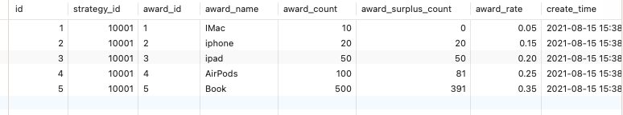


### 8.5 测试状态流转

```java
@Test
public void test_alterState() {
    logger.info("提交审核，测试：{}", JSON.toJSONString(stateHandler.arraignment(100001L, Constants.ActivityState.EDIT)));
    logger.info("审核通过，测试：{}", JSON.toJSONString(stateHandler.checkPass(100001L, Constants.ActivityState.ARRAIGNMENT)));
    logger.info("运行活动，测试：{}", JSON.toJSONString(stateHandler.doing(100001L, Constants.ActivityState.PASS)));
    logger.info("二次提审，测试：{}", JSON.toJSONString(stateHandler.checkPass(100001L, Constants.ActivityState.EDIT)));
}
```

测试验证之前先观察你的活动数据状态，因为后续会不断的变更这个状态，以及变更失败提醒。

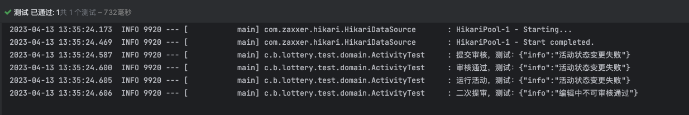

从测试结果可以看到，处于不同状态下的状态操作动作和反馈结果。

1. **注意 domain、lottery-infrastructure，包结构调整，涉及到 POM 配置文件的修改，在 lottery-infrastructure 引入 domain 的 POM 配置**
2. **Activity 活动领域目前只开发了一部分内容，需要注意如何考虑把活动一个类思考🤔出部署活动、领取活动和状态流转的设计实现**
3. **目前我们看到的活动创建还没有一个活动号的设计，下个章节我们会涉及到活动ID策略生成以及领取活动的单号ID生成。**


## 9. ID生成策略领域开发

描述：使用雪花算法、阿帕奇工具包 RandomStringUtils、日期拼接，三种方式生成ID，分别用在订单号、策略ID、活动号的生成上。

### 9.1 开发日志

- 从本章节开始将陆续引入一些基础内容的搭建，包括本章节关于ID的生成，及后续需要引入的分库分表、redis等。
- 使用策略模式把三种生成ID的算法进行统一包装，由调用方法决定使用哪种生成ID的策略。策略模式属于行为模式的一种，一个类的行为或算法可以在运行时进行修改。
- hutool工具包具有包装好的工具类，一般在实际使用使用雪花算法时需要做一些优化处理，如支持时间回拨、支持手工插入、简短生成长度、提升生成速度等。
- 而日期拼接和随机数工具包生成方式，都需要自己保证唯一性，一般使用此方式生成的ID，都用在单表中，本身可以在数据库配置唯一ID。

自增ID可能导致一些信息的泄露，以及在后续做数据迁移到分库分表中存在一定的麻烦。

### 9.2 支撑领域

在domain领域包下新增支持领域，ID的生成服务就放到这个领域下实现

关于ID的生成因为有三种不同ID用于在不同的场景下：

- **订单号：唯一、大量、订单创建时使用、分库分表**
- **活动号：唯一、少量、活动创建时使用、单库单表**
- **策略号：唯一、少量、活动创建时使用、单库单表**


### 9.3 策略模式

通过策略模式的使用，来开发策略ID的服务提供。之所以使用策略模式，是因为外部的调用方会需要根据不同的场景来选择出适合的ID生成策略，而策略模式就非常适合这一场景的使用。

参考文章：[重学 Java 设计模式：实战策略模式「模拟多种营销类型优惠券，折扣金额计算策略场景](https://mp.weixin.qq.com/s/zOFLtSFVrYEyTuihzwgKYw)


#### 9.3.1 工程结构

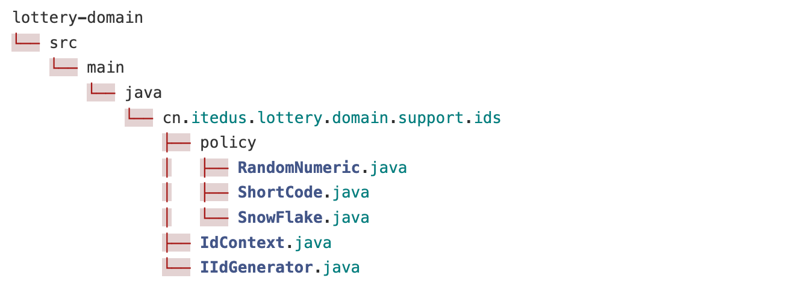

- IIdGenerator，定义生成ID的策略接口。RandomNumeric、ShortCode、SnowFlake，是三种生成ID的策略。
- IdContext，ID生成上下文，也就是从这里提供策略配置服务。


#### 9.3.2 IIdGenerator 策略接口

```java
public interface IIdGenerator {

    /**
     * 获取ID，目前有两种实现方式
     * 1. 雪花算法，用于生成单号
     * 2. 日期算法，用于生成活动编号类，特性是生成数字串较短，但指定时间内不能生成太多
     * 3. 随机算法，用于生成策略ID
     *
     * @return ID
     */
    long nextId();

}
```

#### 9.3.3. 策略ID实现

```java
@Component
public class SnowFlake implements IIdGenerator {

    private Snowflake snowflake;

    @PostConstruct
    public void init() {
        // 0 ~ 31 位，可以采用配置的方式使用
        long workerId;
        try {
            workerId = NetUtil.ipv4ToLong(NetUtil.getLocalhostStr());
        } catch (Exception e) {
            workerId = NetUtil.getLocalhostStr().hashCode();
        }

        workerId = workerId >> 16 & 31;

        long dataCenterId = 1L;
        snowflake = IdUtil.createSnowflake(workerId, dataCenterId);
    }

    @Override
    public synchronized long nextId() {
        return snowflake.nextId();
    }

}
```

- 使用 hutool 工具类提供的雪花算法，提供生成ID服务
- 其他方式的 ID 生成可以直接参考源码

#### 9.3.4. 策略服务上下文

```java
@Configuration
public class IdContext {

    /**
     * 创建 ID 生成策略对象，属于策略设计模式的使用方式
     *
     * @param snowFlake 雪花算法，长码，大量
     * @param shortCode 日期算法，短码，少量，全局唯一需要自己保证
     * @param randomNumeric 随机算法，短码，大量，全局唯一需要自己保证
     * @return IIdGenerator 实现类
     */
    @Bean
    public Map<Constants.Ids, IIdGenerator> idGenerator(SnowFlake snowFlake, ShortCode shortCode, RandomNumeric randomNumeric) {
        Map<Constants.Ids, IIdGenerator> idGeneratorMap = new HashMap<>(8);
        idGeneratorMap.put(Constants.Ids.SnowFlake, snowFlake);
        idGeneratorMap.put(Constants.Ids.ShortCode, shortCode);
        idGeneratorMap.put(Constants.Ids.RandomNumeric, randomNumeric);
        return idGeneratorMap;
    }

}
```

- 通过配置注解 `@Configuration` 和 Bean 对象的生成 `@Bean`，来把策略生成ID服务包装到 `Map<Constants.Ids, IIdGenerator>` 对象中。

### 9.3.4 测试验证

**com.banana69.lottery.test.domain.SupportTest**

```java
@RunWith(SpringRunner.class)
@SpringBootTest
public class SupportTest {

    private Logger logger = LoggerFactory.getLogger(SupportTest.class);

    @Resource
    private Map<Constants.Ids, IIdGenerator> idGeneratorMap;

    @Test
    public void test_ids() {
        logger.info("雪花算法策略，生成ID：{}", idGeneratorMap.get(Constants.Ids.SnowFlake).nextId());
        logger.info("日期算法策略，生成ID：{}", idGeneratorMap.get(Constants.Ids.ShortCode).nextId());
        logger.info("随机算法策略，生成ID：{}", idGeneratorMap.get(Constants.Ids.RandomNumeric).nextId());
    }
}
```

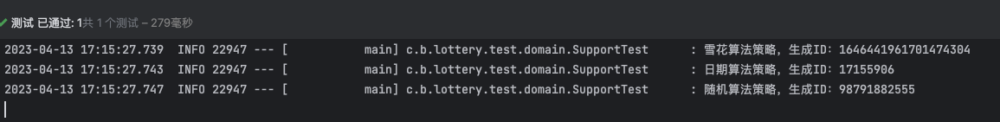


## 10. 实现分库分表

描述：开发一个基于 HashMap 核心设计原理，使用哈希散列+扰动函数的方式，把数据散列到多个库表中的组件，并验证使用。

### 10.1 开发日志

- 新增数据库路由组件开发工程 db-router-spring-boot-starter 这是一个自研的分库分表组件。主要用到的技术点包括：散列算法、数据源切换、AOP切面、SpringBoot Starter 开发等
- 完善分库中表信息，user_take_activity、user_take_activity_count、user_strategy_export_001~004，用于测试验证数据库路由组件
- 基于Mybatis拦截器对数据库路由分表使用方式进行优化，减少用户在使用过程中需要对数据库语句进行硬编码处理


### 10.2 需求分析

由于业务体量较大，数据增长较快，所以把用户数据拆分到不同的库表中，减轻数据库的压力。

分库分表主要有**垂直拆分和水平拆分：**

- **垂直拆分：**指按照业务将表进行分类，分布到不同的数据库上，这样也就将数据的压力分担到不同的库上面。最终一个数据库由很多表的构成，每个表对应着不同的业务，也就是专库专用。
- **水平拆分：**如果垂直拆分后遇到单机瓶颈，可以使用水平拆分。相对于垂直拆分的区别是：垂直拆分是把不同的表拆到不同的数据库中，而本章节需要实现的水平拆分，是把同一个表拆到不同的数据库中。如：user_001、user_002


实现水平拆分的路由设计

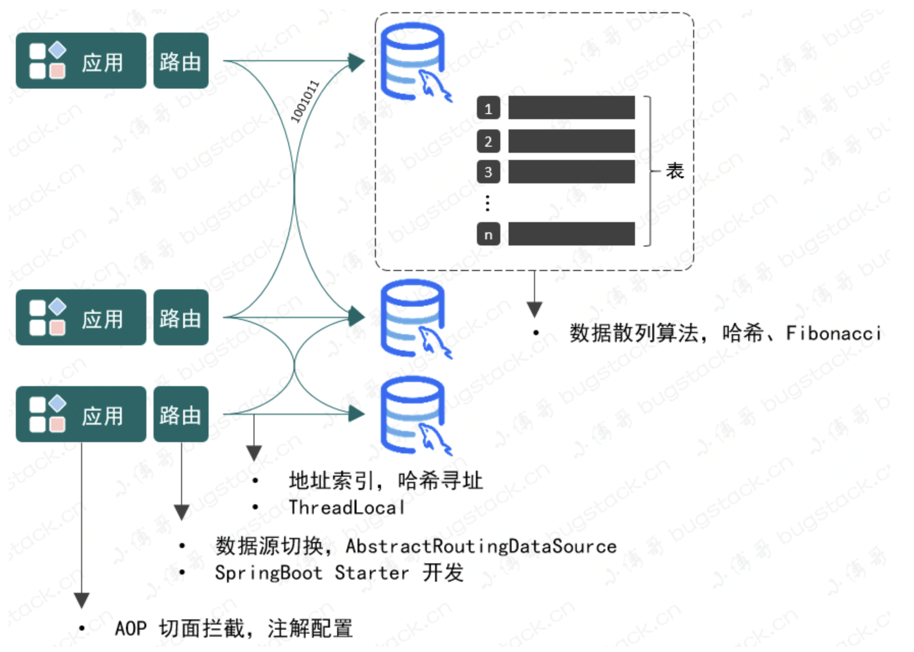

包含知识点：

1. 关于AOP切面拦截的使用，需要给使用数据库路由的方法做上标记，便于处理分库分表逻辑
2. 数据源的切换操作，分库操作设计在多个数据源间进行链接切换，以便数据分配给不同的数据库
3. 数据库表寻址操作，一条数据分配到那个数据库，哪张表都需要进行索引计算，在方法调用的过程中最终通过ThreadLocal记录。
4. 为了让数据均匀的分配到不同的库表中，需要考虑如何进行数据散列的操作，解决数据集中在某个库的某个表的情况。

因此需要用到的技术有：

```
AOP`、`数据源切换`、`散列算法`、`哈希寻址`、`ThreadLoca`l以及`SpringBoot的Starter开发方式`等技术。
```

而像`哈希散列`、`寻址`、`数据存放与HashMap类似。


### 10.3 技术调研

在 JDK 源码中，包含的数据结构设计有：数组、链表、队列、栈、红黑树，具体的实现有 ArrayList、LinkedList、Queue、Stack，而这些在数据存放都是顺序存储，并没有用到哈希索引的方式进行处理。而 HashMap、ThreadLocal，两个功能则用了哈希索引、散列算法以及在数据膨胀时候的拉链寻址和开放寻址，所以我们要分析和借鉴的也会集中在这两个功能上。


### 10.3.1 ThreadLocal

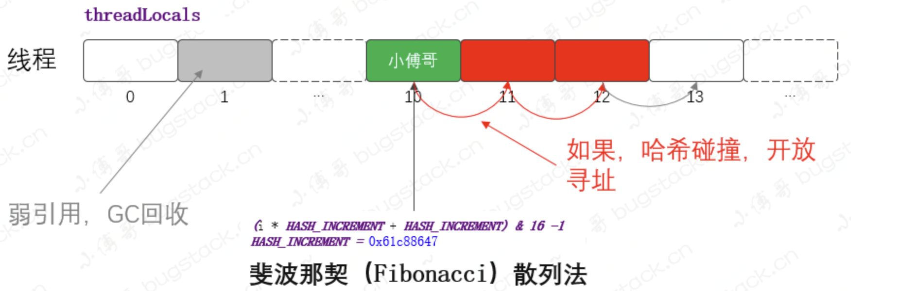

```java
@Test
    public void test_idx() {
        int hashCode = 0;
        for (int i = 0; i < 5; i++) {
            hashCode = i * 0x61c88647 + 0x61c88647;
            int idx = hashCode & 4;
            System.out.println("斐波那契散列：" + idx + " 普通散列：" + (String.valueOf(i).hashCode() & 15));
        }
    }
```

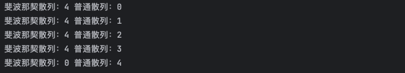

**数据结构**：散列表的数组结构

**散列算法**：斐波那契（Fibonacci）散列法

**寻址方式**：Fibonacci 散列法可以让数据更加分散，在发生数据碰撞时进行开放寻址，从碰撞节点向后寻找位置进行存放元素。公式：`f(k) = ((k * 2654435769) >> X) << Y对于常见的32位整数而言，也就是 f(k) = (k * 2654435769) >> 28 `，黄金分割点：`(√5 - 1) / 2 = 0.6180339887` `1.618:1 == 1:0.618`

可以参考寻址方式和散列算法，但这种数据结构与要设计实现作用到数据库上的结构相差较大，不过 ThreadLocal 可以用于存放和传递数据索引信息。


#### 10.3.2 HashMap

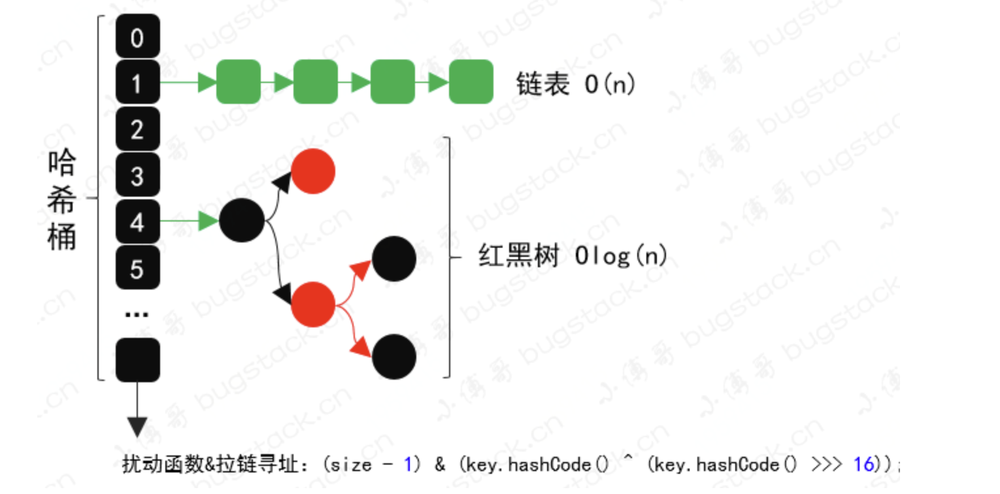

```java
public static int disturbHashIdx(String key, int size) {
    return (size - 1) & (key.hashCode() ^ (key.hashCode() >>> 16));
}
```

**数据结构**：哈希桶数组 + 链表 + 红黑树

**散列算法**：扰动函数、哈希索引，可以让数据更加散列的分布

**寻址方式**：通过拉链寻址的方式解决数据碰撞，数据存放时会进行索引地址，遇到碰撞产生数据链表，在一定容量超过8个元素进行扩容或者树化。

可以把散列算法、寻址方式都运用到数据库路由的设计实现中，还有整个数组+链表的方式其实库+表的方式也有类似之处。


### 10.4 设计实现

#### 10.4.1 定义路由注解

定义：

```java
@Documented
@Retention(RetentionPolicy.RUNTIME)
@Target({ElementType.TYPE, ElementType.METHOD})
public @interface DBRouter {

    String key() default "";

}
```

使用：

```java
@Mapper
public interface IUserDao {

     @DBRouter(key = "userId")
     User queryUserInfoByUserId(User req);

     @DBRouter(key = "userId")
     void insertUser(User req);

}
```

- 首先定义一个注解，用于放置在被数据库路由的方法上
- 使用方式是通过方法配置注解，就可以被指定的AOP切面进行拦截，拦截后进行相应的数据库路由计算和判断，并切换到相应的操作数据源上。


#### 10.4.2 解析路由配置

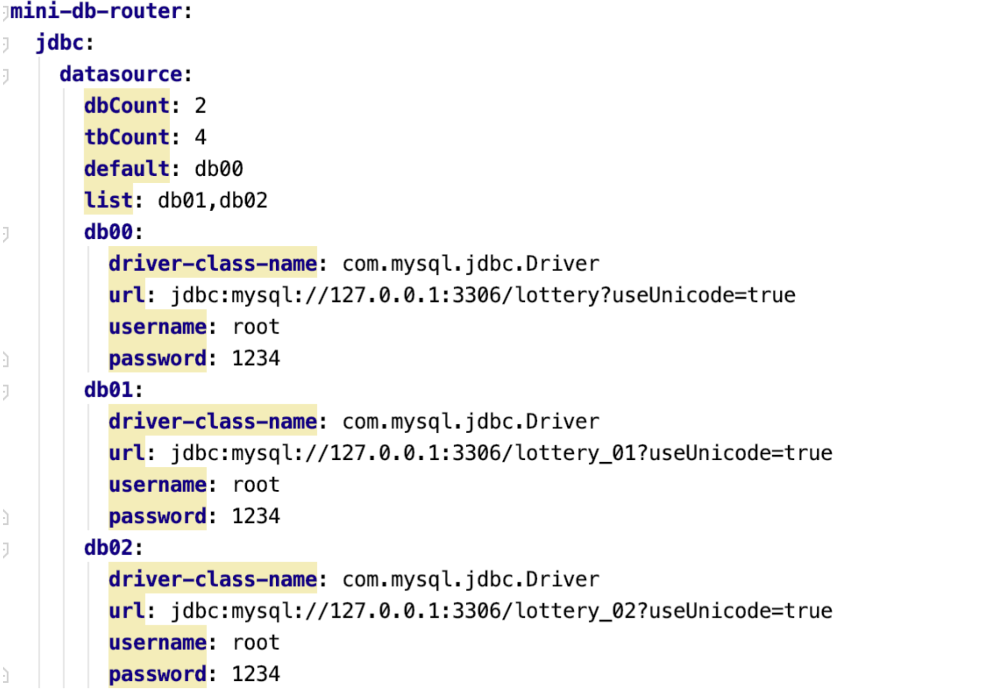

- 以上就是我们实现完数据库路由组件后的一个数据源配置，在分库分表下的数据源使用中，都需要支持多数据源的信息配置，这样才能满足不同需求的扩展。
- 对于这种自定义较大的信息配置，就需要使用到 `org.springframework.context.EnvironmentAware` 接口，来获取配置文件并提取需要的配置信息。


**数据源配置提取**

```java
@Override
public void setEnvironment(Environment environment) {
    String prefix = "router.jdbc.datasource.";    

    dbCount = Integer.valueOf(environment.getProperty(prefix + "dbCount"));
    tbCount = Integer.valueOf(environment.getProperty(prefix + "tbCount"));    

    String dataSources = environment.getProperty(prefix + "list");
    for (String dbInfo : dataSources.split(",")) {
        Map<String, Object> dataSourceProps = PropertyUtil.handle(environment, prefix + dbInfo, Map.class);
        dataSourceMap.put(dbInfo, dataSourceProps);
    }
}
```

- prefix 是数据源配置的开头信息，可以自定义需要的开头内容
- dbCount、tbCount、dataSources、dataSourceProps，都是对配置信息的提取，并存放到 dataSourceMap 中便于后续使用。


#### 10.4.3 数据源切换

在结合 SpringBoot 开发的 Starter 中，需要提供一个 DataSource 的实例化对象，那么这个对象我们就放在 DataSourceAutoConfig 来实现，并且这里提供的数据源是可以动态变换的，也就是支持动态切换数据源。

**创建数据源：**

```java
@Bean
public DataSource dataSource() {
    // 创建数据源
    Map<Object, Object> targetDataSources = new HashMap<>();
    for (String dbInfo : dataSourceMap.keySet()) {
        Map<String, Object> objMap = dataSourceMap.get(dbInfo);
        targetDataSources.put(dbInfo, new DriverManagerDataSource(objMap.get("url").toString(), objMap.get("username").toString(), objMap.get("password").toString()));
    }     

    // 设置数据源
    DynamicDataSource dynamicDataSource = new DynamicDataSource();
    dynamicDataSource.setTargetDataSources(targetDataSources);
    dynamicDataSource.setDefaultTargetDataSource(new DriverManagerDataSource(defaultDataSourceConfig.get("url").toString(), defaultDataSourceConfig.get("username").toString(), defaultDataSourceConfig.get("password").toString()));

    return dynamicDataSource;
}
```

这里是一个简化的创建案例，把基于从配置信息中读取到的数据源信息，进行实例化创建。

数据源创建完成后存放到 `DynamicDataSource` 中，它是一个继承了 AbstractRoutingDataSource 的实现类，这个类里可以存放和读取相应的具体调用的数据源信息。


#### 10.4.4 切面拦截

在AOP的切面拦截中需要完成：数据库路由计算、扰动函数加强散列、计算库表索引、设置到ThreadLocal传递数据源

```java
@Around("aopPoint() && @annotation(dbRouter)")
public Object doRouter(ProceedingJoinPoint jp, DBRouter dbRouter) throws Throwable {
    String dbKey = dbRouter.key();
    if (StringUtils.isBlank(dbKey)) throw new RuntimeException("annotation DBRouter key is null！");

    // 计算路由
    String dbKeyAttr = getAttrValue(dbKey, jp.getArgs());
    int size = dbRouterConfig.getDbCount() * dbRouterConfig.getTbCount();

    // 扰动函数
    int idx = (size - 1) & (dbKeyAttr.hashCode() ^ (dbKeyAttr.hashCode() >>> 16));

    // 库表索引
    int dbIdx = idx / dbRouterConfig.getTbCount() + 1;
    int tbIdx = idx - dbRouterConfig.getTbCount() * (dbIdx - 1);   

    // 设置到 ThreadLocal
    DBContextHolder.setDBKey(String.format("%02d", dbIdx));
    DBContextHolder.setTBKey(String.format("%02d", tbIdx));
    logger.info("数据库路由 method：{} dbIdx：{} tbIdx：{}", getMethod(jp).getName(), dbIdx, tbIdx);
   
    // 返回结果
    try {
        return jp.proceed();
    } finally {
        DBContextHolder.clearDBKey();
        DBContextHolder.clearTBKey();
    }
}
```

- 简化的核心逻辑实现代码如上，首先我们提取了库表乘积的数量，把它当成 HashMap 一样的长度进行使用。
- 接下来使用和 HashMap 一样的扰动函数逻辑，让数据分散的更加散列。
- 当计算完总长度上的一个索引位置后，还需要把这个位置折算到库表中，看看总体长度的索引因为落到哪个库哪个表。
- 最后是把这个计算的索引信息存放到 ThreadLocal 中，用于传递在方法调用过程中可以提取到索引信息。


#### 10.4.5 拦截器处理分表

- 最开始考虑直接在Mybatis对应的表 `INSERT INTO user_strategy_export`**_${tbIdx}** 添加字段的方式处理分表。但这样看上去并不优雅，不过也并不排除这种使用方式，仍然是可以使用的。
- 那么我们可以基于 Mybatis 拦截器进行处理，通过拦截 SQL 语句动态修改添加分表信息，再设置回 Mybatis 执行 SQL 中。
- 此外再完善一些分库分表路由的操作，比如配置默认的分库分表字段以及单字段入参时默认取此字段作为路由字段。

```java
@Intercepts({@Signature(type = StatementHandler.class, method = "prepare", args = {Connection.class, Integer.class})})
public class DynamicMybatisPlugin implements Interceptor {


    private Pattern pattern = Pattern.compile("(from|into|update)[\\s]{1,}(\\w{1,})", Pattern.CASE_INSENSITIVE);

    @Override
    public Object intercept(Invocation invocation) throws Throwable {
        // 获取StatementHandler
        StatementHandler statementHandler = (StatementHandler) invocation.getTarget();
        MetaObject metaObject = MetaObject.forObject(statementHandler, SystemMetaObject.DEFAULT_OBJECT_FACTORY, SystemMetaObject.DEFAULT_OBJECT_WRAPPER_FACTORY, new DefaultReflectorFactory());
        MappedStatement mappedStatement = (MappedStatement) metaObject.getValue("delegate.mappedStatement");

        // 获取自定义注解判断是否进行分表操作
        String id = mappedStatement.getId();
        String className = id.substring(0, id.lastIndexOf("."));
        Class<?> clazz = Class.forName(className);
        DBRouterStrategy dbRouterStrategy = clazz.getAnnotation(DBRouterStrategy.class);
        if (null == dbRouterStrategy || !dbRouterStrategy.splitTable()){
            return invocation.proceed();
        }

        // 获取SQL
        BoundSql boundSql = statementHandler.getBoundSql();
        String sql = boundSql.getSql();

        // 替换SQL表名 USER 为 USER_03
        Matcher matcher = pattern.matcher(sql);
        String tableName = null;
        if (matcher.find()) {
            tableName = matcher.group().trim();
        }
        assert null != tableName;
        String replaceSql = matcher.replaceAll(tableName + "_" + DBContextHolder.getTBKey());

        // 通过反射修改SQL语句
        Field field = boundSql.getClass().getDeclaredField("sql");
        field.setAccessible(true);
        field.set(boundSql, replaceSql);

        return invocation.proceed();
    }
}
```


### 10.5 测试验证

#### 10.5.1 分库

**在需要使用数据库路东的DAO方法加上注解**

```java
// com.banana69..lottery.infrastructure.dao.IUserTakeActivityDao
@Mapper
public interface IUserTakeActivityDao {

    /**
     * 插入用户领取活动信息
     *
     * @param userTakeActivity 入参
     */
    @DBRouter(key = "uId")
    void insert(UserTakeActivity userTakeActivity);

}
```

- @DBRouter(key = "uId") key 是入参对象中的属性，用于提取作为分库分表路由字段使用

**SQL语句：**

```xml
<insert id="insertUserTakeActivity" parameterType="com.banana69.lottery.infrastructure.po.UserTakeActivity">
        INSERT INTO user_take_activity
        (u_id, take_id, activity_id, activity_name, take_date,
        take_count, uuid, create_time, update_time)
        VALUES
        (#{uId}, #{takeId}, #{activityId}, #{activityName}, #{takeDate},
        #{takeCount}, #{uuid}, now(), now())
</insert>
```

如果一个表只分库不分表，则它的 sql 语句并不会有什么差异

如果需要分表，那么则需要在表名后面加入 user_take_activity_${tbIdx} 同时入参对象需要继承 DBRouterBase 这样才可以拿到 tbIdx 分表信息 `这部分内容我们在后续开发中会有体现`

**测试：**

```java
@RunWith(SpringRunner.class)
@SpringBootTest
public class UserTakeActivityDaoTest {

    private Logger logger = LoggerFactory.getLogger(ActivityDaoTest.class);

    @Resource
    private IUserTakeActivityDao userTakeActivityDao;

    @Test
    public void test_insert() {
        UserTakeActivity userTakeActivity = new UserTakeActivity();
        userTakeActivity.setuId("Uhdgkw766120d"); // 1库：Ukdli109op89oi 2库：Ukdli109op811d
        userTakeActivity.setTakeId(121019889410L);
        userTakeActivity.setActivityId(100001L);
        userTakeActivity.setActivityName("测试活动");
        userTakeActivity.setTakeDate(new Date());
        userTakeActivity.setTakeCount(10);
        userTakeActivity.setUuid("Uhdgkw766120d");

        userTakeActivityDao.insert(userTakeActivity);
    }

}
```

测试中分别验证了不同的 uId 主要是为了解决数据散列到不同库表中去。


#### 10.5.2 分表

```java
@Mapper
@DBRouterStrategy(splitTable = true)
public interface IUserStrategyExportDao {

    /**
     * 新增数据
     * @param userStrategyExport 用户策略
     */
    @DBRouter(key = "uId")
    void insert(UserStrategyExport userStrategyExport);

    /**
     * 查询数据
     * @param uId 用户ID
     * @return 用户策略
     */
    @DBRouter
    UserStrategyExport queryUserStrategyExportByUId(String uId);

}
```

- @DBRouterStrategy(splitTable = true) 配置分表信息，配置后会通过数据库路由组件把sql语句添加上分表字段，比如表 sysUser 修改为 user_003
- @DBRouter(key = "uId") 设置路由字段
- @DBRouter 未配置情况下走默认字段，routerKey: uId

**SQL语句：**

```xml
<insert id="insertUserStrategy" parameterType="com.banana69.lottery.infrastructure.po.UserStrategyExport">
        INSERT INTO user_strategy_export
        (u_id, activity_id, order_id, strategy_id, strategy_mode,
        grant_type, grant_date, grant_state, award_id, award_type,
        award_name, award_content, uuid, create_time, update_time)
        VALUES
        (#{uId},#{activityId},#{orderId},#{strategyId},#{strategyMode},
        #{grantType},#{grantDate},#{grantState},#{awardId},#{awardType},
        #{awardName},#{awardContent},#{uuid},now(),now())
</insert>

<select id="queryUserStrategyExportByUId" parameterType="java.lang.String" resultMap="userStrategyExportMap">
        SELECT id, u_id, activity_id, order_id, strategy_id, strategy_mode,
        grant_type, grant_date, grant_state, award_id, award_type,
        award_name, award_content, uuid, create_time, update_time
        FROM user_strategy_export
        WHERE u_id = #{uId}
</select>
```

正常写 SQL 语句即可，如果你不使用注解 @DBRouterStrategy(splitTable = true) 也可以使用 user_strategy_export`_003`


**单元测试**

```java
@RunWith(SpringRunner.class)
@SpringBootTest
public class UserStrategyExportDaoTest {

    private Logger logger = LoggerFactory.getLogger(UserStrategyExportDaoTest.class);

    @Resource
    private IUserStrategyExportDao userStrategyExportDao;

    @Resource
    private Map<Constants.Ids, IIdGenerator> idGeneratorMap;

    @Test
    public void test_insert() {
        UserStrategyExport userStrategyExport = new UserStrategyExport();
        userStrategyExport.setuId("Uhdgkw766120d");
        userStrategyExport.setActivityId(idGeneratorMap.get(Constants.Ids.ShortCode).nextId());
        userStrategyExport.setOrderId(idGeneratorMap.get(Constants.Ids.SnowFlake).nextId());
        userStrategyExport.setStrategyId(idGeneratorMap.get(Constants.Ids.RandomNumeric).nextId());
        userStrategyExport.setStrategyMode(Constants.StrategyMode.SINGLE.getCode());
        userStrategyExport.setGrantType(1);
        userStrategyExport.setGrantDate(new Date());
        userStrategyExport.setGrantState(1);
        userStrategyExport.setAwardId("1");
        userStrategyExport.setAwardType(Constants.AwardType.DESC.getCode());
        userStrategyExport.setAwardName("IMac");
        userStrategyExport.setAwardContent("奖品描述");
        userStrategyExport.setUuid(String.valueOf(userStrategyExport.getOrderId()));

        userStrategyExportDao.insert(userStrategyExport);
    }

    @Test
    public void test_select() {
        UserStrategyExport userStrategyExport = userStrategyExportDao.queryUserStrategyExportByUId("Uhdgkw766120d");
        logger.info("测试结果：{}", JSON.toJSONString(userStrategyExport));
    }
}
```

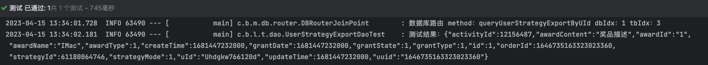


## 11. 声明事务领取活动领域开发

描述：扩展数据库路由组件，支持编程式事务处理。用于领取活动领域功能开发中用户领取活动信息，在一个事务下记录多张表数据。


### 11.1 开发日志

- 扩展和完善db-router-spring-boot-starter 数据库路由组建，拆解路由策略满足编程式路由配合编程式事务一起使用。
- 补全库表 activity 增加字段 strategy_id 。抽奖策略ID字段strategy_id用于关联活动与抽奖系统的关系。即当用户领取完成后，可以通过活动表中的抽奖策略ID继续执行抽奖操作。
- 基于模版模式开发领取活动领域，在领取活动中需要进行活动的日期库存、状态等校验，并处理扣减库存、添加用户领取信息、封装结果等一系列流程操作，因此使用抽象类定义模板模式更为妥当


### 11.2 数据库路由组件扩展编程式事务

**提出问题：**

如果一个场景需要在同一事务下，连续操作不同的dao，就会涉及到在dao上注解`@DBRouter(key = "uId")`反复切换。反复切换后，事务无法进行处理。

**解决：**

把数据源的切换放在事务处理前，而事务操作通过编程式编码进行处理。

#### 11.2.1 拆解路由算法策略，单独提供路由算法

```java
public interface IDBRouterStrategy {

    void doRouter(String dbKeyAttr);

    void clear();

}
```

- 把路由算法拆解出来，无论是切面中还是硬编码，都通过这个方法进行计算路由


#### 11.2.2 配置事务处理对象

```java
@Bean
public IDBRouterStrategy dbRouterStrategy(DBRouterConfig dbRouterConfig) {
    return new DBRouterStrategyHashCode(dbRouterConfig);
}

@Bean
public TransactionTemplate transactionTemplate(DataSource dataSource) {
    DataSourceTransactionManager dataSourceTransactionManager = new DataSourceTransactionManager();
    dataSourceTransactionManager.setDataSource(dataSource);
    TransactionTemplate transactionTemplate = new TransactionTemplate();
    transactionTemplate.setTransactionManager(dataSourceTransactionManager);
    transactionTemplate.setPropagationBehaviorName("PROPAGATION_REQUIRED");
    return transactionTemplate;
}

```

- 创建路由策略对象，便于切面和硬编码注入使用
- 创建事务对象，用于编程式事务引入

### 11.3 活动领取模版抽象类

```java
public abstract class BaseActivityPartake extends ActivityPartakeSupport implements IActivityPartake {

    @Override
    public PartakeResult doPartake(PartakeReq req) {
        // 查询活动账单
        ActivityBillVO activityBillVO = super.queryActivityBill(req);

        // 活动信息校验处理【活动库存、状态、日期、个人参与次数】
        Result checkResult = this.checkActivityBill(req, activityBillVO);
        if (!Constants.ResponseCode.SUCCESS.getCode().equals(checkResult.getCode())) {
            return new PartakeResult(checkResult.getCode(), checkResult.getInfo());
        }

        // 扣减活动库存【目前为直接对配置库中的 lottery.activity 直接操作表扣减库存，后续优化为Redis扣减】
        Result subtractionActivityResult = this.subtractionActivityStock(req);
        if (!Constants.ResponseCode.SUCCESS.getCode().equals(subtractionActivityResult.getCode())) {
            return new PartakeResult(subtractionActivityResult.getCode(), subtractionActivityResult.getInfo());
        }

        // 领取活动信息【个人用户把活动信息写入到用户表】
        Result grabResult = this.grabActivity(req, activityBillVO);
        if (!Constants.ResponseCode.SUCCESS.getCode().equals(grabResult.getCode())) {
            return new PartakeResult(grabResult.getCode(), grabResult.getInfo());
        }

        // 封装结果【返回的策略ID，用于继续完成抽奖步骤】
        PartakeResult partakeResult = new PartakeResult(Constants.ResponseCode.SUCCESS.getCode(), Constants.ResponseCode.SUCCESS.getInfo());
        partakeResult.setStrategyId(activityBillVO.getStrategyId());
        return partakeResult;
    }

    /**
     * 活动信息校验处理，把活动库存、状态、日期、个人参与次数
     *
     * @param partake 参与活动请求
     * @param bill    活动账单
     * @return 校验结果
     */
    protected abstract Result checkActivityBill(PartakeReq partake, ActivityBillVO bill);

    /**
     * 扣减活动库存
     *
     * @param req 参与活动请求
     * @return 扣减结果
     */
    protected abstract Result subtractionActivityStock(PartakeReq req);

    /**
     * 领取活动
     *
     * @param partake 参与活动请求
     * @param bill    活动账单
     * @return 领取结果
     */
    protected abstract Result grabActivity(PartakeReq partake, ActivityBillVO bill);

}

```

- 抽象类BaseActivityPartake继承数据支撑类并且实现接口方法 IActivityPartake#doPartake
- 在领取活动doPartake方法中，先是通过父类提供的数据服务，获取到`活动账单`，再定义三个抽象方法：活动信息校验处理、扣减活动库存、领取活动，一次顺序解决活动的领取操作。


### 11.4 领取活动编程式事务处理

package com.banana69.lottery.domain.activity.service.partake.impl;

```java
@Override
    protected Result grabActivity(PartakeReq partake, ActivityBillVO bill) {
        try {
            dbRouter.doRouter(partake.getuId());
            return transactionTemplate.execute(status -> {
                try {
                    // 扣减个人已参与次数
                    int updateCount = userTakeActivityRepository.subtractionLeftCount(bill.getActivityId(), bill.getActivityName(), bill.getTakeCount(),
                            bill.getUserTakeLeftCount(), partake.getuId(), partake.getPartakeDate());
                    if(0 == updateCount){
                        status.setRollbackOnly();
                        log.error("领取活动，扣减个人已参与次数失败  activityId: {} uId: {}", partake.getActivityId(), partake.getuId());
                        return Result.buildResult(Constants.ResponseCode.NO_UPDATE);
                    }

                    // 插入领取活动信息
                    Long takeId = idGeneratorMap.get(Constants.Ids.SnowFlake).nextId();
                    userTakeActivityRepository.takeActivity(bill.getActivityId(), bill.getActivityName(), bill.getTakeCount(),
                            bill.getUserTakeLeftCount(), partake.getuId(), partake.getPartakeDate(), takeId);
                }catch (DuplicateKeyException e) {
                    status.setRollbackOnly();
                    log.error("领取活动，唯一索引冲突 activityId：{} uId：{}", partake.getActivityId(), partake.getuId(), e);
                    return Result.buildResult(Constants.ResponseCode.INDEX_DUP);
                }
                return Result.buildSuccessResult();
            });
        }finally {
            dbRouter.clear();
        }
    }
```


### 11.5 测试验证

**数据准备**


这里的活动库存可以用来表示活动的人数限制

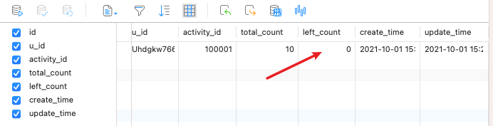

用户参加活动剩余领取次数

- 注意数据库中，lottery.activity、lottery_01.user_take_activity_count 可用的库存数量，否则不能领取活动，会提示相关信息到控制台


**单元测试**

```java
@Test
    public void test_activityPartake() {
        PartakeReq req = new PartakeReq("Uhdgkw766120d", 100001L);
        PartakeResult res = activityPartake.doPartake(req);
        logger.info("请求参数：{}", JSON.toJSONString(req));
        logger.info("测试结果：{}", JSON.toJSONString(res));
    }
```

测试结果(正常领取活动)

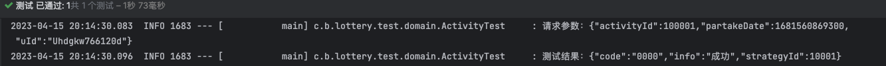

正常领取活动后，会在表 user_take_activity 有对应的领取记录

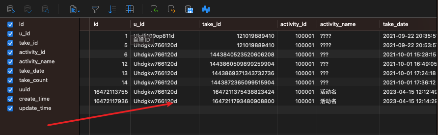

测试结果(个人领取次数无)

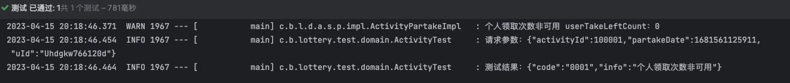


## 12. 在应用层编排抽奖过程

描述：在 application 应用层调用领域服务功能，编排抽奖过程，包括：领取活动、执行抽奖、落库结果，这其中还有一部分待实现的发送 MQ 消息，后续处理。


### 12.1 开发日志

- 分别在两个分库的表 lottery_01.user_take_activity、lottery_02.user_take_activity 中添加 state`【活动单使用状态 0未使用、1已使用】` 状态字段，这个状态字段用于写入中奖信息到 user_strategy_export_000~003 表中时候，两个表可以做一个幂等性的事务。同时还需要加入 strategy_id 策略ID字段，用于处理领取了活动单但执行抽奖失败时，可以继续获取到此抽奖单继续执行抽奖，而不需要重新领取活动。*其实领取活动就像是一种活动镜像信息，可以在控制幂等反复使用*
- 在 lottery-application 模块下新增 process 包用于流程编排，其实它也是 service 服务包是对领域功能的封装，很薄的一层。一般这一层的处理可以使用可视化的流程编排工具通过拖拽的方式，处理这部分代码的逻辑。
- 学习本章记得更新分支下的最新SQL语句，另外本章节还连带引入了需要MQ、Worker的场景，后续开发到这些功能的时候，会继续完善。


### 12.2  编排流程

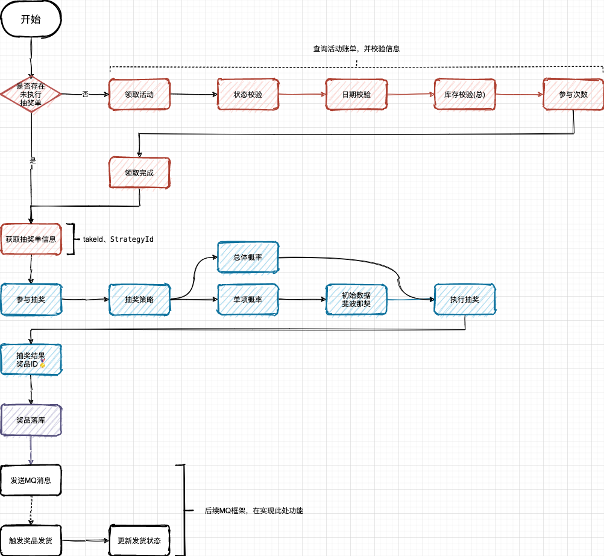

- 抽奖整个活动过程的流程编排，主要包括：对活动的领取、对抽奖的操作、对中奖结果的存放，以及如何处理发奖，对于发奖流程我们设计为MQ触发，后续再补全这部分内容。
- 对于每一个流程节点编排的内容，都是在领域层开发完成的，而应用层只是做最为简单的且很薄的一层。*其实这块也很符合目前很多低代码的使用场景，通过界面可视化控制流程编排，生成代码。


### 12.3 领取活动增加判断和返回领取单ID

**BaseActivityPartake#doPartake**

```java
@Override
    public PartakeResult doPartake(PartakeReq req) {
        // 1. 查询是否存在未执行抽奖领取活动单【user_take_activity 存在 state = 0，领取了但抽奖过程失败的，可以直接返回领取结果继续抽奖】
        UserTakeActivityVO userTakeActivityVO = this.queryNoConsumedTakeActivityOrder(req.getActivityId(), req.getuId());
        if (null != userTakeActivityVO) {
            return buildPartakeResult(userTakeActivityVO.getStrategyId(), userTakeActivityVO.getTakeId());
        }

        // 2. 查询活动账单
        ActivityBillVO activityBillVO = super.queryActivityBill(req);

        // 3. 活动信息校验处理【活动库存、状态、日期、个人参与次数】
        Result checkResult = this.checkActivityBill(req, activityBillVO);
        if (!Constants.ResponseCode.SUCCESS.getCode().equals(checkResult.getCode())) {
            return new PartakeResult(checkResult.getCode(), checkResult.getInfo());
        }

        // 4. 扣减活动库存【目前为直接对配置库中的 lottery.activity 直接操作表扣减库存，后续优化为Redis扣减】
        Result subtractionActivityResult = this.subtractionActivityStock(req);
        if (!Constants.ResponseCode.SUCCESS.getCode().equals(subtractionActivityResult.getCode())) {
            return new PartakeResult(subtractionActivityResult.getCode(), subtractionActivityResult.getInfo());
        }

        // 5. 插入领取活动信息【个人用户把活动信息写入到用户表】
        Long takeId = idGeneratorMap.get(Constants.Ids.SnowFlake).nextId();
        Result grabResult = this.grabActivity(req, activityBillVO, takeId);
        if (!Constants.ResponseCode.SUCCESS.getCode().equals(grabResult.getCode())) {
            return new PartakeResult(grabResult.getCode(), grabResult.getInfo());
        }

        return buildPartakeResult(activityBillVO.getStrategyId(), takeId);

    }
```

- 活动领域中主要是领取活动新增加了`第1步的查询流程`和`修改第5步返回takeId`
- 查询是否存在未执行抽奖领取活动单。在SQL查询当前活动ID，用户最早领取但未消费的一条记录【这部分一般会有业务流程限制，比如是否处理最先还是最新领取单，要根据自己的业务实际场景进行处理】
- this.grabActivity 方法，用户领取活动时候，新增记录：strategy_id、state 两个字段，这两个字段就是为了处理用户对领取镜像记录的二次处理未执行抽奖的领取单，以及state状态控制事务操作的幂等性。


### 12.4 抽奖活动流程编排

**com.banana69.lottery.application.process.impl.ActivityProcessImpl**

```java
@Override
public DrawProcessResult doDrawProcess(DrawProcessReq req) {
    // 1. 领取活动
    PartakeResult partakeResult = activityPartake.doPartake(new PartakeReq(req.getuId(), req.getActivityId()));
    if (!Constants.ResponseCode.SUCCESS.getCode().equals(partakeResult.getCode())) {
        return new DrawProcessResult(partakeResult.getCode(), partakeResult.getInfo());
    }
    Long strategyId = partakeResult.getStrategyId();
    Long takeId = partakeResult.getTakeId();

    // 2. 执行抽奖
    DrawResult drawResult = drawExec.doDrawExec(new DrawReq(req.getuId(), strategyId, String.valueOf(takeId)));
    if (Constants.DrawState.FAIL.getCode().equals(drawResult.getDrawState())) {
        return new DrawProcessResult(Constants.ResponseCode.LOSING_DRAW.getCode(), Constants.ResponseCode.LOSING_DRAW.getInfo());
    }
    DrawAwardInfo drawAwardInfo = drawResult.getDrawAwardInfo();

    // 3. 结果落库
    activityPartake.recordDrawOrder(buildDrawOrderVO(req, strategyId, takeId, drawAwardInfo));

    // 4. 发送MQ，触发发奖流程

    // 5. 返回结果
    return new DrawProcessResult(Constants.ResponseCode.SUCCESS.getCode(), Constants.ResponseCode.SUCCESS.getInfo(), drawAwardInfo);
}

```

按照流程图设计，分别进行：领取活动、执行抽奖、结果落库、发送MQ、返回结果，这些步骤的操作。其实这块的流程就相对来说比较简单了，主要是串联起各个抽奖步骤的操作。


### 12.5 测试验证

```java
@Test
    public void test_doDrawProcess() {
        DrawProcessReq req = new DrawProcessReq();
        req.setuId("test_uid");
        req.setActivityId(100001L);
        int i = 0;
        while(i < 3)
        {
            DrawProcessResult drawProcessResult = activityProcess.doDrawProcess(req);
            log.info("请求入参：{}", JSON.toJSONString(req));
            log.info("测试结果：{}", JSON.toJSONString(drawProcessResult));
            i++;
        }
    }
```

抽奖策略 1:

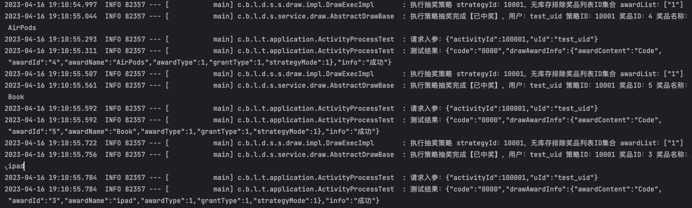

抽奖策略2：

需要先清空表`user_take_activity`中的数据，否则会发生索引冲突

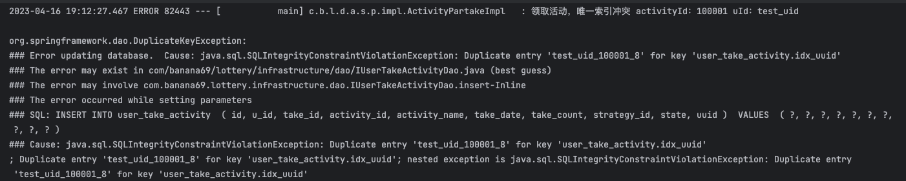

清楚后重新抽奖：

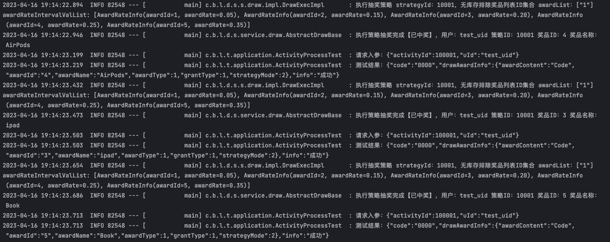


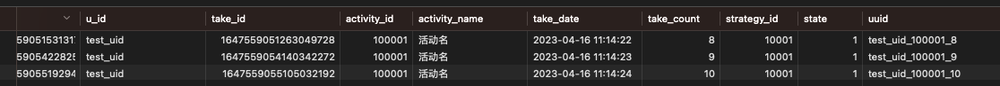

如果将uuid改为`test_uid_100001_11`这样就可以在生成一个表 user_take_activity.uuid 为 `test_uid_100001_10` 的唯一值,这样就会发生索引冲突回滚，那么扣减了 user_take_activity_count.left_count 次数就会恢复回去。


## 13. 规则引擎量化人群参与活动

描述：使用组合模式搭建用于量化人群的规则引擎，用于用户参与活动之前，通过规则引擎过滤性别、年龄、首单消费、消费金额、忠实用户等各类身份来量化出具体可参与的抽奖活动。通过这样的方式控制运营成本和精细化运营。


### 13.1 库表设计

组合模式的特点就像是搭建出一颗二叉树，而库表中则需要把这样一颗二叉树村放进去，那么这里就需要包括：树根、树茎、子叶、果实、在具体包含的逻辑实现中则需要通过子叶判断走哪个树茎以及最终筛选出一个果实来。

**rule_tree**

```sql
CREATE TABLE `rule_tree` (
  `id` bigint(20) NOT NULL AUTO_INCREMENT COMMENT '主键ID',
  `tree_name` varchar(64) DEFAULT NULL COMMENT '规则树NAME',
  `tree_desc` varchar(128) DEFAULT NULL COMMENT '规则树描述',
  `tree_root_node_id` bigint(20) DEFAULT NULL COMMENT '规则树根ID',
  `create_time` datetime DEFAULT NULL COMMENT '创建时间',
  `update_time` datetime DEFAULT NULL COMMENT '更新时间',
  PRIMARY KEY (`id`)
) ENGINE=InnoDB AUTO_INCREMENT=10002 DEFAULT CHARSET=utf8;

```

**rule_tree_node**

```sql
CREATE TABLE `rule_tree_node` (
  `id` bigint(20) NOT NULL AUTO_INCREMENT COMMENT '主键ID',
  `tree_id` int(2) DEFAULT NULL COMMENT '规则树ID',
  `node_type` int(2) DEFAULT NULL COMMENT '节点类型；1子叶、2果实',
  `node_value` varchar(32) DEFAULT NULL COMMENT '节点值[nodeType=2]；果实值',
  `rule_key` varchar(16) DEFAULT NULL COMMENT '规则Key',
  `rule_desc` varchar(32) DEFAULT NULL COMMENT '规则描述',
  PRIMARY KEY (`id`)
) ENGINE=InnoDB AUTO_INCREMENT=123 DEFAULT CHARSET=utf8;

```

**rule_tree_node_line**

```sql
CREATE TABLE `rule_tree_node_line` (
  `id` bigint(20) NOT NULL AUTO_INCREMENT COMMENT '主键ID',
  `tree_id` bigint(20) DEFAULT NULL COMMENT '规则树ID',
  `node_id_from` bigint(20) DEFAULT NULL COMMENT '节点From',
  `node_id_to` bigint(20) DEFAULT NULL COMMENT '节点To',
  `rule_limit_type` int(2) DEFAULT NULL COMMENT '限定类型；1:=;2:>;3:<;4:>=;5<=;6:enum[枚举范围];7:果实',
  `rule_limit_value` varchar(32) DEFAULT NULL COMMENT '限定值',
  PRIMARY KEY (`id`)
) ENGINE=InnoDB AUTO_INCREMENT=7 DEFAULT CHARSET=utf8;

```


### 13.2  应用场景

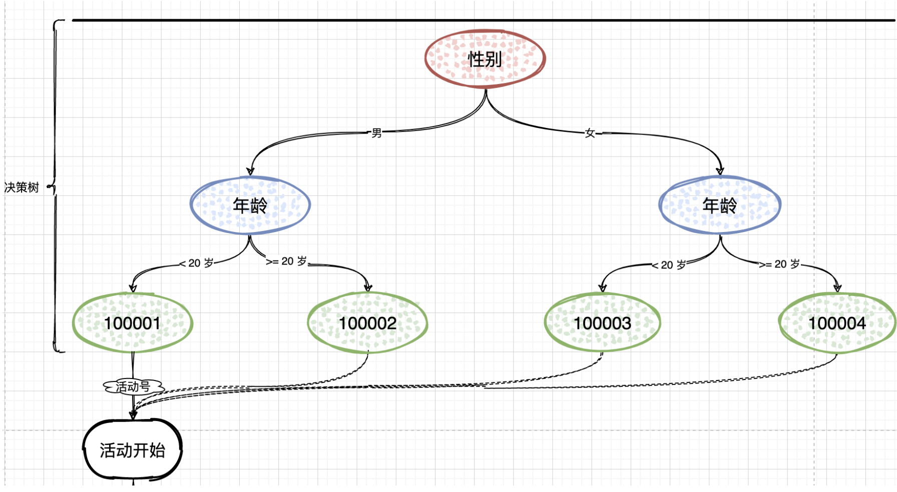

- 基于量化决策引擎，筛选用户身份，找到符合参与的活动号，拿到活动号后，参与到具体的抽奖活动中
- 通常量化决策引擎也是一种用于差异化人群的规则过滤器，不只是可以过滤出活动，也可以用于活动纬度的的过滤，判断是否可以参与到这个抽奖活动中。
- 该抽奖系统会使用规则运气领域服务，在应用层做一层封装后，由接口进行调用使用，即用户参与活动之前，要做一层规则引擎过滤。


### 13.2 功能开发

#### 13.2.1 工程结构

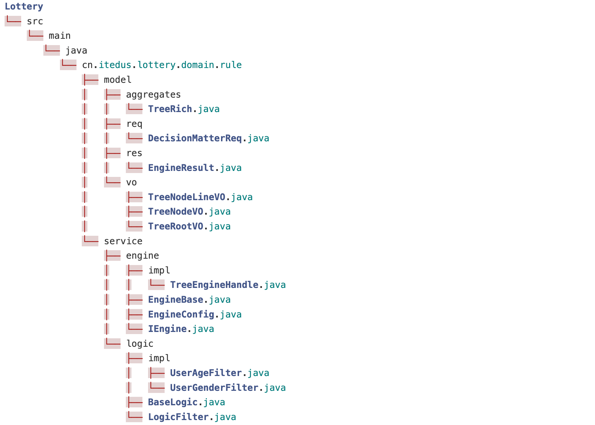


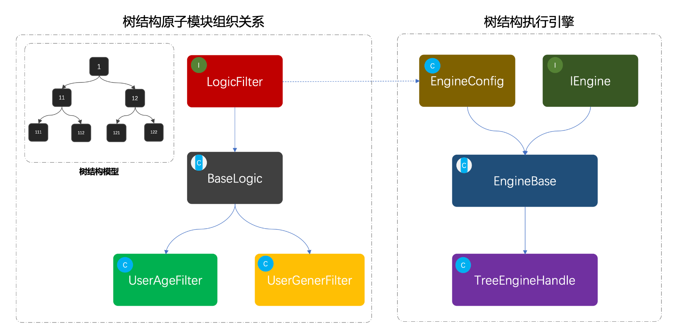

- `1`、`11`、`12`、`111`、`112`、`121`、`122`，这是一组树结构的ID，并由节点串联组合出一棵关系树。

- 接下来是类图部分，左侧是从`LogicFilter`开始定义适配的决策过滤器，`BaseLogic`是对接口的实现，提供最基本的通用方法。

  `UserAgeFilter`,`UserGenerFilter`是两个具体的实现类用于判断年龄和性别。

- 最后则是对这颗可以被组织出来的决策树，进行执行的引擎。同样定义了引擎接口和基础的配置，在配置里面设定了需要的模式决策节点


#### 13.2.2 规则过滤器接口

```java
public interface LogicFilter {

    /**
     * 逻辑决策器
     * @param matterValue          决策值
     * @param treeNodeLineInfoList 决策节点
     * @return                     下一个节点Id
     */
    Long filter(String matterValue, List<TreeNodeLineVO> treeNodeLineInfoList);

    /**
     * 获取决策值
     *
     * @param decisionMatter 决策物料
     * @return               决策值
     */
    String matterValue(DecisionMatterReq decisionMatter);

}
```

- 这一部分定义了适配的通用接口，逻辑决策器、获取决策值，让每一个提供决策能力的节点都必须实现此接口，保证统一性。

#### 13.2.3 规则基础抽奖类

```java
public abstract class BaseLogic implements LogicFilter {

    @Override
    public Long filter(String matterValue, List<TreeNodeLineVO> treeNodeLineInfoList) {
        for (TreeNodeLineVO nodeLine : treeNodeLineInfoList) {
            if (decisionLogic(matterValue, nodeLine)) {
                return nodeLine.getNodeIdTo();
            }
        }
        return Constants.Global.TREE_NULL_NODE;
    }

    /**
     * 获取规则比对值
     * @param decisionMatter 决策物料
     * @return 比对值
     */
    @Override
    public abstract String matterValue(DecisionMatterReq decisionMatter);

    private boolean decisionLogic(String matterValue, TreeNodeLineVO nodeLine) {
        switch (nodeLine.getRuleLimitType()) {
            case Constants.RuleLimitType.EQUAL:
                return matterValue.equals(nodeLine.getRuleLimitValue());
            case Constants.RuleLimitType.GT:
                return Double.parseDouble(matterValue) > Double.parseDouble(nodeLine.getRuleLimitValue());
            case Constants.RuleLimitType.LT:
                return Double.parseDouble(matterValue) < Double.parseDouble(nodeLine.getRuleLimitValue());
            case Constants.RuleLimitType.GE:
                return Double.parseDouble(matterValue) >= Double.parseDouble(nodeLine.getRuleLimitValue());
            case Constants.RuleLimitType.LE:
                return Double.parseDouble(matterValue) <= Double.parseDouble(nodeLine.getRuleLimitValue());
            default:
                return false;
        }
    }

}
```

- 在抽象方法中实现了接口方法，同时定义了基本的决策方法；`1、2、3、4、5`，`等于、小于、大于、小于等于、大于等于`的判断逻辑。
- 同时定义了抽象方法，让每一个实现接口的类都必须按照规则提供`决策值`，这个决策值用于做逻辑比对。

#### 13.3.4 

**年龄规则**

```java
@Component
public class UserAgeFilter extends BaseLogic {

    @Override
    public String matterValue(DecisionMatterReq decisionMatter) {
        return decisionMatter.getValMap().get("age").toString();
    }

}
```

**性别规则**

```java
@Component
public class UserGenderFilter extends BaseLogic {

    @Override
    public String matterValue(DecisionMatterReq decisionMatter) {
        return decisionMatter.getValMap().get("gender").toString();
    }
    
}
```


#### 13.3.5 规则引擎基础类

```java
public class EngineBase extends EngineConfig implements EngineFilter {

    private Logger logger = LoggerFactory.getLogger(EngineBase.class);

    @Override
    public EngineResult process(DecisionMatterReq matter) {
        throw new RuntimeException("未实现规则引擎服务");
    }

    protected TreeNodeVO engineDecisionMaker(TreeRuleRich treeRuleRich, DecisionMatterReq matter) {
        TreeRootVO treeRoot = treeRuleRich.getTreeRoot();
        Map<Long, TreeNodeVO> treeNodeMap = treeRuleRich.getTreeNodeMap();

        // 规则树根ID
        Long rootNodeId = treeRoot.getTreeRootNodeId();
        TreeNodeVO treeNodeInfo = treeNodeMap.get(rootNodeId);

        // 节点类型[NodeType]；1子叶、2果实
        while (Constants.NodeType.STEM.equals(treeNodeInfo.getNodeType())) {
            String ruleKey = treeNodeInfo.getRuleKey();
            LogicFilter logicFilter = logicFilterMap.get(ruleKey);
            String matterValue = logicFilter.matterValue(matter);
            Long nextNode = logicFilter.filter(matterValue, treeNodeInfo.getTreeNodeLineInfoList());
            treeNodeInfo = treeNodeMap.get(nextNode);
            logger.info("决策树引擎=>{} userId：{} treeId：{} treeNode：{} ruleKey：{} matterValue：{}", treeRoot.getTreeName(), matter.getUserId(), matter.getTreeId(), treeNodeInfo.getTreeNodeId(), ruleKey, matterValue);
        }

        return treeNodeInfo;
    }

}
```

- 这里主要提供决策树流程的处理过程，有点像通过链路的关系(`性别`、`年龄`)在二叉树中寻找果实节点的过程。
- 同时提供一个抽象方法，执行决策流程的方法供外部去做具体的实现。

#### 13.3.6 规则引擎处理器


### 13.4 测试验证

```java
 @RunWith(SpringRunner.class)
@SpringBootTest
public class RuleTest {

    private Logger logger = LoggerFactory.getLogger(ActivityTest.class);

    @Resource
    private EngineFilter engineFilter;

    @Test
    public void test_process() {
        DecisionMatterReq req = new DecisionMatterReq();
        req.setTreeId(2110081902L);
        req.setUserId("fustack");
        req.setValMap(new HashMap<String, Object>() {{
            put("gender", "man");
            put("age", "25");
        }});

        EngineResult res = engineFilter.process(req);

        logger.info("请求参数：{}", JSON.toJSONString(req));
        logger.info("测试结果：{}", JSON.toJSONString(res));
    }

}

```

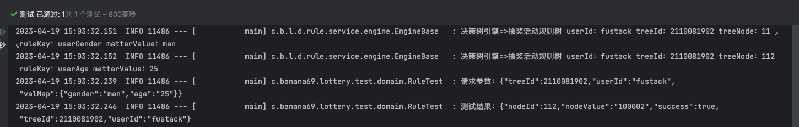

通过测试结果找到 `"nodeValue":"100002"` 这个 100002 就是用户 `fustack` 可以参与的活动号。


## 14. 门面接口封装和对象转换

描述：在 lottery-interfaces 接口层创建 `facade 门面模式` 包装抽奖接口，并在 `assembler 包` 使用 MapStruct 做对象转换操作处理。

### 14.1 开发日志

- 补充 lottery-application 应用层对规则引擎的调用，添加接口方法 IActivityProcess#doRuleQuantificationCrowd
- 删掉 lottery-rpc 测试内容，新增加抽奖活动展台接口 ILotteryActivityBooth，并添加两个抽奖的接口方法，普通抽奖和量化人群抽奖。
- 开发 lottery-interfaces 接口层，对抽奖活动的封装，并对外提供抽奖服务。


### 14.2 对象转换

背景：以DDD设计的结构框架，在接口层和应用层需要做防污处理，也就是说不能直接把应用层，领域层的对象直接暴露处理，因为暴露出去可能会随着业务发展的过程中不断的添加各类字段，从而破坏领域结构。那么就只需要增加一层对象转换，即`vo2dto`,`dto2vo`的操作。但这些转换的字段又基本是重复的，在保证性能的情况下，一些高并发场景就只会选择手动便携get，set，但其实也有很多其他的方式，转换性能也不差。

**在 Java 系统工程开发过程中，都会有各个层之间的对象转换，比如 VO、DTO、PO、VO 等，而如果都是手动get、set又太浪费时间，还可能操作错误，选择一个自动化工具会更加方便。目前市面上有大概12种类型转换的操作，如下：**

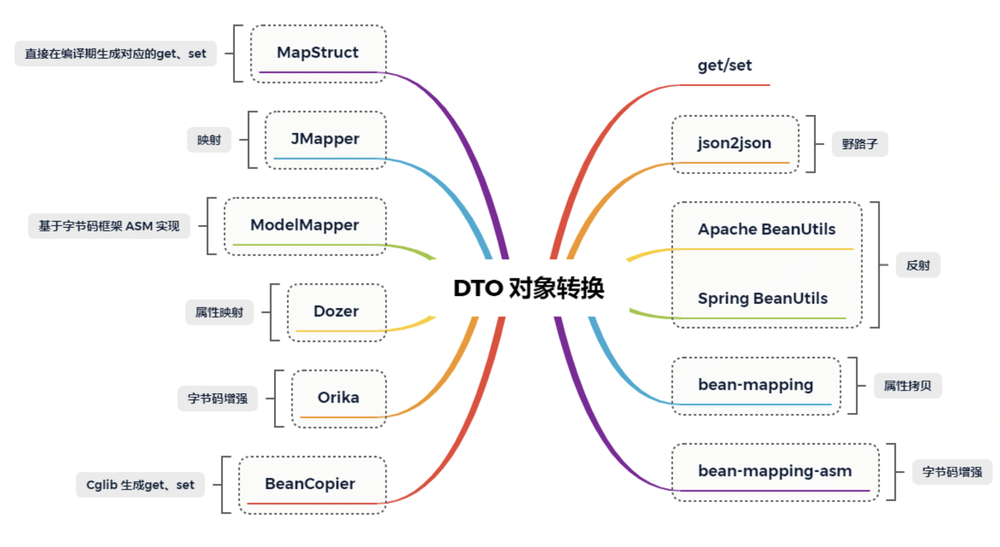

**描述**：在案例工程下创建 interfaces.assembler 包，定义 IAssembler<SOURCE, TARGET>#sourceToTarget(SOURCE var) 接口，提供不同方式的对象转换操作类实现，学习的过程中可以直接下载运行调试。

`MapStruct` 更好用，因为它本身就是在编译期生成`get、set`代码，性能也更好。

### 14.3 功能开发

- lottery-interfaces 是对 lottery-rpc 接口定义的具体实现，在 rpc 接口定义层还会定义出 DTO、REQ、RES 对象
- lottery-interfaces 包括 facade 门面接口、assembler 对象转换操作

#### 14.3.1 接口包装

 ```java
  @Controller
  public class LotteryActivityBooth implements ILotteryActivityBooth {
  
      private Logger logger = LoggerFactory.getLogger(LotteryActivityBooth.class);
  
      @Resource
      private IActivityProcess activityProcess;
  
      @Resource
      private IMapping<DrawAwardVO, AwardDTO> awardMapping;
  
      @Override
      public DrawRes doDraw(DrawReq drawReq) {
          try {
              logger.info("抽奖，开始 uId：{} activityId：{}", drawReq.getuId(), drawReq.getActivityId());
  
              // 1. 执行抽奖
              DrawProcessResult drawProcessResult = activityProcess.doDrawProcess(new DrawProcessReq(drawReq.getuId(), drawReq.getActivityId()));
              if (!Constants.ResponseCode.SUCCESS.getCode().equals(drawProcessResult.getCode())) {
                  logger.error("抽奖，失败(抽奖过程异常) uId：{} activityId：{}", drawReq.getuId(), drawReq.getActivityId());
                  return new DrawRes(drawProcessResult.getCode(), drawProcessResult.getInfo());
              }
  
              // 2. 数据转换
              DrawAwardVO drawAwardVO = drawProcessResult.getDrawAwardVO();
              AwardDTO awardDTO = awardMapping.sourceToTarget(drawAwardVO);
              awardDTO.setActivityId(drawReq.getActivityId());
  
              // 3. 封装数据
              DrawRes drawRes = new DrawRes(Constants.ResponseCode.SUCCESS.getCode(), Constants.ResponseCode.SUCCESS.getInfo());
              drawRes.setAwardDTO(awardDTO);
  
              logger.info("抽奖，完成 uId：{} activityId：{} drawRes：{}", drawReq.getuId(), drawReq.getActivityId(), JSON.toJSONString(drawRes));
  
              return drawRes;
          } catch (Exception e) {
              logger.error("抽奖，失败 uId：{} activityId：{} reqJson：{}", drawReq.getuId(), drawReq.getActivityId(), JSON.toJSONString(drawReq), e);
              return new DrawRes(Constants.ResponseCode.UN_ERROR.getCode(), Constants.ResponseCode.UN_ERROR.getInfo());
          }
      }
  
      @Override
      public DrawRes doQuantificationDraw(QuantificationDrawReq quantificationDrawReq) {
          try {
              logger.info("量化人群抽奖，开始 uId：{} treeId：{}", quantificationDrawReq.getuId(), quantificationDrawReq.getTreeId());
  
              // 1. 执行规则引擎，获取用户可以参与的活动号
              RuleQuantificationCrowdResult ruleQuantificationCrowdResult = activityProcess.doRuleQuantificationCrowd(new DecisionMatterReq(quantificationDrawReq.getuId(), quantificationDrawReq.getTreeId(), quantificationDrawReq.getValMap()));
              if (!Constants.ResponseCode.SUCCESS.getCode().equals(ruleQuantificationCrowdResult.getCode())) {
                  logger.error("量化人群抽奖，失败(规则引擎执行异常) uId：{} treeId：{}", quantificationDrawReq.getuId(), quantificationDrawReq.getTreeId());
                  return new DrawRes(ruleQuantificationCrowdResult.getCode(), ruleQuantificationCrowdResult.getInfo());
              }
  
              // 2. 执行抽奖
              Long activityId = ruleQuantificationCrowdResult.getActivityId();
              DrawProcessResult drawProcessResult = activityProcess.doDrawProcess(new DrawProcessReq(quantificationDrawReq.getuId(), activityId));
              if (!Constants.ResponseCode.SUCCESS.getCode().equals(drawProcessResult.getCode())) {
                  logger.error("量化人群抽奖，失败(抽奖过程异常) uId：{} treeId：{}", quantificationDrawReq.getuId(), quantificationDrawReq.getTreeId());
                  return new DrawRes(drawProcessResult.getCode(), drawProcessResult.getInfo());
              }
  
              // 3. 数据转换
              DrawAwardVO drawAwardVO = drawProcessResult.getDrawAwardVO();
              AwardDTO awardDTO = awardMapping.sourceToTarget(drawAwardVO);
              awardDTO.setActivityId(activityId);
  
              // 4. 封装数据
              DrawRes drawRes = new DrawRes(Constants.ResponseCode.SUCCESS.getCode(), Constants.ResponseCode.SUCCESS.getInfo());
              drawRes.setAwardDTO(awardDTO);
  
              logger.info("量化人群抽奖，完成 uId：{} treeId：{} drawRes：{}", quantificationDrawReq.getuId(), quantificationDrawReq.getTreeId(), JSON.toJSONString(drawRes));
  
              return drawRes;
          } catch (Exception e) {
              logger.error("量化人群抽奖，失败 uId：{} treeId：{} reqJson：{}", quantificationDrawReq.getuId(), quantificationDrawReq.getTreeId(), JSON.toJSONString(quantificationDrawReq), e);
              return new DrawRes(Constants.ResponseCode.UN_ERROR.getCode(), Constants.ResponseCode.UN_ERROR.getInfo());
          }
      }
  
  }
 ```

- 在抽奖活动展台的类中主要实现了两个接口方法，指定活动抽奖(doDraw)、量化人群抽奖(doQuantificationDraw)

#### 14.3.2 对象转化

```java
@Mapper(componentModel = "spring", unmappedTargetPolicy = ReportingPolicy.IGNORE, unmappedSourcePolicy = ReportingPolicy.IGNORE)
public interface AwardMapping extends IMapping<DrawAwardVO, AwardDTO> {

    @Mapping(target = "userId", source = "uId")
    @Override
    AwardDTO sourceToTarget(DrawAwardVO var1);

    @Override
    DrawAwardVO targetToSource(AwardDTO var1);

}
```

- 定义接口 AwardMapping 继承 IMapping<DrawAwardVO, AwardDTO> 做对象转换操作
- 如果一些接口字段在两个对象间不是同名的，则需要进行配置，就像 uId -> userId


### 14.4 测试验证

**普通抽奖**

```java
@Test
    public void test_doDraw() {
        DrawReq drawReq = new DrawReq();
        drawReq.setUId("admin");
        drawReq.setActivityId(100001L);
        DrawRes drawRes = lotteryActivityBooth.doDraw(drawReq);
        log.info("请求参数：{}", JSON.toJSONString(drawReq));
        log.info("测试结果：{}", JSON.toJSONString(drawRes));
    }
```

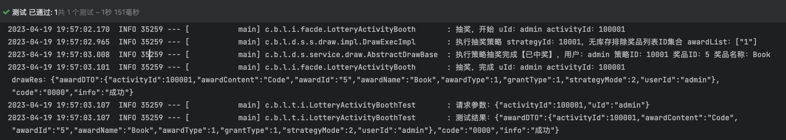

**量化抽奖**

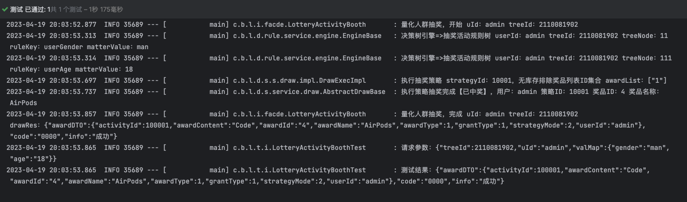


## 15. 搭建MQ消息组件Kafka服务环境

描述：搭建MQ消息组件Kafka服务环境，并整合到SpringBoot中，完成消息的生产和消费处理

### 15.1 Kafka 安装与配置

Apache Kafka是一个分布式发布 - 订阅消息系统和一个强大的队列，可以处理大量的数据，并使您能够将消息从一个端点传递到另一个端点。 Kafka适合离线和在线消息消费。 Kafka消息保留在磁盘上，并在群集内复制以防止数据丢失。 Kafka构建在ZooKeeper同步服务之上。 它与Apache Storm和Spark非常好地集成，用于实时流式数据分析。

**使用docker安装 kakfa**

```bash
docker pull wurstmeister/kafka

docker run -d --name kafka -p 9092:9092 -e KAFKA_BROKER_ID=0 -e KAFKA_ZOOKEEPER_CONNECT=docker.for.mac.host.internal:2181/kafka -e KAFKA_ADVERTISED_LISTENERS=PLAINTEXT://docker.for.mac.host.internal:9092 -e KAFKA_LISTENERS=PLAINTEXT://0.0.0.0:9092 wurstmeister/kafka


# 测试 
docker exec -it kafka bash
cd /opt/kafka/bin
# 运行kafka生产者
./kafka-console-producer.sh --broker-list 127.0.0.1:9092 --topic first-topic
# 出现>之后发送Hello
>Hello
# 打开新终端，启动kafka消费者
cd /opt/kafka/bin
./kafka-console-consumer.sh --bootstrap-server 127.0.0.1:9092 --topic first-topic --from-beginning

```

- KAFKA_BROKER_ID=0 在kafka集群中，每个kafka都有一个BROKER_ID来区分自己
- KAFKA_ZOOKEEPER_CONNECT={host-ip}:{zookeeper-port}/kafka 配置zookeeper管理kafka的路径
- KAFKA_ADVERTISED_LISTENERS=PLAINTEXT://{host-ip}:9092 把kafka的地址端口注册给zookeeper
- KAFKA_LISTENERS=PLAINTEXT://0.0.0.0:9092 kafka监听地址

mac 环境，在`/etc/hosts`设置`docker.for.mac.host.internal`

### 15.2 SpringBoot 整合 Kafka

```
<dependency>
    <groupId>org.springframework.kafka</groupId>
    <artifactId>spring-kafka</artifactId>
</dependency>
```

`application.yml`

```yml
spring:
  kafka:
    bootstrap-servers: 127.0.0.1:9092
    producer:
      # 发生错误后，消息重发的次数。
      retries: 1
      #当有多个消息需要被发送到同一个分区时，生产者会把它们放在同一个批次里。该参数指定了一个批次可以使用的内存大小，按照字节数计算。
      batch-size: 16384
      # 设置生产者内存缓冲区的大小。
      buffer-memory: 33554432
      # 键的序列化方式
      key-serializer: org.apache.kafka.common.serialization.StringSerializer
      # 值的序列化方式
      value-serializer: org.apache.kafka.common.serialization.StringSerializer
      # acks=0 ： 生产者在成功写入消息之前不会等待任何来自服务器的响应。
      # acks=1 ： 只要集群的首领节点收到消息，生产者就会收到一个来自服务器成功响应。
      # acks=all ：只有当所有参与复制的节点全部收到消息时，生产者才会收到一个来自服务器的成功响应。
      acks: 1
    consumer:
      # 自动提交的时间间隔 在spring boot 2.X 版本中这里采用的是值的类型为Duration 需要符合特定的格式，如1S,1M,2H,5D
      auto-commit-interval: 1S
      # 该属性指定了消费者在读取一个没有偏移量的分区或者偏移量无效的情况下该作何处理：
      # latest（默认值）在偏移量无效的情况下，消费者将从最新的记录开始读取数据（在消费者启动之后生成的记录）
      # earliest ：在偏移量无效的情况下，消费者将从起始位置读取分区的记录
      auto-offset-reset: earliest
      # 是否自动提交偏移量，默认值是true,为了避免出现重复数据和数据丢失，可以把它设置为false,然后手动提交偏移量
      enable-auto-commit: false
      # 键的反序列化方式
      key-deserializer: org.apache.kafka.common.serialization.StringDeserializer
      # 值的反序列化方式
      value-deserializer: org.apache.kafka.common.serialization.StringDeserializer
    listener:
      # 在侦听器容器中运行的线程数。
      concurrency: 5
      #listner负责ack，每调用一次，就立即commit
      ack-mode: manual_immediate
      missing-topics-fatal: false

```

**生产者**

```java
@Component
public class KafkaProducer {

    private Logger logger = LoggerFactory.getLogger(KafkaProducer.class);

    @Resource
    private KafkaTemplate<String, Object> kafkaTemplate;

    public static final String TOPIC_TEST = "Hello-Kafka";

    public static final String TOPIC_GROUP = "test-consumer-group";

    public void send(Object obj) {
        String obj2String = JSON.toJSONString(obj);
        logger.info("准备发送消息为：{}", obj2String);

        // 发送消息
        ListenableFuture<SendResult<String, Object>> future = kafkaTemplate.send(TOPIC_TEST, obj);
        future.addCallback(new ListenableFutureCallback<SendResult<String, Object>>() {
            @Override
            public void onFailure(Throwable throwable) {
                //发送失败的处理
                logger.info(TOPIC_TEST + " - 生产者 发送消息失败：" + throwable.getMessage());
            }

            @Override
            public void onSuccess(SendResult<String, Object> stringObjectSendResult) {
                //成功的处理
                logger.info(TOPIC_TEST + " - 生产者 发送消息成功：" + stringObjectSendResult.toString());
            }
        });
    }

}
```

**消费者**

```java
@Component
public class KafkaConsumer {

    private Logger logger = LoggerFactory.getLogger(KafkaConsumer.class);

    @KafkaListener(topics = KafkaProducer.TOPIC_TEST, groupId = KafkaProducer.TOPIC_GROUP)
    public void topicTest(ConsumerRecord<?, ?> record, Acknowledgment ack, @Header(KafkaHeaders.RECEIVED_TOPIC) String topic) {
        Optional<?> message = Optional.ofNullable(record.value());
        if (message.isPresent()) {
            Object msg = message.get();
            logger.info("topic_test 消费了： Topic:" + topic + ",Message:" + msg);
            ack.acknowledge();
        }
    }

}
```

### 15.3 测试验证

测试之前需要开启 Kafka 和Zookeeper服务

```java
@SpringBootTest
@Slf4j
@RunWith(SpringRunner.class)
public class KafkaProducerTest {
    @Resource
    private KafkaProducer kafkaProducer;
    
    @Test
    public void test_send() throws InterruptedException {
        // 循环发送消息
       for(int i = 0; i < 5; i++) {
            kafkaProducer.send("你好，我是Lottery --001");
            Thread.sleep(3500);
        }
    }
}
```

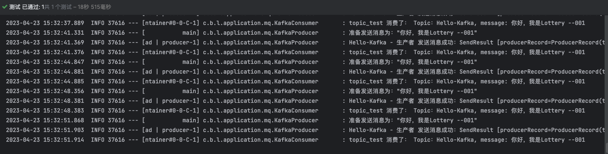


## 16. 使用MQ解藕抽奖发货流程

描述：使用MQ消息的特性，把用户抽奖到发货到流程进行解耦。这个过程中包括了消息的发送、库表中状态的更新、消息的接收消费、发奖状态的处理等。


### 16.1 开发日志

- 在数据库表 `user_strategy_export` 添加字段 `mq_state` 这个字段用于发送 MQ 成功更新库表状态，如果 MQ 消息发送失败则需要通过定时任务补偿 MQ 消息。
- 启动 kafka 新增 topic：lottery_invoice 用于发货单消息，当抽奖完成后则发送一个发货单，再异步处理发货流程，这个部分就是MQ的解耦流程使用。
- 在 `ActivityProcessImpl#doDrawProcess` 活动抽奖流程编排中补全用户抽奖后，发送MQ触达异步奖品发送的流程。


### 16.2 Kafka 创建主 topic

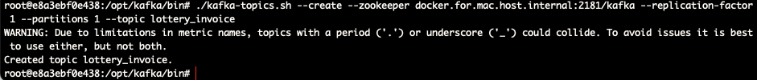

`./kafka-topics.sh --create --zookeeper docker.for.mac.host.internal:2181/kafka --replication-factor 1 --partitions 1 --topic lottery_invoice`


### 16.3流程说明

**MQ流程**

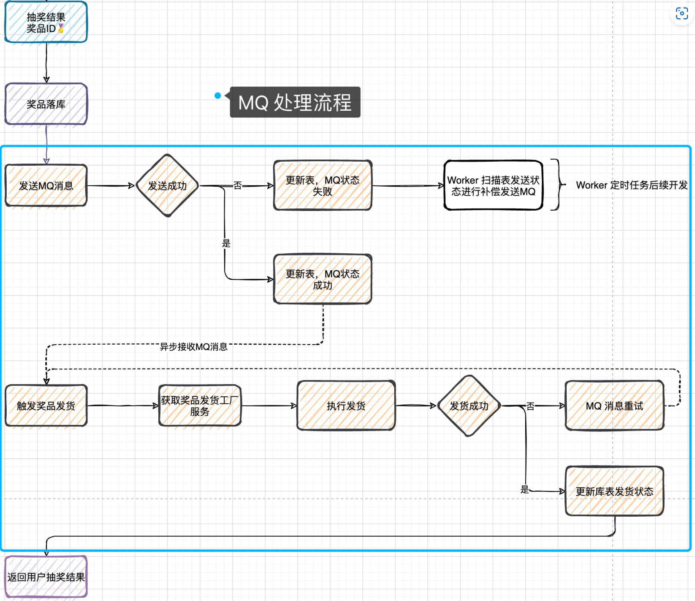

- 从用户发起抽奖到中奖后开始为MQ处理发奖的流程
- 由于MQ消息的发送不具备事务性，因此可能在发送MQ时失败。所以在MQ发送完成后需要知道是否发送成功，进行库表状态更新，如果发送失败则需要用worker补偿MQ发送。
- MQ发送完成到消费也存在失败的可能性，如处理失败、更新库表失败等，任何失败都需要保证MQ进行重新处理。保证MQ消息重试的前提是服务的幂等性，否则在重试过程中存在流程异常，如更新次数变多、数据库插入过多、给用户发奖过多等。


### 16.4 MQ服务

关于 MQ 的使用，无论是 Kafka 还是 RocketMQ，基本方式都是类似的，一个生产消息，一个监听消息，只不过在一些符合各自业务场景下，做了细分的优化，但这并不会影响你的使用。

#### 16.4.1 生产消息

```java
@Component
public class KafkaProducer {

    private Logger logger = LoggerFactory.getLogger(KafkaProducer.class);

    @Resource
    private KafkaTemplate<String, Object> kafkaTemplate;

    /**
     * MQ主题：中奖发货单
     */
    public static final String TOPIC_INVOICE = "lottery_invoice";

    /**
     * 发送中奖物品发货单消息
     *
     * @param invoice 发货单
     */
    public ListenableFuture<SendResult<String, Object>> sendLotteryInvoice(InvoiceVO invoice) {
        String objJson = JSON.toJSONString(invoice);
        logger.info("发送MQ消息 topic：{} bizId：{} message：{}", TOPIC_INVOICE, invoice.getuId(), objJson);
        return kafkaTemplate.send(TOPIC_INVOICE, objJson);
    }

}
```

- 把所有的生产消息都放到KafkaProducer中，并对外提供一个可以发送MQ消息的方法。
- 我们配置的类型转换为 StringDeserializer 所以发送消息的方式是 JSON 字符串，当然这个编解码器是可以重写的，满足你发送其他类型的数据。

#### 16.4.2 消费消息

```java
@Component
public class LotteryInvoiceListener {

    private Logger logger = LoggerFactory.getLogger(LotteryInvoiceListener.class);

    @Resource
    private DistributionGoodsFactory distributionGoodsFactory;

    @KafkaListener(topics = "lottery_invoice", groupId = "lottery")
    public void onMessage(ConsumerRecord<?, ?> record, Acknowledgment ack, @Header(KafkaHeaders.RECEIVED_TOPIC) String topic) {
        Optional<?> message = Optional.ofNullable(record.value());

        // 1. 判断消息是否存在
        if (!message.isPresent()) {
            return;
        }

        // 2. 处理 MQ 消息
        try {
            // 1. 转化对象（或者你也可以重写Serializer<T>）
            InvoiceVO invoiceVO = JSON.parseObject((String) message.get(), InvoiceVO.class);

            // 2. 获取发送奖品工厂，执行发奖
            IDistributionGoods distributionGoodsService = distributionGoodsFactory.getDistributionGoodsService(invoiceVO.getAwardType());
            DistributionRes distributionRes = distributionGoodsService.doDistribution(new GoodsReq(invoiceVO.getuId(), invoiceVO.getOrderId(), invoiceVO.getAwardId(), invoiceVO.getAwardName(), invoiceVO.getAwardContent()));

            Assert.isTrue(Constants.AwardState.SUCCESS.getCode().equals(distributionRes.getCode()), distributionRes.getInfo());

            // 3. 打印日志
            logger.info("消费MQ消息，完成 topic：{} bizId：{} 发奖结果：{}", topic, invoiceVO.getuId(), JSON.toJSONString(distributionRes));

            // 4. 消息消费完成
            ack.acknowledge();
        } catch (Exception e) {
            // 发奖环节失败，消息重试。所有到环节，发货、更新库，都需要保证幂等。
            logger.error("消费MQ消息，失败 topic：{} message：{}", topic, message.get());
            throw e;
        }
    }

}
```

- 每一个MQ消息的消费都有一个对应的Listender来处理消息体，如果使用一些其他的MQ可能还会看到一些抽象类来处理MQ消息集合
- 在这个 LotteryInvoiceListener 消息监听类中，主要就是通过消息中的发奖类型获取到对应的奖品发货工厂，处理奖品的发送操作。
- 在奖品发送操作中，已经补全了 `DistributionBase#updateUserAwardState` 更新奖品发送状态的操作。

### 16.5 抽奖流程解藕

```java
public DrawProcessResult doDrawProcess(DrawProcessReq req) {
    // 1. 领取活动
    
    // 2. 执行抽奖

    // 3. 结果落库

    // 4. 发送MQ，触发发奖流程
    InvoiceVO invoiceVO = buildInvoiceVO(drawOrderVO);
    ListenableFuture<SendResult<String, Object>> future = kafkaProducer.sendLotteryInvoice(invoiceVO);
    future.addCallback(new ListenableFutureCallback<SendResult<String, Object>>() {
        @Override
        public void onSuccess(SendResult<String, Object> stringObjectSendResult) {
            // 4.1 MQ 消息发送完成，更新数据库表 user_strategy_export.mq_state = 1
            activityPartake.updateInvoiceMqState(invoiceVO.getuId(), invoiceVO.getOrderId(), Constants.MQState.COMPLETE.getCode());
        }
        @Override
        public void onFailure(Throwable throwable) {
            // 4.2 MQ 消息发送失败，更新数据库表 user_strategy_export.mq_state = 2 【等待定时任务扫码补偿MQ消息】
            activityPartake.updateInvoiceMqState(invoiceVO.getuId(), invoiceVO.getOrderId(), Constants.MQState.FAIL.getCode());
        }
    });

    // 5. 返回结果
    return new DrawProcessResult(Constants.ResponseCode.SUCCESS.getCode(), Constants.ResponseCode.SUCCESS.getInfo(), drawAwardVO);
}
```

- 在 ActivityProcessImpl#doDrawProcess 方法中，主要补全的就是关于 MQ 的处理，这里我们会调动 kafkaProducer.sendLotteryInvoice 发送一个中奖结果的发货单。
- 消息发送完毕后会进行回调处理，更新数据库中的MQ的发送状态，如果有M发送失败则更新数据库`mq_state=2`这里还有可能在更新数据库时失败，需要worker补偿处理，一种是发送 MQ 失败，另外一种是 MQ 状态为 0 但很久都没有发送 MQ 那么也可以触发发送。
- 现在从用户领取活动、执行抽奖、结果落库，到 发送MQ处理后续发奖的流程就解耦了，因为用户只需要知道自己中奖了，但发奖到货是可以等待的，毕竟发送虚拟商品的等待时间并不会很长，而实物商品走物流就更可以接收了。所以对于这样的流程进行解耦是非常有必要的，否则你的程序逻辑会让用户在界面等待更久的时间。

### 16.5 测试验证

**发送消息测试**

```java
@RunWith(SpringRunner.class)
@SpringBootTest

public class KafkaProducerTest {

    @Resource
    private KafkaProducer kafkaProducer;

    @Test
    public void test_send() throws InterruptedException {
        InvoiceVO invoice = new InvoiceVO();
        invoice.setuId("admin");
        invoice.setOrderId(1444540456057864192L);
        invoice.setAwardId("3");
        invoice.setAwardType(Constants.AwardType.DESC.getCode());
        invoice.setAwardName("Code");
        invoice.setAwardContent("苹果电脑");
        invoice.setShippingAddress(null);
        invoice.setExtInfo(null);
        kafkaProducer.sendLotteryInvoice(invoice);
    }
}
```

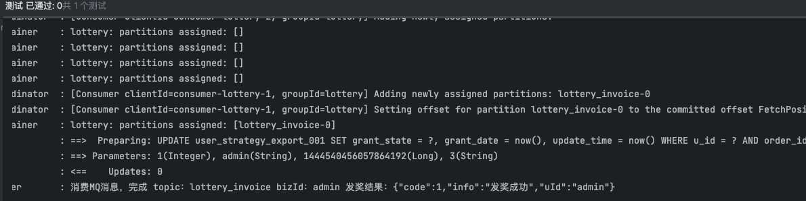

**流程测试**

```java
public class ActivityProcessTest {
    @Resource
    private IActivityProcess activityProcess;

    @Test
    public void test_doDrawProcess() {
        DrawProcessReq req = new DrawProcessReq();
        req.setuId("admin");
        req.setActivityId(100001L);
        DrawProcessResult drawProcessResult = activityProcess.doDrawProcess(req);
        log.info("请求入参：{}", JSON.toJSONString(req));
        log.info("测试结果：{}", JSON.toJSONString(drawProcessResult));
    }
}
```

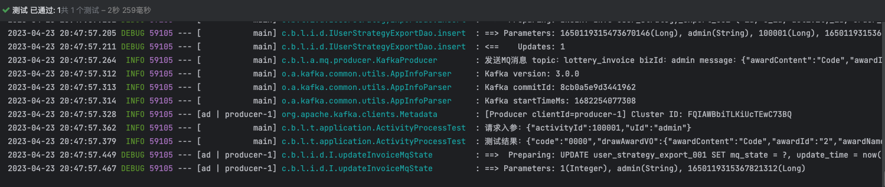

执行抽奖中奖后，已经触发了 MQ 消息的发送，并进行了消费，最终奖品发放完成。


## 17. 引入xxl job处理活动状态扫描

描述：引入x x l-job分布式任务调度平台，分布式任务调度平台，处理需要使用定时任务解决的场景。

### 17.1 开发日志

- 在官网：https://github.com/xuxueli/xxl-job/ 下载运行包，按照 Java SpringBoot 修改一些基本配置，项目启动即可。
- 配置 XXL-JOB 的基础使用环境，导入库表、配置文件、验证官网管理，测试任务启动运行。
- 扫描抽奖活动状态，把审核通过的活动扫描为活动中，把已过期活动中的状态扫描为关闭。


### 17.2 环境搭建

#### 17.2.1 介绍

XXL-JOB是一个分布式任务调度平台，其核心设计目标是开发迅速、学习简单、轻量级、易扩展。

#### 17.2.2 功能

- 1、简单：支持通过Web页面对任务进行CRUD操作，操作简单，一分钟上手；
- 2、动态：支持动态修改任务状态、启动/停止任务，以及终止运行中任务，即时生效；
- 3、调度中心HA（中心式）：调度采用中心式设计，“调度中心”自研调度组件并支持集群部署，可保证调度中心HA；
- 4、执行器HA（分布式）：任务分布式执行，任务"执行器"支持集群部署，可保证任务执行HA；
- 5、注册中心: 执行器会周期性自动注册任务, 调度中心将会自动发现注册的任务并触发执行。同时，也支持手动录入执行器地址；
- 6、弹性扩容缩容：一旦有新执行器机器上线或者下线，下次调度时将会重新分配任务；
- 7、触发策略：提供丰富的任务触发策略，包括：Cron触发、固定间隔触发、固定延时触发、API（事件）触发、人工触发、父子任务触发；
- 8、调度过期策略：调度中心错过调度时间的补偿处理策略，包括：忽略、立即补偿触发一次等；
- 9、阻塞处理策略：调度过于密集执行器来不及处理时的处理策略，策略包括：单机串行（默认）、丢弃后续调度、覆盖之前调度；
- 10、任务超时控制：支持自定义任务超时时间，任务运行超时将会主动中断任务；
- 11、任务失败重试：支持自定义任务失败重试次数，当任务失败时将会按照预设的失败重试次数主动进行重试；其中分片任务支持分片粒度的失败重试；
- 12、任务失败告警；默认提供邮件方式失败告警，同时预留扩展接口，可方便的扩展短信、钉钉等告警方式；
- 13、路由策略：执行器集群部署时提供丰富的路由策略，包括：第一个、最后一个、轮询、随机、一致性HASH、最不经常使用、最近最久未使用、故障转移、忙碌转移等；
- 14、分片广播任务：执行器集群部署时，任务路由策略选择"分片广播"情况下，一次任务调度将会广播触发集群中所有执行器执行一次任务，可根据分片参数开发分片任务；
- 15、动态分片：分片广播任务以执行器为维度进行分片，支持动态扩容执行器集群从而动态增加分片数量，协同进行业务处理；在进行大数据量业务操作时可显著提升任务处理能力和速度。
- 16、故障转移：任务路由策略选择"故障转移"情况下，如果执行器集群中某一台机器故障，将会自动Failover切换到一台正常的执行器发送调度请求。
- 17、任务进度监控：支持实时监控任务进度；
- 18、Rolling实时日志：支持在线查看调度结果，并且支持以Rolling方式实时查看执行器输出的完整的执行日志；
- 19、GLUE：提供Web IDE，支持在线开发任务逻辑代码，动态发布，实时编译生效，省略部署上线的过程。支持30个版本的历史版本回溯。
- 20、脚本任务：支持以GLUE模式开发和运行脚本任务，包括Shell、Python、NodeJS、PHP、PowerShell等类型脚本;
- 21、命令行任务：原生提供通用命令行任务Handler（Bean任务，"CommandJobHandler"）；业务方只需要提供命令行即可；
- 22、任务依赖：支持配置子任务依赖，当父任务执行结束且执行成功后将会主动触发一次子任务的执行, 多个子任务用逗号分隔；
- 23、一致性：“调度中心”通过DB锁保证集群分布式调度的一致性, 一次任务调度只会触发一次执行；
- 24、自定义任务参数：支持在线配置调度任务入参，即时生效；
- 25、调度线程池：调度系统多线程触发调度运行，确保调度精确执行，不被堵塞；
- 26、数据加密：调度中心和执行器之间的通讯进行数据加密，提升调度信息安全性；
- 27、邮件报警：任务失败时支持邮件报警，支持配置多邮件地址群发报警邮件；
- 28、推送maven中央仓库: 将会把最新稳定版推送到maven中央仓库, 方便用户接入和使用;
- 29、运行报表：支持实时查看运行数据，如任务数量、调度次数、执行器数量等；以及调度报表，如调度日期分布图，调度成功分布图等；
- 30、全异步：任务调度流程全异步化设计实现，如异步调度、异步运行、异步回调等，有效对密集调度进行流量削峰，理论上支持任意时长任务的运行；
- 31、跨语言：调度中心与执行器提供语言无关的 RESTful API 服务，第三方任意语言可据此对接调度中心或者实现执行器。除此之外，还提供了 “多任务模式”和“httpJobHandler”等其他跨语言方案；
- 32、国际化：调度中心支持国际化设置，提供中文、英文两种可选语言，默认为中文；
- 33、容器化：提供官方docker镜像，并实时更新推送dockerhub，进一步实现产品开箱即用；
- 34、线程池隔离：调度线程池进行隔离拆分，慢任务自动降级进入"Slow"线程池，避免耗尽调度线程，提高系统稳定性；
- 35、用户管理：支持在线管理系统用户，存在管理员、普通用户两种角色；
- 36、权限控制：执行器维度进行权限控制，管理员拥有全量权限，普通用户需要分配执行器权限后才允许相关操作；

#### 17.2.3 基础配置

下载最新版本 https://github.com/xuxueli/xxl-job/

1. 打开：使用 IDEA 打开下载的 xxl-job
2. 导表：把 xxl-job 中的 `doc\db\tables_xxl_job.sql` 导入到自己的数据库中
3. 启动：xxl-job-admin 是用于管理分布式任务调度的后台，一切配置完后，启动 xxl-job-admin 另外你需要配置 application.properties 修改数据库链接参数和日志文件夹
4. 案例：xxl-job-executor-samples 是一组job任务案例，运行后可以在分布式任务调度后台管理任务，配置、启动、关闭
5. 核心：xxl-job-core

修改端口号为7789，访问http://127.0.0.1:7789/xxl-job-admin，默认账号为`admin/123456`

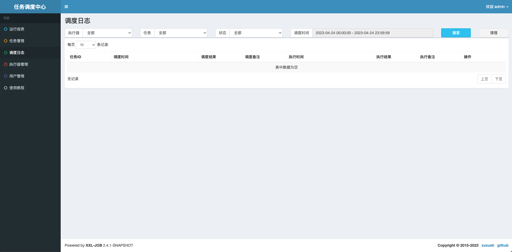

在任务管理中开启任务，并执行一次

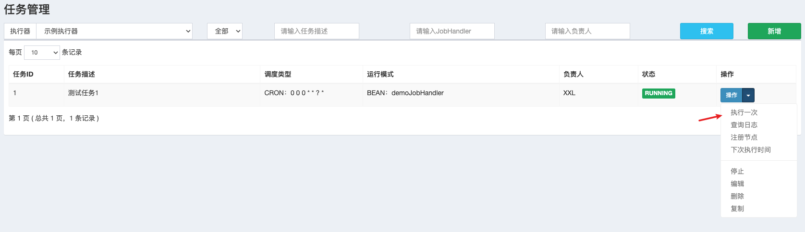

在执行日志中可以看到执行结果

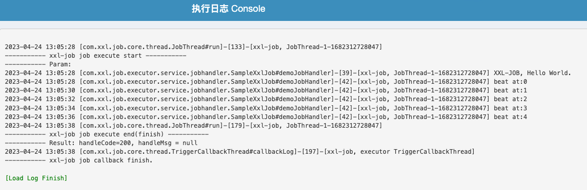

### 17.3 任务扫描活动状态

#### 17.3.1 引入pom

```xml
<!-- xxl-job-core https://github.com/xuxueli/xxl-job/-->
<dependency>
    <groupId>com.xuxueli</groupId>
    <artifactId>xxl-job-core</artifactId>
    <version>2.3.0</version>
</dependency>
```


#### 17.3.2 配置application.yml

```yml
xxl:
  job:
    admin:
      addresses: http://127.0.0.1:7789/xxl-job-admin
    executor:
      address:
      appname: lottery-job
      ip:
      port: 9998
      logpath: applogs/xxl-job/jobhandler
      logretentiondays: 50
    accessToken:
```


#### 17.3.3 任务初始类

**com.banana69.lottery.application.worker.LotteryXxlJobConfig**

```java
/**
 * Created with IntelliJ IDEA.
 *
 * @author: banana69
 * @date: 2023/04/24/13:34
 * @description: XXL-JOB配置
 */
@Configuration
@Slf4j
public class LotteryXxlJobConfig {
    @Value("${xxl.job.admin.addresses}")
    private String adminAddresses;

    @Value("${xxl.job.accessToken}")
    private String accessToken;

    @Value("${xxl.job.executor.appname}")
    private String appname;

    @Value("${xxl.job.executor.address}")
    private String address;

    @Value("${xxl.job.executor.ip}")
    private String ip;

    @Value("${xxl.job.executor.port}")
    private int port;

    @Value("${xxl.job.executor.logpath}")
    private String logPath;

    @Value("${xxl.job.executor.logretentiondays}")
    private int logRetentionDays;

    @Bean
    public XxlJobSpringExecutor xxlJobExecutor() {
        log.info(">>>>>>>>>>> xxl-job config init.");

        XxlJobSpringExecutor xxlJobSpringExecutor = new XxlJobSpringExecutor();
        xxlJobSpringExecutor.setAdminAddresses(adminAddresses);
        xxlJobSpringExecutor.setAppname(appname);
        xxlJobSpringExecutor.setAddress(address);
        xxlJobSpringExecutor.setIp(ip);
        xxlJobSpringExecutor.setPort(port);
        xxlJobSpringExecutor.setAccessToken(accessToken);
        xxlJobSpringExecutor.setLogPath(logPath);
        xxlJobSpringExecutor.setLogRetentionDays(logRetentionDays);

        return xxlJobSpringExecutor;
    }
}

```

#### 17.3.4 活动扫描任务

**com.banana69.lottery.application.worker.LotteryXxlJob**

```java
@Component
public class LotteryXxlJob {

    private Logger logger = LoggerFactory.getLogger(LotteryXxlJob.class);

    @Resource
    private IActivityDeploy activityDeploy;

    @Resource
    private IStateHandler stateHandler;

    @XxlJob("lotteryActivityStateJobHandler")
    public void lotteryActivityStateJobHandler() throws Exception {
        logger.info("扫描活动状态 Begin");

        List<ActivityVO> activityVOList = activityDeploy.scanToDoActivityList(0L);
        if (activityVOList.isEmpty()){
            logger.info("扫描活动状态 End 暂无符合需要扫描的活动列表");
            return;
        }

        while (!activityVOList.isEmpty()) {
            for (ActivityVO activityVO : activityVOList) {
                Integer state = activityVO.getState();
                switch (state) {
                    // 活动状态为审核通过，在临近活动开启时间前，审核活动为活动中。在使用活动的时候，需要依照活动状态核时间两个字段进行判断和使用。
                    case 4:
                        Result state4Result = stateHandler.doing(activityVO.getActivityId(), Constants.ActivityState.PASS);
                        logger.info("扫描活动状态为活动中 结果：{} activityId：{} activityName：{} creator：{}", JSON.toJSONString(state4Result), activityVO.getActivityId(), activityVO.getActivityName(), activityVO.getCreator());
                        break;
                    // 扫描时间已过期的活动，从活动中状态变更为关闭状态
                    case 5:
                        if (activityVO.getEndDateTime().before(new Date())){
                            Result state5Result = stateHandler.close(activityVO.getActivityId(), Constants.ActivityState.DOING);
                            logger.info("扫描活动状态为关闭 结果：{} activityId：{} activityName：{} creator：{}", JSON.toJSONString(state5Result), activityVO.getActivityId(), activityVO.getActivityName(), activityVO.getCreator());
                        }
                        break;
                    default:
                        break;
                }
            }

            // 获取集合中最后一条记录，继续扫描后面10条记录
            ActivityVO activityVO = activityVOList.get(activityVOList.size() - 1);
            activityVOList = activityDeploy.scanToDoActivityList(activityVO.getId());
        }

        logger.info("扫描活动状态 End");

    }

}
```

在任务扫描中，主要把已经审核通过的活动和已经过期的活动状态进行变更操作

- 审核通过 -> 扫描为活动中
- 活动中已过期时间 -> 扫描为活动关闭

#### 17.3.5 配置任务调度执行器

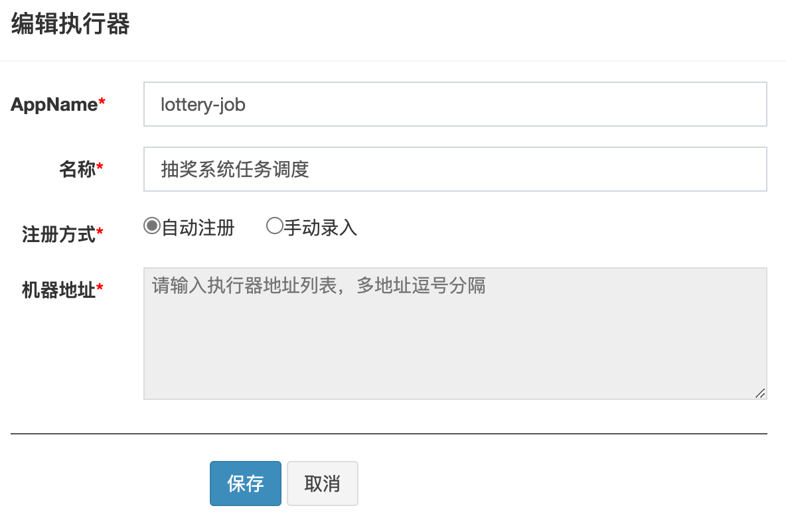

- 只有配置了任务执行器，才能执行当前这个实例中的任务。
- 另外在有些业务体量较大的场景中，需要把任务开发为新工程并单独部署。


#### 17.3.6 配置任务

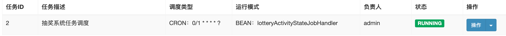


### 17.4 测试验证

确保数据库中有可以扫描的活动数据，比如可以把活动数据从活动中扫描为结束，也就是把状态5变更为7

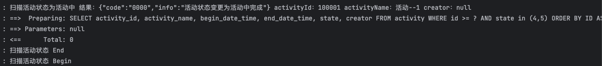


## 18. 扫描库表补偿发货单MQ消息

描述：分布式任务调度，扫描抽奖发货单消息状态，对于未发送MQ或者发送失败的MQ，进行补偿发送处理

### 18.1 开发日志

- 循环把每个库下的多张表的每条用户记录都进行扫描。所以需要在分库分表组件中，提供出可以设置路由到的库和表。
- 在application应用层下的worker中，添加关于扫密哦啊库表补偿消息发送的任务，并在开发完成后把任务配置到xxl-job任务调度后台中

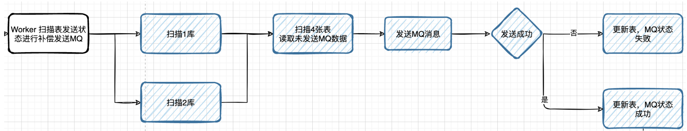

任务流程就是在完成的整个抽奖活动中，关于中奖结果落库后，进行MQ后，若出现问题，则进行补偿消息发送处理的部分。

在MQ消息补偿的过程中，会把发送失败的消息和未发送的消息都进行补偿，保障全流程的可靠性。


### 18.2 功能实现

#### 18.2.1 路由组件提供必要方法

在路由组件中提供获取分库数，分表数和设置库表路由，即手动设置的操作，这一部分代码参考[KnowledgePlanet / db-router-spring-boot-starter · GitCode](https://gitcode.net/KnowledgePlanet/db-router-spring-boot-starter)

`IDBRouterStrategy`


#### 18.2.2 消息补偿任务

```java
@XxlJob("lotteryOrderMQStateJobHandler")
public void lotteryOrderMQStateJobHandler() throws Exception {
    // 验证参数
    String jobParam = XxlJobHelper.getJobParam();
    if (null == jobParam) {
        logger.info("扫描用户抽奖奖品发放MQ状态[Table = 2*4] 错误 params is null");
        return;
    }

    // 获取分布式任务配置参数信息 参数配置格式：1,2,3 也可以是指定扫描一个，也可以配置多个库，按照部署的任务集群进行数量配置，均摊分别扫描效率更高
    String[] params = jobParam.split(",");
    logger.info("扫描用户抽奖奖品发放MQ状态[Table = 2*4] 开始 params：{}", JSON.toJSONString(params));
    if (params.length == 0) {
        logger.info("扫描用户抽奖奖品发放MQ状态[Table = 2*4] 结束 params is null");
        return;
    }

    // 获取分库分表配置下的分表数
    int tbCount = dbRouter.tbCount();
    // 循环获取指定扫描库
    for (String param : params) {
        // 获取当前任务扫描的指定分库
        int dbCount = Integer.parseInt(param);
        // 判断配置指定扫描库数，是否存在
        if (dbCount > dbRouter.dbCount()) {
            logger.info("扫描用户抽奖奖品发放MQ状态[Table = 2*4] 结束 dbCount not exist");
            continue;
        }

        // 循环扫描对应表
        for (int i = 0; i < tbCount; i++) {
            // 扫描库表数据
            List<InvoiceVO> invoiceVOList = activityPartake.scanInvoiceMqState(dbCount, i);
            logger.info("扫描用户抽奖奖品发放MQ状态[Table = 2*4] 扫描库：{} 扫描表：{} 扫描数：{}", dbCount, i, invoiceVOList.size());
            // 补偿 MQ 消息
            for (InvoiceVO invoiceVO : invoiceVOList) {
                ListenableFuture<SendResult<String, Object>> future = kafkaProducer.sendLotteryInvoice(invoiceVO);
                future.addCallback(new ListenableFutureCallback<SendResult<String, Object>>() {
                    @Override
                    public void onSuccess(SendResult<String, Object> stringObjectSendResult) {
                        // MQ 消息发送完成，更新数据库表 user_strategy_export.mq_state = 1
                        activityPartake.updateInvoiceMqState(invoiceVO.getuId(), invoiceVO.getOrderId(), Constants.MQState.
                    }
                    @Override
                    public void onFailure(Throwable throwable) {
                        // MQ 消息发送失败，更新数据库表 user_strategy_export.mq_state = 2 【等待定时任务扫码补偿MQ消息】
                        activityPartake.updateInvoiceMqState(invoiceVO.getuId(), invoiceVO.getOrderId(), Constants.MQState.
                    }
                });
            }
        }

    }
    logger.info("扫描用户抽奖奖品发放MQ状态[Table = 2*4] 完成 param：{}", JSON.toJSONString(params));
}
```

- 使用任务扫描库表的操作，在 activityPartake.scanInvoiceMqState 方法中，会设定路由，如下：

```java
@Override
public List<InvoiceVO> scanInvoiceMqState(int dbCount, int tbCount) {
    try {
        // 设置路由
        dbRouter.setDBKey(dbCount);
        dbRouter.setTBKey(tbCount);
        // 查询数据
        return userTakeActivityRepository.scanInvoiceMqState();
    } finally {
        dbRouter.clear();
    }
}
```


### 18.3 测试验证

修改库表中，user_strategy_export_001~004 中任意一个表的 MQ 状态为 2 表示发送 MQ 失败

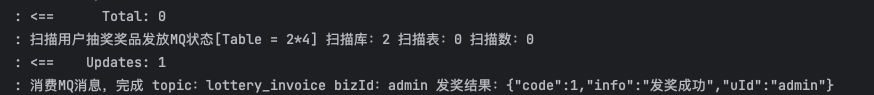
